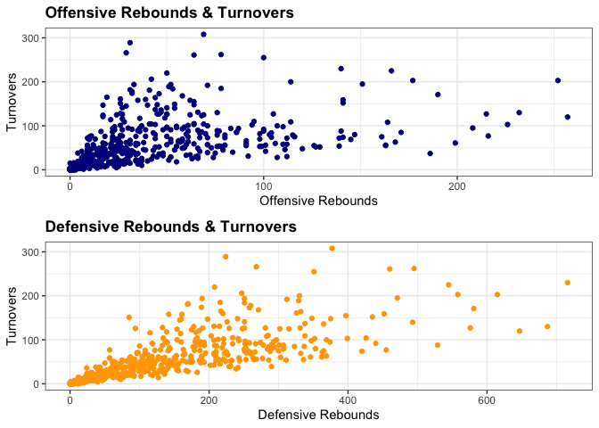

1) Loading the season data and extracting some meaningful statistics 
 - field goals made
 - three points made
 - free throws made
 - total rebounds
 - total points
 

```r
library(SportsAnalytics)

nba1920 <- fetch_NBAPlayerStatistics("19-20")

player_stat <- nba1920[, c("Name", "Team", "FieldGoalsMade", "ThreesMade", "FreeThrowsMade", "TotalRebounds",
                           "TotalPoints")]
```

2) Subsetting the data to include only players for LAL, the champion of 19-20 season and finding the players who are “best” for some meaningful stats.


```r
LAL_subset <- subset(nba1920, Team == 'LAL')
sub <- matrix(c(LAL_subset[which.max(LAL_subset$FieldGoalsMade), c("Name", "FieldGoalsMade")],
LAL_subset[which.max(LAL_subset$ThreesMade), c("Name", "ThreesMade")],
LAL_subset[which.max(LAL_subset$FreeThrowsMade), c("Name", "FreeThrowsMade")],
LAL_subset[which.max(LAL_subset$TotalRebounds), c("Name", "TotalRebounds")],
LAL_subset[which.max(LAL_subset$TotalPoints), c("Name", "TotalPoints")]), ncol = 2, byrow = TRUE)
colnames(sub) <- c("Player", "Statistics")
rownames(sub) <- c("Field Goals Made", "Three Points Made", "Free Throws Made", "Total Rebounds",
                   "Total Points")
sub
```

```
##                   Player          Statistics
## Field Goals Made  "Lebron James"  643       
## Three Points Made "Lebron James"  148       
## Free Throws Made  "Anthony Davis" 444       
## Total Rebounds    "Anthony Davis" 576       
## Total Points      "Lebron James"  1698
```

3) Showing 5 teams for the season that have the most wins in descending order.


```r
library(rvest)
```

```
## Loading required package: xml2
```

```r
reg_season1920 <- read_html("https://en.wikipedia.org/wiki/2019%E2%80%9320_NBA_season")
reg_season_data <- reg_season1920 %>% html_nodes("table.wikitable")

#By Division
East_ATL_Div <- (reg_season_data[2] %>% html_table)[[1]]  # Eastern Conference - Atlantic Division
East_CEN_Div <- (reg_season_data[3] %>% html_table)[[1]]  # Eastern Conference - Central Division
East_SOU_Div <- (reg_season_data[4] %>% html_table)[[1]]  # Eastern Conference - Southeast Division

West_NOR_Div <- (reg_season_data[5] %>% html_table)[[1]]  # Western Conference - Northwest Division
West_PAC_Div <- (reg_season_data[6] %>% html_table)[[1]]  # Western Conference - Pacific Division
West_SOU_Div <- (reg_season_data[7] %>% html_table)[[1]]  # Western Conference - Southhwest Division

#Getting rid of unnecessary indications on the Team names
East_ATL_Div$`Atlantic Division` <- gsub("y – ", "", East_ATL_Div$`Atlantic Division`)
East_ATL_Div$`Atlantic Division` <- gsub("x – ", "", East_ATL_Div$`Atlantic Division`)

East_CEN_Div$`Central Division` <- gsub("z – ", "", East_CEN_Div$`Central Division`)
East_CEN_Div$`Central Division` <- gsub("x – ", "", East_CEN_Div$`Central Division`)

East_SOU_Div$`Southeast Division` <- gsub("y – ", "", East_SOU_Div$`Southeast Division`)
East_SOU_Div$`Southeast Division` <- gsub("x – ", "", East_SOU_Div$`Southeast Division`)

West_NOR_Div$`Northwest Division` <- gsub("y – ", "", West_NOR_Div$`Northwest Division`)
West_NOR_Div$`Northwest Division` <- gsub("x – ", "", West_NOR_Div$`Northwest Division`)

West_PAC_Div$`Pacific Division` <- gsub("c – ", "", West_PAC_Div$`Pacific Division`)
West_PAC_Div$`Pacific Division` <- gsub("x – ", "", West_PAC_Div$`Pacific Division`)

West_SOU_Div$`Southwest Division` <- gsub("y – ", "", West_SOU_Div$`Southwest Division`)
West_SOU_Div$`Southwest Division` <- gsub("x – ", "", West_SOU_Div$`Southwest Division`)

East_ATL_Div
```

```
##    Atlantic Division  W  L   PCT   GB  Home  Road  Div GP
## 1    Toronto Raptors 53 19 0.736  0.0 26–10  27–9  9–5 72
## 2     Boston Celtics 48 24 0.667  5.0 26–10 22–14  9–6 72
## 3 Philadelphia 76ers 43 30 0.589 10.5  31–4 12–26 11–5 73
## 4      Brooklyn Nets 35 37 0.486 18.0 20–16 15–21 6–10 72
## 5    New York Knicks 21 45 0.318 29.0 11–22 10–23 2–11 66
```

```r
East_CEN_Div
```

```
##      Central Division  W  L   PCT   GB  Home  Road  Div GP
## 1     Milwaukee Bucks 56 17 0.767  0.0  30–5 26–12 13–1 73
## 2      Indiana Pacers 45 28 0.616 11.0 25–11 20–17  8–7 73
## 3       Chicago Bulls 22 43 0.338 30.0 14–20  8–23  7–9 65
## 4     Detroit Pistons 20 46 0.303 32.5 11–22  9–24 5–10 66
## 5 Cleveland Cavaliers 19 46 0.292 33.0 11–25  8–21 4–10 65
```

```r
East_SOU_Div
```

```
##   Southeast Division  W  L   PCT   GB  Home  Road  Div GP
## 1         Miami Heat 44 29 0.603  0.0  29–7 15–22 10–4 73
## 2      Orlando Magic 33 40 0.452 11.0 18–17 15–23  9–5 73
## 3 Washington Wizards 25 47 0.347 18.5 16–20  9–27  5–9 72
## 4  Charlotte Hornets 23 42 0.354 17.0 10–21 13–21  2–7 65
## 5      Atlanta Hawks 20 47 0.299 21.0 14–20  6–27  6–7 67
```

```r
West_NOR_Div
```

```
##       Northwest Division  W  L   PCT   GB  Home  Road  Div GP
## 1         Denver Nuggets 46 27 0.630  0.0 26–11 20–16 12–2 73
## 2  Oklahoma City Thunder 44 28 0.611  1.5 23–14 21–14  8–5 72
## 3              Utah Jazz 44 28 0.611  1.5 23–12 21–16  5–7 72
## 4 Portland Trail Blazers 35 39 0.473 11.5 21–15 14–24  5–8 74
## 5 Minnesota Timberwolves 19 45 0.297 22.5  8–24 11–21 2–10 64
```

```r
West_PAC_Div
```

```
##        Pacific Division  W  L   PCT   GB  Home  Road  Div GP
## 1    Los Angeles Lakers 52 19 0.732  0.0 25–10  27–9 10–3 71
## 2  Los Angeles Clippers 49 23 0.681  3.5  27–9 22–14  8–6 72
## 3          Phoenix Suns 34 39 0.466 19.0 17–22 17–17  6–9 73
## 4      Sacramento Kings 31 41 0.431 21.5 16–19 15–22  8–5 72
## 5 Golden State Warriors 15 50 0.231 34.0  8–26  7–24 2–11 65
```

```r
West_SOU_Div
```

```
##     Southwest Division  W  L   PCT   GB  Home  Road  Div GP
## 1      Houston Rockets 44 28 0.611  0.0 24–12 20–16  8–5 72
## 2     Dallas Mavericks 43 32 0.573  2.5 20–18 23–14 10–4 75
## 3    Memphis Grizzlies 34 39 0.466 10.5 20–17 14–22  4–9 73
## 4    San Antonio Spurs 32 39 0.451 11.5 19–15 13–24  7–6 71
## 5 New Orleans Pelicans 30 42 0.417 14.0 15–21 15–21  4–9 72
```

```r
#By Conference with top 5 teams
EastConf <- (reg_season_data[8] %>% html_table)[[1]][1:6,]  #6 rows needed due to the header name (conference)
WestConf <- (reg_season_data[9] %>% html_table)[[1]][1:6,]

colnames(EastConf) <- EastConf[1,]  #Make the appropriate column names for the table
EastConf <- EastConf[-1,]
rownames(EastConf) <- NULL

colnames(WestConf) <- WestConf[1,]
WestConf <- WestConf[-1,]
rownames(WestConf) <- NULL

EastConf$Team <- gsub("z – ", "", EastConf$Team)
EastConf$Team <- gsub("y – ", "", EastConf$Team)
EastConf$Team <- gsub("x – ", "", EastConf$Team)
EastConf$Team <- gsub("\\*", "", EastConf$Team)
EastConf$Team <- gsub("\\s", "", EastConf$Team)
EastConf$Team <- gsub("([a-z])([A-Z])", "\\1 \\2", EastConf$Team)

WestConf$Team <- gsub("c – ", "", WestConf$Team)
WestConf$Team <- gsub("x – ", "", WestConf$Team)
WestConf$Team <- gsub("y – ", "", WestConf$Team)
WestConf$Team <- gsub("\\*", "", WestConf$Team)
WestConf$Team <- gsub("\\s", "", WestConf$Team)
WestConf$Team <- gsub("([a-z])([A-Z])", "\\1 \\2", WestConf$Team)

EastConf
```

```
##   #            Team  W  L  PCT   GB GP
## 1 1 Milwaukee Bucks 56 17 .767    – 73
## 2 2 Toronto Raptors 53 19 .736  2.5 72
## 3 3  Boston Celtics 48 24 .667  7.5 72
## 4 4  Indiana Pacers 45 28 .616 11.0 73
## 5 5      Miami Heat 44 29 .603 12.0 73
```

```r
WestConf
```

```
##   #                  Team  W  L  PCT  GB GP
## 1 1    Los Angeles Lakers 52 19 .732   – 71
## 2 2  Los Angeles Clippers 49 23 .681 3.5 72
## 3 3        Denver Nuggets 46 27 .630 7.0 73
## 4 4       Houston Rockets 44 28 .611 8.5 72
## 5 5 Oklahoma City Thunder 44 28 .611 8.5 72
```

4) Creating data visualizations with NBA 19-29
i) Comparison between Eastern and Western in terms of five statistics that are previously selected


```r
library(ggplot2)
library(tidyr)

EastStat <- subset(player_stat, player_stat$Team == "MIL" | player_stat$Team == "TOR" | 
                     player_stat$Team == "BOS" | player_stat$Team == "IND" | player_stat$Team == "MIA" |
                     player_stat$Team == "PHI" | player_stat$Team == "BRO" | player_stat$Team == "ORL" |
                     player_stat$Team == "WAS" | player_stat$Team == "CHA" | player_stat$Team == "CHI" |
                     player_stat$Team == "NYK" | player_stat$Team == "DET" | player_stat$Team == "ATL" |
                     player_stat$Team == "CLE")
WestStat <- subset(player_stat, player_stat$Team == "LAL" | player_stat$Team == "LAC" | 
                     player_stat$Team == "DEN" | player_stat$Team == "HOU" | player_stat$Team == "OKL" |
                     player_stat$Team == "UTA" | player_stat$Team == "DAL" | player_stat$Team == "POR" |
                     player_stat$Team == "MEM" | player_stat$Team == "PHO" | player_stat$Team == "SAN" |
                     player_stat$Team == "SAC" | player_stat$Team == "NOR" | player_stat$Team == "MIN" |
                     player_stat$Team == "GSW")

EastStat$Conf <- "Eastern"
WestStat$Conf <- "Western"

AllConf <- rbind(EastStat, WestStat)

FGM_by_Conf <- setNames(aggregate(x = AllConf$FieldGoalsMade, by = list(AllConf$Conf), FUN = sum), 
                        c("Conference", "Field Goals Made"))
THR_by_Conf <- setNames(aggregate(x = AllConf$ThreesMade, by = list(AllConf$Conf), FUN = sum),
                        c("Conference", "Three Points Made"))
FTM_by_Conf <- setNames(aggregate(x = AllConf$FreeThrowsMade, by = list(AllConf$Conf), FUN = sum),
                        c("Conference", "Free Throws Made"))
TRB_by_Conf <- setNames(aggregate(x = AllConf$TotalRebounds, by = list(AllConf$Conf), FUN = sum),
                        c("Conference", "Total Rebounds"))
TP_by_Conf <- setNames(aggregate(x = AllConf$TotalPoints, by = list(AllConf$Conf), FUN = sum),
                       c("Conference", "Total Points"))

AllMerged <- merge(merge(merge(merge(FGM_by_Conf, THR_by_Conf), FTM_by_Conf), TRB_by_Conf), TP_by_Conf)

AllMergedGathered <- gather(AllMerged, Stats, Records, -Conference)
ggplot(AllMergedGathered, aes(x = Stats, y = Records, fill = factor(Conference))) + 
  geom_bar(stat = 'identity', position = 'dodge') + theme_minimal() + 
  scale_fill_discrete(name = "Conference") + 
  scale_fill_manual("Conference", values = c("Eastern" = "green", "Western" = "red")) + 
  theme(axis.text.x = element_text(face = "bold")) + theme(axis.text.y = element_text(face = "bold")) +
  ggtitle("Five Stats Comparison by Conference") + xlab('') + ylab('') +
  coord_flip()
```

```
## Scale for 'fill' is already present. Adding another scale for 'fill', which
## will replace the existing scale.
```

<!-- -->

The comparison above reflects every Eastern and Western conference team. As we can see, the Western statistics are slightly higher than the Eastern, but the difference does not seem to be meaningfully significant. Although it shows only the 19-20 season along with just five statistics, which are not enough to make a conclusion, as a general fan of NBA, I believe both conferences are the best basketball leagues in the world.

ii) Fouls by position of top 5 Western teams


```r
west_top5 <- subset(nba1920, nba1920$Team == "LAL" | nba1920$Team == "LAC" | nba1920$Team == "DEN" |
                      nba1920$Team == "HOU" | nba1920$Team == "OKL")

foul_by_pos <- west_top5[, c("Team", "Position", "PersonalFouls")]
ggplot(foul_by_pos, aes(x = Position, y = PersonalFouls, fill = Team)) + 
  geom_bar(stat = 'identity', position = 'dodge') + 
  ggtitle("Personal Fouls by Position of Top 5 Western Teams") + 
  scale_fill_manual("Team", values = c("DEN" = "navy blue", "HOU" = "red", "LAC" = "black", 
                                       "LAL" = "yellow", "OKL" = "orange")) +
  ylab("Number of Fouls") + theme_bw() + theme(plot.title = element_text(face = "bold"))
```

<!-- -->

The graph compares top 5 Western Conference teams in the season. Houston Rockets players committed many more fouls than other teams except Centers. By position, Centers and Power Forward similarly committed fouls except Houston Rockets, and LA Lakers Point Guards made the minimum fouls, while OKL City Thunder Small Forwards committed the minimum fouls. Lastly, the shooting guard of LA Clippers made the least fouls.

iii) Number of Views on NBA Final


```r
final_views <- read_html("https://en.wikipedia.org/wiki/NBA_Finals_television_ratings")
final_views_data <- final_views %>% html_nodes("table.wikitable")

views_by_year <- (final_views_data[2] %>% html_table(fill = TRUE))[[1]]
views_by_year <- views_by_year[, 1:ncol(views_by_year) - 1]

views_by_year$Year <- gsub('\\[a]', '', views_by_year$Year)

views_by_year$Avg <- gsub("[a-z]", "", views_by_year$Avg)
views_by_year$Avg <- gsub("[A-Z]", "", views_by_year$Avg)
views_by_year$Avg <- gsub(".*\\((.*)\\).*", "\\1", views_by_year$Avg)

views_by_year$Avg <- as.numeric(views_by_year$Avg)
```

```
## Warning: NAs introduced by coercion
```

```r
views_by_year$Year <- as.numeric(views_by_year$Year)

views_by_year <- views_by_year[1:35, ] #Before 1986, there's no data of number of views, so truncated
views_by_year$NumGame <- ifelse(views_by_year$`Game 5` == "No Game" & !is.na(views_by_year$`Game 5`), 
                                "Sweep", views_by_year$`Game 5`)
views_by_year$NumGame <- ifelse(views_by_year$`Game 5` != "No Game" & views_by_year$`Game 6` == "No Game" & 
                                  !is.na(views_by_year$`Game 6`), "5 Games", views_by_year$NumGame)
views_by_year$NumGame <- ifelse(views_by_year$`Game 5` != "No Game" & views_by_year$`Game 6` != "No Game" & 
                                  views_by_year$`Game 7` == "No Game" & !is.na(views_by_year$`Game 7`), 
                                "6 Games", views_by_year$NumGame)
views_by_year$NumGame <- ifelse(views_by_year$`Game 5` != "No Game" & views_by_year$`Game 6` != "No Game" & 
                                  views_by_year$`Game 7` != "No Game" & !is.na(views_by_year$`Game 7`), 
                                "7 Games", views_by_year$NumGame)

library(gridExtra)
a <- ggplot(views_by_year, aes(x = Year, y = Avg)) + geom_line(linetype = 'dashed') + geom_point() + 
  ggtitle("Number of Views on NBA Finals since 1986") + ylab("Average Views in Million") + theme_bw() +
  theme(plot.title = element_text(face = "bold"))

b <-ggplot(views_by_year, aes(x = Year, y = Avg, group = NumGame, colour = NumGame)) + geom_line(size = 1) + 
  ggtitle("Number of Views on NBA Finals since 1986 by Games") + ylab("Average Views in Million") +
  theme_bw() + theme(plot.title = element_text(face = "bold"))

grid.arrange(a, b, nrow = 2)
```

<!-- -->

Those graphs show the number of views on NBA Finals since 1986. Unfortunately, 2020 NBA final recorded the lowest views since 1986. NBA had a tough time in this year due to COVID-19, which seems to impact even the number of views on final games. Also, the number of views significantly dropped after 1990s. This seems to be due to the retirement of the greatest basket player, Michael Jordan (mostly retired in 90s as he retired several times). 

The second graph shows the number of views by number of final games. The sweep games are slightly less viewed than others, which means that the more final games, the higher likelihood of more views.

iv) Five NBA Star Players Stat Comparison


```r
star_players <- subset(nba1920, nba1920$Name == "Lebron James" | nba1920$Name == "G Antetokounmpo" |
                       nba1920$Name == "Anthony Davis" | nba1920$Name == "James Harden" | 
                       nba1920$Name == "Kawhi Leonard") 

TMP <- setNames(aggregate(x = star_players$TotalMinutesPlayed, by = list(star_players$Name), FUN = sum),
                c("Name", "Total Minutes Played"))
TP <- setNames(aggregate(x = star_players$TotalPoints, by = list(star_players$Name), FUN = sum),
               c("Name", "Total Points"))
TR <- setNames(aggregate(x = star_players$TotalRebounds, by = list(star_players$Name), FUN = sum),
                c("Name", "Total Rebound"))
FGM <- setNames(aggregate(x = star_players$FieldGoalsMade, by = list(star_players$Name), FUN = sum),
                c("Name", "Field Goals Made"))

AllMerged2 <- merge(merge(merge(TMP, TP), TR), FGM)

AllMerged2_gathered <- gather(AllMerged2, Stats, Records, -Name)

ggplot(AllMerged2_gathered, aes(x = Stats, y = Records, group = Name, colour = Name)) + 
  geom_line(size = 1) + geom_point(color = 'black') + theme_bw() + 
  ggtitle("Five NBA Star Players Stat Comparison") + scale_fill_discrete(name = "Players") +
  theme(axis.text.x = element_text(angle = 45, face = "bold")) + xlab(NULL) + ylab(NULL) + 
  theme(plot.title = element_text(face = "bold"))
```

<!-- -->

We can see that James Harden performed the best except the total rebound. As his three points and total points are dominating the other players, he seems to deserve to be the best scorer in this season. Also, compared to the total minutes played, Giannis Antetokounmpo made more scores than the majority did and dominated the total rebound statistic as well. Lastly and impressively, despite his age, Lebron James still performs so well that his statistics are either 2nd or 3rd among the star players.

v) LAL 2020 starting lineup players stat comparison


```r
library(fmsb)

LAL_lineups <- nba1920[nba1920$Name == "Alex Caruso" | nba1920$Name == "Anthony Davis" | nba1920$Name == "Danny Green" | 
                  nba1920$Name == "K Caldwell-pope" | nba1920$Name == "Lebron James", 
                  c("TotalMinutesPlayed", "FieldGoalsMade", "FieldGoalsAttempted", "ThreesMade", "ThreesAttempted", "FreeThrowsMade", 
                    "FreeThrowsAttempted", "TotalRebounds", "Assists", "Steals", "Turnovers", "Blocks", "PersonalFouls")]
LAL_lineups$`Field Goal%` <- LAL_lineups$FieldGoalsMade / LAL_lineups$FieldGoalsAttempted * 100
LAL_lineups$`3P%` <- LAL_lineups$ThreesMade / LAL_lineups$ThreesAttempted * 100
LAL_lineups$`Free Thr%` <- LAL_lineups$FreeThrowsMade / LAL_lineups$FreeThrowsAttempted * 100
LAL_lineups <- LAL_lineups[c("TotalMinutesPlayed", "Field Goal%", "3P%", "Free Thr%",
                             "TotalRebounds", "Assists", "Steals", "Turnovers", "Blocks", "PersonalFouls")]
rownames(LAL_lineups) <- c("K Caldwell-pope", "Alex Caruso", "Anthony Davis", "Danny Green", "Lebron James")
colnames(LAL_lineups) <- c("PlayMinutes", "Field Goal%", "3P%", "Free Thr%", "Rebounds", "Assists", "Steals", "Turnovers", "Blocks",
                           "Fouls")
LAL_lineups <- rbind(c(2500, 100, 100, 100, 550, 700, 100, 280, 150, 170), c(1000, 0, 0, 0, 100, 80, 50, 50, 10, 80), LAL_lineups)

par(mfrow = c(2,3))
radarchart(LAL_lineups[1:3, ], title = "K Caldwell-pope (SG)", axistype = 2, pcol=rgb(0.2,0.5,0.5,0.9), pfcol=rgb(0.2,0.5,0.5,0.5),
           plwd=4, cglcol="grey", cglty=1, axislabcol="purple")
radarchart(LAL_lineups[c(1,2,4),], title = "Alex Caruso (PG)", axistype = 2, pcol=rgb(0.8,0.2,0.5,0.9), pfcol=rgb(0.8,0.2,0.5,0.5), 
           plwd=4, cglcol="grey", cglty=1, axislabcol="purple")
radarchart(LAL_lineups[c(1,2,5),], title = "Anthony Davis (PF)", axistype = 2, pcol=rgb(0.7,0.5,0.1,0.9), pfcol=rgb(0.7,0.5,0.1,0.5), 
           plwd=4, cglcol="grey", cglty=1, axislabcol="purple")
radarchart(LAL_lineups[c(1,2,6),], title = "Danny Green (SF)", axistype = 2, pcol=rgb(0.2,0.8,0.4,0.9), pfcol=rgb(0.2,0.8,0.4,0.5), 
           plwd=4, cglcol="grey", cglty=1, axislabcol="purple")
radarchart(LAL_lineups[c(1,2,7),], title = "Lebron James (PG)", axistype = 2, pcol=rgb(0.9,0.4,0.3,0.9), pfcol=rgb(0.9,0.4,0.3,0.5), 
           plwd=4, cglcol="grey", cglty=1, axislabcol="purple")
par(mfrow = c(1,1))
```

<!-- -->

The radar charts concern 10 statistics in order to assess each position of LA Lakers starting lineup. 
- Total minutes played
- % of field goals success (field goals made / attempts)
- % of three points success (3P made / attempts)
- % of free throws success (free throws made / attempts)
- Total rebounds
- Assists
- Steals
- Turnovers
- Blocks
- Fouls

vi) Offensive Rebounds vs Defensive Rebounds for Turnovers


```r
nba1920$DefensiveRebounds <- nba1920$TotalRebounds - nba1920$OffensiveRebounds  

x <- ggplot(nba1920, aes(x = OffensiveRebounds, y = Turnovers)) + geom_point(color = "dark blue") + 
  theme_bw() + ggtitle("Offensive Rebounds & Turnovers") + xlab("Offensive Rebounds") + 
  theme(plot.title = element_text(face = "bold"))

y <- ggplot(nba1920, aes(x = DefensiveRebounds, y = Turnovers)) + geom_point(color = "orange") + 
  theme_bw() + ggtitle("Defensive Rebounds & Turnovers") + xlab("Defensive Rebounds") + 
  theme(plot.title = element_text(face = "bold"))

grid.arrange(x,y, nrow = 2)
```

<!-- -->

There are two kinds of rebounds: offensive and defensive. Offensive rebounds mean that the offensive side recovered the ball so that they keep possessing their turn, while defensive rebounds mean that the defending side gains the possession and the turn changes. Regardless of the types of rebounds, generally the more rebounds the more turnovers. However, if we take a deeper look inside with these two separate rebound types, defensive rebounds have more strong correlation with turnovers than offensive rebounds do. This implies that if the team fails in offensive rebounds, turnovers are more likely to occur than in case the team fails in defensive rebounds.

5) Displaying the home locations of the last 10 champions of the league with GoogleVis


```r
library(googleVis)
```

```
## Creating a generic function for 'toJSON' from package 'jsonlite' in package 'googleVis'
```

```
## 
## Welcome to googleVis version 0.6.6
## 
## Please read Google's Terms of Use
## before you start using the package:
## https://developers.google.com/terms/
## 
## Note, the plot method of googleVis will by default use
## the standard browser to display its output.
## 
## See the googleVis package vignettes for more details,
## or visit https://github.com/mages/googleVis.
## 
## To suppress this message use:
## suppressPackageStartupMessages(library(googleVis))
```

```r
library(dplyr)
```

```
## 
## Attaching package: 'dplyr'
```

```
## The following object is masked from 'package:gridExtra':
## 
##     combine
```

```
## The following objects are masked from 'package:stats':
## 
##     filter, lag
```

```
## The following objects are masked from 'package:base':
## 
##     intersect, setdiff, setequal, union
```

```r
library(tmap)
library(tmaptools)

NBA_Champs <- read_html("https://en.wikipedia.org/wiki/List_of_NBA_champions")
NBA_Champs_data <- NBA_Champs %>% html_nodes("table.wikitable")

Champs <- (NBA_Champs_data[2] %>% html_table())[[1]]
Champs <- tail(Champs, 10) %>% select(Year,`Western champion`,Result,`Eastern champion`)

Champs$`Eastern champion` <- gsub("\\s.*", "", Champs$`Eastern champion`)
Champs$`Western champion` <- gsub("^(\\S*\\s+\\S+).*", "\\1", Champs$`Western champion`)
Champs$`Western champion` <- gsub("Golden State", "San Francisco", Champs$`Western champion`)
Champs$`Western champion` <- gsub("Mavericks", "", Champs$`Western champion`)

Champs$WestWins <- as.numeric(substr(Champs$Result,1,1))
Champs$EastWins <- as.numeric(substr(Champs$Result,3,3))
Champs$Winner <- ifelse(Champs$WestWins > Champs$EastWins, Champs$`Western champion`, Champs$`Eastern champion`)

latlong <- geocode_OSM(unique(Champs$Winner))
latlong <- as_tibble(latlong) %>% rename(Winner = query)

newChamps <- Champs %>% inner_join(latlong)
```

```
## Joining, by = "Winner"
```

```r
newChamps$LatLong <- paste(as.character(newChamps$lat), as.character(newChamps$lon), sep = ":")
newChamps$state <- c("Texas", "Florida", "Florida", "Texas", "California", "Ohio", rep("California", 2),
                     "Ontario", "California")

stateChart <- gvisGeoChart(newChamps, "state",
                           options = list(region = "US", resolution = 'provinces'))
cityChart <- gvisGeoChart(newChamps, "LatLong",
                          options = list(region = "US", resolution = 'provinces'))

plot(stateChart)
```

```
## starting httpd help server ...
```

```
##  done
```

```r
plot(cityChart)
```

The locations of NBA champions from 2011 to 2020 are presented with googleVis. There are some duplicated areas along with one region in Canada. I plotted two maps (state vs cities) for better understanding. Note that the state map does not indicate Toronto as it’s Canadian region, but the city map shows all the locations by using the longitudes and latitudes.

6) Simple Linear Regression for Total Points by Field Goals Attempted (See comments for the equation)

```r
cor(nba1920$FieldGoalsAttempted, nba1920$TotalPoints)  #Field Goals Attempted has a high correlation coefficient with total points
```

```
## [1] 0.9895421
```

```r
m <- lm(TotalPoints~FieldGoalsAttempted, data = nba1920)
summary(m)    #The equation of the model is y = -14.131 + 1.3x, meaning that each field goal attempt increases 1.3 total points
```

```
## 
## Call:
## lm(formula = TotalPoints ~ FieldGoalsAttempted, data = nba1920)
## 
## Residuals:
##     Min      1Q  Median      3Q     Max 
## -190.44  -30.25    3.61   18.11  383.42 
## 
## Coefficients:
##                       Estimate Std. Error t value Pr(>|t|)    
## (Intercept)         -14.130523   3.970253  -3.559 0.000406 ***
## FieldGoalsAttempted   1.298354   0.008244 157.485  < 2e-16 ***
## ---
## Signif. codes:  0 '***' 0.001 '**' 0.01 '*' 0.05 '.' 0.1 ' ' 1
## 
## Residual standard error: 61.57 on 527 degrees of freedom
## Multiple R-squared:  0.9792,	Adjusted R-squared:  0.9792 
## F-statistic: 2.48e+04 on 1 and 527 DF,  p-value: < 2.2e-16
```

```r
ggplot(nba1920,aes(x = FieldGoalsAttempted, y = TotalPoints)) + geom_point(color = 'dark blue') +
  geom_smooth(method = "lm", color = 'orange') + theme_bw() + 
  ggtitle("Field Goals Attempted and Total Points") + xlab("Field Goals Attempted") +
  ylab("Total Points") + theme(plot.title = element_text(face = "bold"))
```

```
## `geom_smooth()` using formula 'y ~ x'
```

<!-- -->

Also, below is the interactive plot with ggPredict() for this simple linear regression.

```r
library(ggiraph)
library(ggiraphExtra)
library(plyr)
```

```
## ------------------------------------------------------------------------------
```

```
## You have loaded plyr after dplyr - this is likely to cause problems.
## If you need functions from both plyr and dplyr, please load plyr first, then dplyr:
## library(plyr); library(dplyr)
```

```
## ------------------------------------------------------------------------------
```

```
## 
## Attaching package: 'plyr'
```

```
## The following objects are masked from 'package:dplyr':
## 
##     arrange, count, desc, failwith, id, mutate, rename, summarise,
##     summarize
```

```r
ggPredict(m, se = TRUE, interactive = TRUE)
```

<!--html_preserve--><div id="htmlwidget-4c7a4b428da531d3844e" style="width:672px;height:480px;" class="girafe html-widget"></div>
<script type="application/json" data-for="htmlwidget-4c7a4b428da531d3844e">{"x":{"html":"<?xml version=\"1.0\" encoding=\"UTF-8\"?>\n<svg xmlns='http://www.w3.org/2000/svg' xmlns:xlink='http://www.w3.org/1999/xlink' id='svg_c9cc99f1-e79a-4700-b6d8-88681c277482' viewBox='0 0 432.00 360.00'>\n  <g>\n    <defs>\n      <clipPath id='svg_c9cc99f1-e79a-4700-b6d8-88681c277482_cl_1'>\n        <rect x='0.00' y='0.00' width='432.00' height='360.00'/>\n      <\/clipPath>\n    <\/defs>\n    <rect x='0.00' y='0.00' width='432.00' height='360.00' id='svg_c9cc99f1-e79a-4700-b6d8-88681c277482_el_1' clip-path='url(#svg_c9cc99f1-e79a-4700-b6d8-88681c277482_cl_1)' fill='#FFFFFF' fill-opacity='1' stroke='#FFFFFF' stroke-opacity='1' stroke-width='0.75' stroke-linejoin='round' stroke-linecap='round'/>\n    <defs>\n      <clipPath id='svg_c9cc99f1-e79a-4700-b6d8-88681c277482_cl_2'>\n        <rect x='0.00' y='0.00' width='432.00' height='360.00'/>\n      <\/clipPath>\n    <\/defs>\n    <rect x='0.00' y='0.00' width='432.00' height='360.00' id='svg_c9cc99f1-e79a-4700-b6d8-88681c277482_el_2' clip-path='url(#svg_c9cc99f1-e79a-4700-b6d8-88681c277482_cl_2)' fill='#FFFFFF' fill-opacity='1' stroke='#FFFFFF' stroke-opacity='1' stroke-width='1.07' stroke-linejoin='round' stroke-linecap='round'/>\n    <defs>\n      <clipPath id='svg_c9cc99f1-e79a-4700-b6d8-88681c277482_cl_3'>\n        <rect x='43.05' y='5.48' width='383.47' height='322.79'/>\n      <\/clipPath>\n    <\/defs>\n    <rect x='43.05' y='5.48' width='383.47' height='322.79' id='svg_c9cc99f1-e79a-4700-b6d8-88681c277482_el_3' clip-path='url(#svg_c9cc99f1-e79a-4700-b6d8-88681c277482_cl_3)' fill='#EBEBEB' fill-opacity='1' stroke='none'/>\n    <polyline points='43.05,280.16 426.52,280.16' id='svg_c9cc99f1-e79a-4700-b6d8-88681c277482_el_4' clip-path='url(#svg_c9cc99f1-e79a-4700-b6d8-88681c277482_cl_3)' fill='none' stroke='#FFFFFF' stroke-opacity='1' stroke-width='0.53' stroke-linejoin='round' stroke-linecap='butt'/>\n    <polyline points='43.05,217.81 426.52,217.81' id='svg_c9cc99f1-e79a-4700-b6d8-88681c277482_el_5' clip-path='url(#svg_c9cc99f1-e79a-4700-b6d8-88681c277482_cl_3)' fill='none' stroke='#FFFFFF' stroke-opacity='1' stroke-width='0.53' stroke-linejoin='round' stroke-linecap='butt'/>\n    <polyline points='43.05,155.46 426.52,155.46' id='svg_c9cc99f1-e79a-4700-b6d8-88681c277482_el_6' clip-path='url(#svg_c9cc99f1-e79a-4700-b6d8-88681c277482_cl_3)' fill='none' stroke='#FFFFFF' stroke-opacity='1' stroke-width='0.53' stroke-linejoin='round' stroke-linecap='butt'/>\n    <polyline points='43.05,93.10 426.52,93.10' id='svg_c9cc99f1-e79a-4700-b6d8-88681c277482_el_7' clip-path='url(#svg_c9cc99f1-e79a-4700-b6d8-88681c277482_cl_3)' fill='none' stroke='#FFFFFF' stroke-opacity='1' stroke-width='0.53' stroke-linejoin='round' stroke-linecap='butt'/>\n    <polyline points='43.05,30.75 426.52,30.75' id='svg_c9cc99f1-e79a-4700-b6d8-88681c277482_el_8' clip-path='url(#svg_c9cc99f1-e79a-4700-b6d8-88681c277482_cl_3)' fill='none' stroke='#FFFFFF' stroke-opacity='1' stroke-width='0.53' stroke-linejoin='round' stroke-linecap='butt'/>\n    <polyline points='114.95,328.27 114.95,5.48' id='svg_c9cc99f1-e79a-4700-b6d8-88681c277482_el_9' clip-path='url(#svg_c9cc99f1-e79a-4700-b6d8-88681c277482_cl_3)' fill='none' stroke='#FFFFFF' stroke-opacity='1' stroke-width='0.53' stroke-linejoin='round' stroke-linecap='butt'/>\n    <polyline points='223.89,328.27 223.89,5.48' id='svg_c9cc99f1-e79a-4700-b6d8-88681c277482_el_10' clip-path='url(#svg_c9cc99f1-e79a-4700-b6d8-88681c277482_cl_3)' fill='none' stroke='#FFFFFF' stroke-opacity='1' stroke-width='0.53' stroke-linejoin='round' stroke-linecap='butt'/>\n    <polyline points='332.83,328.27 332.83,5.48' id='svg_c9cc99f1-e79a-4700-b6d8-88681c277482_el_11' clip-path='url(#svg_c9cc99f1-e79a-4700-b6d8-88681c277482_cl_3)' fill='none' stroke='#FFFFFF' stroke-opacity='1' stroke-width='0.53' stroke-linejoin='round' stroke-linecap='butt'/>\n    <polyline points='43.05,311.34 426.52,311.34' id='svg_c9cc99f1-e79a-4700-b6d8-88681c277482_el_12' clip-path='url(#svg_c9cc99f1-e79a-4700-b6d8-88681c277482_cl_3)' fill='none' stroke='#FFFFFF' stroke-opacity='1' stroke-width='1.07' stroke-linejoin='round' stroke-linecap='butt'/>\n    <polyline points='43.05,248.99 426.52,248.99' id='svg_c9cc99f1-e79a-4700-b6d8-88681c277482_el_13' clip-path='url(#svg_c9cc99f1-e79a-4700-b6d8-88681c277482_cl_3)' fill='none' stroke='#FFFFFF' stroke-opacity='1' stroke-width='1.07' stroke-linejoin='round' stroke-linecap='butt'/>\n    <polyline points='43.05,186.63 426.52,186.63' id='svg_c9cc99f1-e79a-4700-b6d8-88681c277482_el_14' clip-path='url(#svg_c9cc99f1-e79a-4700-b6d8-88681c277482_cl_3)' fill='none' stroke='#FFFFFF' stroke-opacity='1' stroke-width='1.07' stroke-linejoin='round' stroke-linecap='butt'/>\n    <polyline points='43.05,124.28 426.52,124.28' id='svg_c9cc99f1-e79a-4700-b6d8-88681c277482_el_15' clip-path='url(#svg_c9cc99f1-e79a-4700-b6d8-88681c277482_cl_3)' fill='none' stroke='#FFFFFF' stroke-opacity='1' stroke-width='1.07' stroke-linejoin='round' stroke-linecap='butt'/>\n    <polyline points='43.05,61.93 426.52,61.93' id='svg_c9cc99f1-e79a-4700-b6d8-88681c277482_el_16' clip-path='url(#svg_c9cc99f1-e79a-4700-b6d8-88681c277482_cl_3)' fill='none' stroke='#FFFFFF' stroke-opacity='1' stroke-width='1.07' stroke-linejoin='round' stroke-linecap='butt'/>\n    <polyline points='60.48,328.27 60.48,5.48' id='svg_c9cc99f1-e79a-4700-b6d8-88681c277482_el_17' clip-path='url(#svg_c9cc99f1-e79a-4700-b6d8-88681c277482_cl_3)' fill='none' stroke='#FFFFFF' stroke-opacity='1' stroke-width='1.07' stroke-linejoin='round' stroke-linecap='butt'/>\n    <polyline points='169.42,328.27 169.42,5.48' id='svg_c9cc99f1-e79a-4700-b6d8-88681c277482_el_18' clip-path='url(#svg_c9cc99f1-e79a-4700-b6d8-88681c277482_cl_3)' fill='none' stroke='#FFFFFF' stroke-opacity='1' stroke-width='1.07' stroke-linejoin='round' stroke-linecap='butt'/>\n    <polyline points='278.36,328.27 278.36,5.48' id='svg_c9cc99f1-e79a-4700-b6d8-88681c277482_el_19' clip-path='url(#svg_c9cc99f1-e79a-4700-b6d8-88681c277482_cl_3)' fill='none' stroke='#FFFFFF' stroke-opacity='1' stroke-width='1.07' stroke-linejoin='round' stroke-linecap='butt'/>\n    <polyline points='387.30,328.27 387.30,5.48' id='svg_c9cc99f1-e79a-4700-b6d8-88681c277482_el_20' clip-path='url(#svg_c9cc99f1-e79a-4700-b6d8-88681c277482_cl_3)' fill='none' stroke='#FFFFFF' stroke-opacity='1' stroke-width='1.07' stroke-linejoin='round' stroke-linecap='butt'/>\n    <polygon points='60.48,312.61 82.27,296.48 104.06,280.35 125.85,264.19 147.63,248.00 169.42,231.78 191.21,215.54 213.00,199.28 234.79,183.01 256.57,166.73 278.36,150.45 300.15,134.16 321.94,117.88 343.73,101.59 365.51,85.30 387.30,69.01 409.09,52.72 409.09,55.36 387.30,71.46 365.51,87.55 343.73,103.64 321.94,119.74 300.15,135.83 278.36,151.93 256.57,168.03 234.79,184.14 213.00,200.25 191.21,216.37 169.42,232.51 147.63,248.67 125.85,264.87 104.06,281.09 82.27,297.33 60.48,313.60' id='svg_c9cc99f1-e79a-4700-b6d8-88681c277482_el_21' clip-path='url(#svg_c9cc99f1-e79a-4700-b6d8-88681c277482_cl_3)' fill='#333333' fill-opacity='0.2' stroke='none'/>\n    <polyline points='60.48,312.61 82.27,296.48 104.06,280.35 125.85,264.19 147.63,248.00 169.42,231.78 191.21,215.54 213.00,199.28 234.79,183.01 256.57,166.73 278.36,150.45 300.15,134.16 321.94,117.88 343.73,101.59 365.51,85.30 387.30,69.01 409.09,52.72' id='svg_c9cc99f1-e79a-4700-b6d8-88681c277482_el_22' clip-path='url(#svg_c9cc99f1-e79a-4700-b6d8-88681c277482_cl_3)' fill='none' stroke='none'/>\n    <polyline points='409.09,55.36 387.30,71.46 365.51,87.55 343.73,103.64 321.94,119.74 300.15,135.83 278.36,151.93 256.57,168.03 234.79,184.14 213.00,200.25 191.21,216.37 169.42,232.51 147.63,248.67 125.85,264.87 104.06,281.09 82.27,297.33 60.48,313.60' id='svg_c9cc99f1-e79a-4700-b6d8-88681c277482_el_23' clip-path='url(#svg_c9cc99f1-e79a-4700-b6d8-88681c277482_cl_3)' fill='none' stroke='none'/>\n    <circle cx='164.63' cy='226.04' r='1.47pt' id='svg_c9cc99f1-e79a-4700-b6d8-88681c277482_el_24' clip-path='url(#svg_c9cc99f1-e79a-4700-b6d8-88681c277482_cl_3)' fill='#000000' fill-opacity='1' stroke='#000000' stroke-opacity='1' stroke-width='0.71' stroke-linejoin='round' stroke-linecap='round' data-id='1' title='1&amp;lt;br&amp;gt;FieldGoalsAttempted=478&amp;lt;br&amp;gt;TotalPoints=684'/>\n    <circle cx='232.82' cy='168.43' r='1.47pt' id='svg_c9cc99f1-e79a-4700-b6d8-88681c277482_el_25' clip-path='url(#svg_c9cc99f1-e79a-4700-b6d8-88681c277482_cl_3)' fill='#000000' fill-opacity='1' stroke='#000000' stroke-opacity='1' stroke-width='0.71' stroke-linejoin='round' stroke-linecap='round' data-id='2' title='2&amp;lt;br&amp;gt;FieldGoalsAttempted=791&amp;lt;br&amp;gt;TotalPoints=1146'/>\n    <circle cx='233.48' cy='186.51' r='1.47pt' id='svg_c9cc99f1-e79a-4700-b6d8-88681c277482_el_26' clip-path='url(#svg_c9cc99f1-e79a-4700-b6d8-88681c277482_cl_3)' fill='#000000' fill-opacity='1' stroke='#000000' stroke-opacity='1' stroke-width='0.71' stroke-linejoin='round' stroke-linecap='round' data-id='3' title='3&amp;lt;br&amp;gt;FieldGoalsAttempted=794&amp;lt;br&amp;gt;TotalPoints=1001'/>\n    <circle cx='60.92' cy='311.09' r='1.47pt' id='svg_c9cc99f1-e79a-4700-b6d8-88681c277482_el_27' clip-path='url(#svg_c9cc99f1-e79a-4700-b6d8-88681c277482_cl_3)' fill='#000000' fill-opacity='1' stroke='#000000' stroke-opacity='1' stroke-width='0.71' stroke-linejoin='round' stroke-linecap='round' data-id='4' title='4&amp;lt;br&amp;gt;FieldGoalsAttempted=2&amp;lt;br&amp;gt;TotalPoints=2'/>\n    <circle cx='118.44' cy='278.04' r='1.47pt' id='svg_c9cc99f1-e79a-4700-b6d8-88681c277482_el_28' clip-path='url(#svg_c9cc99f1-e79a-4700-b6d8-88681c277482_cl_3)' fill='#000000' fill-opacity='1' stroke='#000000' stroke-opacity='1' stroke-width='0.71' stroke-linejoin='round' stroke-linecap='round' data-id='5' title='5&amp;lt;br&amp;gt;FieldGoalsAttempted=266&amp;lt;br&amp;gt;TotalPoints=267'/>\n    <circle cx='115.17' cy='270.19' r='1.47pt' id='svg_c9cc99f1-e79a-4700-b6d8-88681c277482_el_29' clip-path='url(#svg_c9cc99f1-e79a-4700-b6d8-88681c277482_cl_3)' fill='#000000' fill-opacity='1' stroke='#000000' stroke-opacity='1' stroke-width='0.71' stroke-linejoin='round' stroke-linecap='round' data-id='6' title='6&amp;lt;br&amp;gt;FieldGoalsAttempted=251&amp;lt;br&amp;gt;TotalPoints=330'/>\n    <circle cx='161.80' cy='214.69' r='1.47pt' id='svg_c9cc99f1-e79a-4700-b6d8-88681c277482_el_30' clip-path='url(#svg_c9cc99f1-e79a-4700-b6d8-88681c277482_cl_3)' fill='#000000' fill-opacity='1' stroke='#000000' stroke-opacity='1' stroke-width='0.71' stroke-linejoin='round' stroke-linecap='round' data-id='7' title='7&amp;lt;br&amp;gt;FieldGoalsAttempted=465&amp;lt;br&amp;gt;TotalPoints=775'/>\n    <circle cx='70.07' cy='305.10' r='1.47pt' id='svg_c9cc99f1-e79a-4700-b6d8-88681c277482_el_31' clip-path='url(#svg_c9cc99f1-e79a-4700-b6d8-88681c277482_cl_3)' fill='#000000' fill-opacity='1' stroke='#000000' stroke-opacity='1' stroke-width='0.71' stroke-linejoin='round' stroke-linecap='round' data-id='8' title='8&amp;lt;br&amp;gt;FieldGoalsAttempted=44&amp;lt;br&amp;gt;TotalPoints=50'/>\n    <circle cx='79.22' cy='301.61' r='1.47pt' id='svg_c9cc99f1-e79a-4700-b6d8-88681c277482_el_32' clip-path='url(#svg_c9cc99f1-e79a-4700-b6d8-88681c277482_cl_3)' fill='#000000' fill-opacity='1' stroke='#000000' stroke-opacity='1' stroke-width='0.71' stroke-linejoin='round' stroke-linecap='round' data-id='9' title='9&amp;lt;br&amp;gt;FieldGoalsAttempted=86&amp;lt;br&amp;gt;TotalPoints=78'/>\n    <circle cx='68.76' cy='307.85' r='1.47pt' id='svg_c9cc99f1-e79a-4700-b6d8-88681c277482_el_33' clip-path='url(#svg_c9cc99f1-e79a-4700-b6d8-88681c277482_cl_3)' fill='#000000' fill-opacity='1' stroke='#000000' stroke-opacity='1' stroke-width='0.71' stroke-linejoin='round' stroke-linecap='round' data-id='10' title='10&amp;lt;br&amp;gt;FieldGoalsAttempted=38&amp;lt;br&amp;gt;TotalPoints=28'/>\n    <circle cx='132.60' cy='262.70' r='1.47pt' id='svg_c9cc99f1-e79a-4700-b6d8-88681c277482_el_34' clip-path='url(#svg_c9cc99f1-e79a-4700-b6d8-88681c277482_cl_3)' fill='#000000' fill-opacity='1' stroke='#000000' stroke-opacity='1' stroke-width='0.71' stroke-linejoin='round' stroke-linecap='round' data-id='11' title='11&amp;lt;br&amp;gt;FieldGoalsAttempted=331&amp;lt;br&amp;gt;TotalPoints=390'/>\n    <circle cx='62.01' cy='310.71' r='1.47pt' id='svg_c9cc99f1-e79a-4700-b6d8-88681c277482_el_35' clip-path='url(#svg_c9cc99f1-e79a-4700-b6d8-88681c277482_cl_3)' fill='#000000' fill-opacity='1' stroke='#000000' stroke-opacity='1' stroke-width='0.71' stroke-linejoin='round' stroke-linecap='round' data-id='12' title='12&amp;lt;br&amp;gt;FieldGoalsAttempted=7&amp;lt;br&amp;gt;TotalPoints=5'/>\n    <circle cx='330.22' cy='79.76' r='1.47pt' id='svg_c9cc99f1-e79a-4700-b6d8-88681c277482_el_36' clip-path='url(#svg_c9cc99f1-e79a-4700-b6d8-88681c277482_cl_3)' fill='#000000' fill-opacity='1' stroke='#000000' stroke-opacity='1' stroke-width='0.71' stroke-linejoin='round' stroke-linecap='round' data-id='13' title='13&amp;lt;br&amp;gt;FieldGoalsAttempted=1238&amp;lt;br&amp;gt;TotalPoints=1857'/>\n    <circle cx='61.13' cy='310.47' r='1.47pt' id='svg_c9cc99f1-e79a-4700-b6d8-88681c277482_el_37' clip-path='url(#svg_c9cc99f1-e79a-4700-b6d8-88681c277482_cl_3)' fill='#000000' fill-opacity='1' stroke='#000000' stroke-opacity='1' stroke-width='0.71' stroke-linejoin='round' stroke-linecap='round' data-id='14' title='14&amp;lt;br&amp;gt;FieldGoalsAttempted=3&amp;lt;br&amp;gt;TotalPoints=7'/>\n    <circle cx='70.94' cy='304.48' r='1.47pt' id='svg_c9cc99f1-e79a-4700-b6d8-88681c277482_el_38' clip-path='url(#svg_c9cc99f1-e79a-4700-b6d8-88681c277482_cl_3)' fill='#000000' fill-opacity='1' stroke='#000000' stroke-opacity='1' stroke-width='0.71' stroke-linejoin='round' stroke-linecap='round' data-id='15' title='15&amp;lt;br&amp;gt;FieldGoalsAttempted=48&amp;lt;br&amp;gt;TotalPoints=55'/>\n    <circle cx='230.86' cy='199.73' r='1.47pt' id='svg_c9cc99f1-e79a-4700-b6d8-88681c277482_el_39' clip-path='url(#svg_c9cc99f1-e79a-4700-b6d8-88681c277482_cl_3)' fill='#000000' fill-opacity='1' stroke='#000000' stroke-opacity='1' stroke-width='0.71' stroke-linejoin='round' stroke-linecap='round' data-id='16' title='16&amp;lt;br&amp;gt;FieldGoalsAttempted=782&amp;lt;br&amp;gt;TotalPoints=895'/>\n    <circle cx='183.80' cy='219.93' r='1.47pt' id='svg_c9cc99f1-e79a-4700-b6d8-88681c277482_el_40' clip-path='url(#svg_c9cc99f1-e79a-4700-b6d8-88681c277482_cl_3)' fill='#000000' fill-opacity='1' stroke='#000000' stroke-opacity='1' stroke-width='0.71' stroke-linejoin='round' stroke-linecap='round' data-id='17' title='17&amp;lt;br&amp;gt;FieldGoalsAttempted=566&amp;lt;br&amp;gt;TotalPoints=733'/>\n    <circle cx='108.41' cy='278.79' r='1.47pt' id='svg_c9cc99f1-e79a-4700-b6d8-88681c277482_el_41' clip-path='url(#svg_c9cc99f1-e79a-4700-b6d8-88681c277482_cl_3)' fill='#000000' fill-opacity='1' stroke='#000000' stroke-opacity='1' stroke-width='0.71' stroke-linejoin='round' stroke-linecap='round' data-id='18' title='18&amp;lt;br&amp;gt;FieldGoalsAttempted=220&amp;lt;br&amp;gt;TotalPoints=261'/>\n    <circle cx='131.07' cy='258.59' r='1.47pt' id='svg_c9cc99f1-e79a-4700-b6d8-88681c277482_el_42' clip-path='url(#svg_c9cc99f1-e79a-4700-b6d8-88681c277482_cl_3)' fill='#000000' fill-opacity='1' stroke='#000000' stroke-opacity='1' stroke-width='0.71' stroke-linejoin='round' stroke-linecap='round' data-id='19' title='19&amp;lt;br&amp;gt;FieldGoalsAttempted=324&amp;lt;br&amp;gt;TotalPoints=423'/>\n    <circle cx='160.92' cy='236.64' r='1.47pt' id='svg_c9cc99f1-e79a-4700-b6d8-88681c277482_el_43' clip-path='url(#svg_c9cc99f1-e79a-4700-b6d8-88681c277482_cl_3)' fill='#000000' fill-opacity='1' stroke='#000000' stroke-opacity='1' stroke-width='0.71' stroke-linejoin='round' stroke-linecap='round' data-id='20' title='20&amp;lt;br&amp;gt;FieldGoalsAttempted=461&amp;lt;br&amp;gt;TotalPoints=599'/>\n    <circle cx='184.24' cy='225.29' r='1.47pt' id='svg_c9cc99f1-e79a-4700-b6d8-88681c277482_el_44' clip-path='url(#svg_c9cc99f1-e79a-4700-b6d8-88681c277482_cl_3)' fill='#000000' fill-opacity='1' stroke='#000000' stroke-opacity='1' stroke-width='0.71' stroke-linejoin='round' stroke-linecap='round' data-id='21' title='21&amp;lt;br&amp;gt;FieldGoalsAttempted=568&amp;lt;br&amp;gt;TotalPoints=690'/>\n    <circle cx='113.64' cy='283.40' r='1.47pt' id='svg_c9cc99f1-e79a-4700-b6d8-88681c277482_el_45' clip-path='url(#svg_c9cc99f1-e79a-4700-b6d8-88681c277482_cl_3)' fill='#000000' fill-opacity='1' stroke='#000000' stroke-opacity='1' stroke-width='0.71' stroke-linejoin='round' stroke-linecap='round' data-id='22' title='22&amp;lt;br&amp;gt;FieldGoalsAttempted=244&amp;lt;br&amp;gt;TotalPoints=224'/>\n    <circle cx='96.87' cy='288.27' r='1.47pt' id='svg_c9cc99f1-e79a-4700-b6d8-88681c277482_el_46' clip-path='url(#svg_c9cc99f1-e79a-4700-b6d8-88681c277482_cl_3)' fill='#000000' fill-opacity='1' stroke='#000000' stroke-opacity='1' stroke-width='0.71' stroke-linejoin='round' stroke-linecap='round' data-id='23' title='23&amp;lt;br&amp;gt;FieldGoalsAttempted=167&amp;lt;br&amp;gt;TotalPoints=185'/>\n    <circle cx='210.16' cy='218.43' r='1.47pt' id='svg_c9cc99f1-e79a-4700-b6d8-88681c277482_el_47' clip-path='url(#svg_c9cc99f1-e79a-4700-b6d8-88681c277482_cl_3)' fill='#000000' fill-opacity='1' stroke='#000000' stroke-opacity='1' stroke-width='0.71' stroke-linejoin='round' stroke-linecap='round' data-id='24' title='24&amp;lt;br&amp;gt;FieldGoalsAttempted=687&amp;lt;br&amp;gt;TotalPoints=745'/>\n    <circle cx='122.79' cy='269.94' r='1.47pt' id='svg_c9cc99f1-e79a-4700-b6d8-88681c277482_el_48' clip-path='url(#svg_c9cc99f1-e79a-4700-b6d8-88681c277482_cl_3)' fill='#000000' fill-opacity='1' stroke='#000000' stroke-opacity='1' stroke-width='0.71' stroke-linejoin='round' stroke-linecap='round' data-id='25' title='25&amp;lt;br&amp;gt;FieldGoalsAttempted=286&amp;lt;br&amp;gt;TotalPoints=332'/>\n    <circle cx='105.58' cy='283.65' r='1.47pt' id='svg_c9cc99f1-e79a-4700-b6d8-88681c277482_el_49' clip-path='url(#svg_c9cc99f1-e79a-4700-b6d8-88681c277482_cl_3)' fill='#000000' fill-opacity='1' stroke='#000000' stroke-opacity='1' stroke-width='0.71' stroke-linejoin='round' stroke-linecap='round' data-id='26' title='26&amp;lt;br&amp;gt;FieldGoalsAttempted=207&amp;lt;br&amp;gt;TotalPoints=222'/>\n    <circle cx='233.04' cy='180.90' r='1.47pt' id='svg_c9cc99f1-e79a-4700-b6d8-88681c277482_el_50' clip-path='url(#svg_c9cc99f1-e79a-4700-b6d8-88681c277482_cl_3)' fill='#000000' fill-opacity='1' stroke='#000000' stroke-opacity='1' stroke-width='0.71' stroke-linejoin='round' stroke-linecap='round' data-id='27' title='27&amp;lt;br&amp;gt;FieldGoalsAttempted=792&amp;lt;br&amp;gt;TotalPoints=1046'/>\n    <circle cx='218.66' cy='211.20' r='1.47pt' id='svg_c9cc99f1-e79a-4700-b6d8-88681c277482_el_51' clip-path='url(#svg_c9cc99f1-e79a-4700-b6d8-88681c277482_cl_3)' fill='#000000' fill-opacity='1' stroke='#000000' stroke-opacity='1' stroke-width='0.71' stroke-linejoin='round' stroke-linecap='round' data-id='28' title='28&amp;lt;br&amp;gt;FieldGoalsAttempted=726&amp;lt;br&amp;gt;TotalPoints=803'/>\n    <circle cx='221.28' cy='202.10' r='1.47pt' id='svg_c9cc99f1-e79a-4700-b6d8-88681c277482_el_52' clip-path='url(#svg_c9cc99f1-e79a-4700-b6d8-88681c277482_cl_3)' fill='#000000' fill-opacity='1' stroke='#000000' stroke-opacity='1' stroke-width='0.71' stroke-linejoin='round' stroke-linecap='round' data-id='29' title='29&amp;lt;br&amp;gt;FieldGoalsAttempted=738&amp;lt;br&amp;gt;TotalPoints=876'/>\n    <circle cx='111.47' cy='275.42' r='1.47pt' id='svg_c9cc99f1-e79a-4700-b6d8-88681c277482_el_53' clip-path='url(#svg_c9cc99f1-e79a-4700-b6d8-88681c277482_cl_3)' fill='#000000' fill-opacity='1' stroke='#000000' stroke-opacity='1' stroke-width='0.71' stroke-linejoin='round' stroke-linecap='round' data-id='30' title='30&amp;lt;br&amp;gt;FieldGoalsAttempted=234&amp;lt;br&amp;gt;TotalPoints=288'/>\n    <circle cx='78.13' cy='301.49' r='1.47pt' id='svg_c9cc99f1-e79a-4700-b6d8-88681c277482_el_54' clip-path='url(#svg_c9cc99f1-e79a-4700-b6d8-88681c277482_cl_3)' fill='#000000' fill-opacity='1' stroke='#000000' stroke-opacity='1' stroke-width='0.71' stroke-linejoin='round' stroke-linecap='round' data-id='31' title='31&amp;lt;br&amp;gt;FieldGoalsAttempted=81&amp;lt;br&amp;gt;TotalPoints=79'/>\n    <circle cx='143.71' cy='251.35' r='1.47pt' id='svg_c9cc99f1-e79a-4700-b6d8-88681c277482_el_55' clip-path='url(#svg_c9cc99f1-e79a-4700-b6d8-88681c277482_cl_3)' fill='#000000' fill-opacity='1' stroke='#000000' stroke-opacity='1' stroke-width='0.71' stroke-linejoin='round' stroke-linecap='round' data-id='32' title='32&amp;lt;br&amp;gt;FieldGoalsAttempted=382&amp;lt;br&amp;gt;TotalPoints=481'/>\n    <circle cx='176.83' cy='236.89' r='1.47pt' id='svg_c9cc99f1-e79a-4700-b6d8-88681c277482_el_56' clip-path='url(#svg_c9cc99f1-e79a-4700-b6d8-88681c277482_cl_3)' fill='#000000' fill-opacity='1' stroke='#000000' stroke-opacity='1' stroke-width='0.71' stroke-linejoin='round' stroke-linecap='round' data-id='33' title='33&amp;lt;br&amp;gt;FieldGoalsAttempted=534&amp;lt;br&amp;gt;TotalPoints=597'/>\n    <circle cx='129.55' cy='268.69' r='1.47pt' id='svg_c9cc99f1-e79a-4700-b6d8-88681c277482_el_57' clip-path='url(#svg_c9cc99f1-e79a-4700-b6d8-88681c277482_cl_3)' fill='#000000' fill-opacity='1' stroke='#000000' stroke-opacity='1' stroke-width='0.71' stroke-linejoin='round' stroke-linecap='round' data-id='34' title='34&amp;lt;br&amp;gt;FieldGoalsAttempted=317&amp;lt;br&amp;gt;TotalPoints=342'/>\n    <circle cx='344.38' cy='94.10' r='1.47pt' id='svg_c9cc99f1-e79a-4700-b6d8-88681c277482_el_58' clip-path='url(#svg_c9cc99f1-e79a-4700-b6d8-88681c277482_cl_3)' fill='#000000' fill-opacity='1' stroke='#000000' stroke-opacity='1' stroke-width='0.71' stroke-linejoin='round' stroke-linecap='round' data-id='35' title='35&amp;lt;br&amp;gt;FieldGoalsAttempted=1303&amp;lt;br&amp;gt;TotalPoints=1742'/>\n    <circle cx='176.83' cy='234.64' r='1.47pt' id='svg_c9cc99f1-e79a-4700-b6d8-88681c277482_el_59' clip-path='url(#svg_c9cc99f1-e79a-4700-b6d8-88681c277482_cl_3)' fill='#000000' fill-opacity='1' stroke='#000000' stroke-opacity='1' stroke-width='0.71' stroke-linejoin='round' stroke-linecap='round' data-id='36' title='36&amp;lt;br&amp;gt;FieldGoalsAttempted=534&amp;lt;br&amp;gt;TotalPoints=615'/>\n    <circle cx='128.90' cy='266.32' r='1.47pt' id='svg_c9cc99f1-e79a-4700-b6d8-88681c277482_el_60' clip-path='url(#svg_c9cc99f1-e79a-4700-b6d8-88681c277482_cl_3)' fill='#000000' fill-opacity='1' stroke='#000000' stroke-opacity='1' stroke-width='0.71' stroke-linejoin='round' stroke-linecap='round' data-id='37' title='37&amp;lt;br&amp;gt;FieldGoalsAttempted=314&amp;lt;br&amp;gt;TotalPoints=361'/>\n    <circle cx='75.08' cy='299.74' r='1.47pt' id='svg_c9cc99f1-e79a-4700-b6d8-88681c277482_el_61' clip-path='url(#svg_c9cc99f1-e79a-4700-b6d8-88681c277482_cl_3)' fill='#000000' fill-opacity='1' stroke='#000000' stroke-opacity='1' stroke-width='0.71' stroke-linejoin='round' stroke-linecap='round' data-id='38' title='38&amp;lt;br&amp;gt;FieldGoalsAttempted=67&amp;lt;br&amp;gt;TotalPoints=93'/>\n    <circle cx='110.16' cy='280.29' r='1.47pt' id='svg_c9cc99f1-e79a-4700-b6d8-88681c277482_el_62' clip-path='url(#svg_c9cc99f1-e79a-4700-b6d8-88681c277482_cl_3)' fill='#000000' fill-opacity='1' stroke='#000000' stroke-opacity='1' stroke-width='0.71' stroke-linejoin='round' stroke-linecap='round' data-id='39' title='39&amp;lt;br&amp;gt;FieldGoalsAttempted=228&amp;lt;br&amp;gt;TotalPoints=249'/>\n    <circle cx='80.53' cy='297.99' r='1.47pt' id='svg_c9cc99f1-e79a-4700-b6d8-88681c277482_el_63' clip-path='url(#svg_c9cc99f1-e79a-4700-b6d8-88681c277482_cl_3)' fill='#000000' fill-opacity='1' stroke='#000000' stroke-opacity='1' stroke-width='0.71' stroke-linejoin='round' stroke-linecap='round' data-id='40' title='40&amp;lt;br&amp;gt;FieldGoalsAttempted=92&amp;lt;br&amp;gt;TotalPoints=107'/>\n    <circle cx='193.39' cy='207.33' r='1.47pt' id='svg_c9cc99f1-e79a-4700-b6d8-88681c277482_el_64' clip-path='url(#svg_c9cc99f1-e79a-4700-b6d8-88681c277482_cl_3)' fill='#000000' fill-opacity='1' stroke='#000000' stroke-opacity='1' stroke-width='0.71' stroke-linejoin='round' stroke-linecap='round' data-id='41' title='41&amp;lt;br&amp;gt;FieldGoalsAttempted=610&amp;lt;br&amp;gt;TotalPoints=834'/>\n    <circle cx='134.78' cy='260.83' r='1.47pt' id='svg_c9cc99f1-e79a-4700-b6d8-88681c277482_el_65' clip-path='url(#svg_c9cc99f1-e79a-4700-b6d8-88681c277482_cl_3)' fill='#000000' fill-opacity='1' stroke='#000000' stroke-opacity='1' stroke-width='0.71' stroke-linejoin='round' stroke-linecap='round' data-id='42' title='42&amp;lt;br&amp;gt;FieldGoalsAttempted=341&amp;lt;br&amp;gt;TotalPoints=405'/>\n    <circle cx='91.64' cy='284.90' r='1.47pt' id='svg_c9cc99f1-e79a-4700-b6d8-88681c277482_el_66' clip-path='url(#svg_c9cc99f1-e79a-4700-b6d8-88681c277482_cl_3)' fill='#000000' fill-opacity='1' stroke='#000000' stroke-opacity='1' stroke-width='0.71' stroke-linejoin='round' stroke-linecap='round' data-id='43' title='43&amp;lt;br&amp;gt;FieldGoalsAttempted=143&amp;lt;br&amp;gt;TotalPoints=212'/>\n    <circle cx='93.16' cy='289.89' r='1.47pt' id='svg_c9cc99f1-e79a-4700-b6d8-88681c277482_el_67' clip-path='url(#svg_c9cc99f1-e79a-4700-b6d8-88681c277482_cl_3)' fill='#000000' fill-opacity='1' stroke='#000000' stroke-opacity='1' stroke-width='0.71' stroke-linejoin='round' stroke-linecap='round' data-id='44' title='44&amp;lt;br&amp;gt;FieldGoalsAttempted=150&amp;lt;br&amp;gt;TotalPoints=172'/>\n    <circle cx='121.05' cy='262.33' r='1.47pt' id='svg_c9cc99f1-e79a-4700-b6d8-88681c277482_el_68' clip-path='url(#svg_c9cc99f1-e79a-4700-b6d8-88681c277482_cl_3)' fill='#000000' fill-opacity='1' stroke='#000000' stroke-opacity='1' stroke-width='0.71' stroke-linejoin='round' stroke-linecap='round' data-id='45' title='45&amp;lt;br&amp;gt;FieldGoalsAttempted=278&amp;lt;br&amp;gt;TotalPoints=393'/>\n    <circle cx='202.97' cy='207.71' r='1.47pt' id='svg_c9cc99f1-e79a-4700-b6d8-88681c277482_el_69' clip-path='url(#svg_c9cc99f1-e79a-4700-b6d8-88681c277482_cl_3)' fill='#000000' fill-opacity='1' stroke='#000000' stroke-opacity='1' stroke-width='0.71' stroke-linejoin='round' stroke-linecap='round' data-id='46' title='46&amp;lt;br&amp;gt;FieldGoalsAttempted=654&amp;lt;br&amp;gt;TotalPoints=831'/>\n    <circle cx='214.09' cy='197.73' r='1.47pt' id='svg_c9cc99f1-e79a-4700-b6d8-88681c277482_el_70' clip-path='url(#svg_c9cc99f1-e79a-4700-b6d8-88681c277482_cl_3)' fill='#000000' fill-opacity='1' stroke='#000000' stroke-opacity='1' stroke-width='0.71' stroke-linejoin='round' stroke-linecap='round' data-id='47' title='47&amp;lt;br&amp;gt;FieldGoalsAttempted=705&amp;lt;br&amp;gt;TotalPoints=911'/>\n    <circle cx='227.38' cy='196.11' r='1.47pt' id='svg_c9cc99f1-e79a-4700-b6d8-88681c277482_el_71' clip-path='url(#svg_c9cc99f1-e79a-4700-b6d8-88681c277482_cl_3)' fill='#000000' fill-opacity='1' stroke='#000000' stroke-opacity='1' stroke-width='0.71' stroke-linejoin='round' stroke-linecap='round' data-id='48' title='48&amp;lt;br&amp;gt;FieldGoalsAttempted=766&amp;lt;br&amp;gt;TotalPoints=924'/>\n    <circle cx='264.20' cy='152.34' r='1.47pt' id='svg_c9cc99f1-e79a-4700-b6d8-88681c277482_el_72' clip-path='url(#svg_c9cc99f1-e79a-4700-b6d8-88681c277482_cl_3)' fill='#000000' fill-opacity='1' stroke='#000000' stroke-opacity='1' stroke-width='0.71' stroke-linejoin='round' stroke-linecap='round' data-id='49' title='49&amp;lt;br&amp;gt;FieldGoalsAttempted=935&amp;lt;br&amp;gt;TotalPoints=1275'/>\n    <circle cx='66.58' cy='306.35' r='1.47pt' id='svg_c9cc99f1-e79a-4700-b6d8-88681c277482_el_73' clip-path='url(#svg_c9cc99f1-e79a-4700-b6d8-88681c277482_cl_3)' fill='#000000' fill-opacity='1' stroke='#000000' stroke-opacity='1' stroke-width='0.71' stroke-linejoin='round' stroke-linecap='round' data-id='50' title='50&amp;lt;br&amp;gt;FieldGoalsAttempted=28&amp;lt;br&amp;gt;TotalPoints=40'/>\n    <circle cx='62.88' cy='310.09' r='1.47pt' id='svg_c9cc99f1-e79a-4700-b6d8-88681c277482_el_74' clip-path='url(#svg_c9cc99f1-e79a-4700-b6d8-88681c277482_cl_3)' fill='#000000' fill-opacity='1' stroke='#000000' stroke-opacity='1' stroke-width='0.71' stroke-linejoin='round' stroke-linecap='round' data-id='51' title='51&amp;lt;br&amp;gt;FieldGoalsAttempted=11&amp;lt;br&amp;gt;TotalPoints=10'/>\n    <circle cx='60.48' cy='311.34' r='1.47pt' id='svg_c9cc99f1-e79a-4700-b6d8-88681c277482_el_75' clip-path='url(#svg_c9cc99f1-e79a-4700-b6d8-88681c277482_cl_3)' fill='#000000' fill-opacity='1' stroke='#000000' stroke-opacity='1' stroke-width='0.71' stroke-linejoin='round' stroke-linecap='round' data-id='52' title='52&amp;lt;br&amp;gt;FieldGoalsAttempted=0&amp;lt;br&amp;gt;TotalPoints=0'/>\n    <circle cx='64.84' cy='309.84' r='1.47pt' id='svg_c9cc99f1-e79a-4700-b6d8-88681c277482_el_76' clip-path='url(#svg_c9cc99f1-e79a-4700-b6d8-88681c277482_cl_3)' fill='#000000' fill-opacity='1' stroke='#000000' stroke-opacity='1' stroke-width='0.71' stroke-linejoin='round' stroke-linecap='round' data-id='53' title='53&amp;lt;br&amp;gt;FieldGoalsAttempted=20&amp;lt;br&amp;gt;TotalPoints=12'/>\n    <circle cx='111.47' cy='270.19' r='1.47pt' id='svg_c9cc99f1-e79a-4700-b6d8-88681c277482_el_77' clip-path='url(#svg_c9cc99f1-e79a-4700-b6d8-88681c277482_cl_3)' fill='#000000' fill-opacity='1' stroke='#000000' stroke-opacity='1' stroke-width='0.71' stroke-linejoin='round' stroke-linecap='round' data-id='54' title='54&amp;lt;br&amp;gt;FieldGoalsAttempted=234&amp;lt;br&amp;gt;TotalPoints=330'/>\n    <circle cx='340.24' cy='79.01' r='1.47pt' id='svg_c9cc99f1-e79a-4700-b6d8-88681c277482_el_78' clip-path='url(#svg_c9cc99f1-e79a-4700-b6d8-88681c277482_cl_3)' fill='#000000' fill-opacity='1' stroke='#000000' stroke-opacity='1' stroke-width='0.71' stroke-linejoin='round' stroke-linecap='round' data-id='55' title='55&amp;lt;br&amp;gt;FieldGoalsAttempted=1284&amp;lt;br&amp;gt;TotalPoints=1863'/>\n    <circle cx='125.63' cy='260.08' r='1.47pt' id='svg_c9cc99f1-e79a-4700-b6d8-88681c277482_el_79' clip-path='url(#svg_c9cc99f1-e79a-4700-b6d8-88681c277482_cl_3)' fill='#000000' fill-opacity='1' stroke='#000000' stroke-opacity='1' stroke-width='0.71' stroke-linejoin='round' stroke-linecap='round' data-id='56' title='56&amp;lt;br&amp;gt;FieldGoalsAttempted=299&amp;lt;br&amp;gt;TotalPoints=411'/>\n    <circle cx='62.66' cy='310.59' r='1.47pt' id='svg_c9cc99f1-e79a-4700-b6d8-88681c277482_el_80' clip-path='url(#svg_c9cc99f1-e79a-4700-b6d8-88681c277482_cl_3)' fill='#000000' fill-opacity='1' stroke='#000000' stroke-opacity='1' stroke-width='0.71' stroke-linejoin='round' stroke-linecap='round' data-id='57' title='57&amp;lt;br&amp;gt;FieldGoalsAttempted=10&amp;lt;br&amp;gt;TotalPoints=6'/>\n    <circle cx='130.42' cy='269.56' r='1.47pt' id='svg_c9cc99f1-e79a-4700-b6d8-88681c277482_el_81' clip-path='url(#svg_c9cc99f1-e79a-4700-b6d8-88681c277482_cl_3)' fill='#000000' fill-opacity='1' stroke='#000000' stroke-opacity='1' stroke-width='0.71' stroke-linejoin='round' stroke-linecap='round' data-id='58' title='58&amp;lt;br&amp;gt;FieldGoalsAttempted=321&amp;lt;br&amp;gt;TotalPoints=335'/>\n    <circle cx='143.93' cy='258.59' r='1.47pt' id='svg_c9cc99f1-e79a-4700-b6d8-88681c277482_el_82' clip-path='url(#svg_c9cc99f1-e79a-4700-b6d8-88681c277482_cl_3)' fill='#000000' fill-opacity='1' stroke='#000000' stroke-opacity='1' stroke-width='0.71' stroke-linejoin='round' stroke-linecap='round' data-id='59' title='59&amp;lt;br&amp;gt;FieldGoalsAttempted=383&amp;lt;br&amp;gt;TotalPoints=423'/>\n    <circle cx='101.66' cy='275.80' r='1.47pt' id='svg_c9cc99f1-e79a-4700-b6d8-88681c277482_el_83' clip-path='url(#svg_c9cc99f1-e79a-4700-b6d8-88681c277482_cl_3)' fill='#000000' fill-opacity='1' stroke='#000000' stroke-opacity='1' stroke-width='0.71' stroke-linejoin='round' stroke-linecap='round' data-id='60' title='60&amp;lt;br&amp;gt;FieldGoalsAttempted=189&amp;lt;br&amp;gt;TotalPoints=285'/>\n    <circle cx='66.58' cy='308.35' r='1.47pt' id='svg_c9cc99f1-e79a-4700-b6d8-88681c277482_el_84' clip-path='url(#svg_c9cc99f1-e79a-4700-b6d8-88681c277482_cl_3)' fill='#000000' fill-opacity='1' stroke='#000000' stroke-opacity='1' stroke-width='0.71' stroke-linejoin='round' stroke-linecap='round' data-id='61' title='61&amp;lt;br&amp;gt;FieldGoalsAttempted=28&amp;lt;br&amp;gt;TotalPoints=24'/>\n    <circle cx='65.27' cy='309.22' r='1.47pt' id='svg_c9cc99f1-e79a-4700-b6d8-88681c277482_el_85' clip-path='url(#svg_c9cc99f1-e79a-4700-b6d8-88681c277482_cl_3)' fill='#000000' fill-opacity='1' stroke='#000000' stroke-opacity='1' stroke-width='0.71' stroke-linejoin='round' stroke-linecap='round' data-id='62' title='62&amp;lt;br&amp;gt;FieldGoalsAttempted=22&amp;lt;br&amp;gt;TotalPoints=17'/>\n    <circle cx='61.35' cy='310.71' r='1.47pt' id='svg_c9cc99f1-e79a-4700-b6d8-88681c277482_el_86' clip-path='url(#svg_c9cc99f1-e79a-4700-b6d8-88681c277482_cl_3)' fill='#000000' fill-opacity='1' stroke='#000000' stroke-opacity='1' stroke-width='0.71' stroke-linejoin='round' stroke-linecap='round' data-id='63' title='63&amp;lt;br&amp;gt;FieldGoalsAttempted=4&amp;lt;br&amp;gt;TotalPoints=5'/>\n    <circle cx='166.15' cy='228.16' r='1.47pt' id='svg_c9cc99f1-e79a-4700-b6d8-88681c277482_el_87' clip-path='url(#svg_c9cc99f1-e79a-4700-b6d8-88681c277482_cl_3)' fill='#000000' fill-opacity='1' stroke='#000000' stroke-opacity='1' stroke-width='0.71' stroke-linejoin='round' stroke-linecap='round' data-id='64' title='64&amp;lt;br&amp;gt;FieldGoalsAttempted=485&amp;lt;br&amp;gt;TotalPoints=667'/>\n    <circle cx='224.55' cy='206.21' r='1.47pt' id='svg_c9cc99f1-e79a-4700-b6d8-88681c277482_el_88' clip-path='url(#svg_c9cc99f1-e79a-4700-b6d8-88681c277482_cl_3)' fill='#000000' fill-opacity='1' stroke='#000000' stroke-opacity='1' stroke-width='0.71' stroke-linejoin='round' stroke-linecap='round' data-id='65' title='65&amp;lt;br&amp;gt;FieldGoalsAttempted=753&amp;lt;br&amp;gt;TotalPoints=843'/>\n    <circle cx='68.32' cy='306.72' r='1.47pt' id='svg_c9cc99f1-e79a-4700-b6d8-88681c277482_el_89' clip-path='url(#svg_c9cc99f1-e79a-4700-b6d8-88681c277482_cl_3)' fill='#000000' fill-opacity='1' stroke='#000000' stroke-opacity='1' stroke-width='0.71' stroke-linejoin='round' stroke-linecap='round' data-id='66' title='66&amp;lt;br&amp;gt;FieldGoalsAttempted=36&amp;lt;br&amp;gt;TotalPoints=37'/>\n    <circle cx='73.34' cy='302.48' r='1.47pt' id='svg_c9cc99f1-e79a-4700-b6d8-88681c277482_el_90' clip-path='url(#svg_c9cc99f1-e79a-4700-b6d8-88681c277482_cl_3)' fill='#000000' fill-opacity='1' stroke='#000000' stroke-opacity='1' stroke-width='0.71' stroke-linejoin='round' stroke-linecap='round' data-id='67' title='67&amp;lt;br&amp;gt;FieldGoalsAttempted=59&amp;lt;br&amp;gt;TotalPoints=71'/>\n    <circle cx='222.80' cy='199.98' r='1.47pt' id='svg_c9cc99f1-e79a-4700-b6d8-88681c277482_el_91' clip-path='url(#svg_c9cc99f1-e79a-4700-b6d8-88681c277482_cl_3)' fill='#000000' fill-opacity='1' stroke='#000000' stroke-opacity='1' stroke-width='0.71' stroke-linejoin='round' stroke-linecap='round' data-id='68' title='68&amp;lt;br&amp;gt;FieldGoalsAttempted=745&amp;lt;br&amp;gt;TotalPoints=893'/>\n    <circle cx='292.96' cy='164.06' r='1.47pt' id='svg_c9cc99f1-e79a-4700-b6d8-88681c277482_el_92' clip-path='url(#svg_c9cc99f1-e79a-4700-b6d8-88681c277482_cl_3)' fill='#000000' fill-opacity='1' stroke='#000000' stroke-opacity='1' stroke-width='0.71' stroke-linejoin='round' stroke-linecap='round' data-id='69' title='69&amp;lt;br&amp;gt;FieldGoalsAttempted=1067&amp;lt;br&amp;gt;TotalPoints=1181'/>\n    <circle cx='157.87' cy='246.87' r='1.47pt' id='svg_c9cc99f1-e79a-4700-b6d8-88681c277482_el_93' clip-path='url(#svg_c9cc99f1-e79a-4700-b6d8-88681c277482_cl_3)' fill='#000000' fill-opacity='1' stroke='#000000' stroke-opacity='1' stroke-width='0.71' stroke-linejoin='round' stroke-linecap='round' data-id='70' title='70&amp;lt;br&amp;gt;FieldGoalsAttempted=447&amp;lt;br&amp;gt;TotalPoints=517'/>\n    <circle cx='64.62' cy='308.84' r='1.47pt' id='svg_c9cc99f1-e79a-4700-b6d8-88681c277482_el_94' clip-path='url(#svg_c9cc99f1-e79a-4700-b6d8-88681c277482_cl_3)' fill='#000000' fill-opacity='1' stroke='#000000' stroke-opacity='1' stroke-width='0.71' stroke-linejoin='round' stroke-linecap='round' data-id='71' title='71&amp;lt;br&amp;gt;FieldGoalsAttempted=19&amp;lt;br&amp;gt;TotalPoints=20'/>\n    <circle cx='253.74' cy='166.80' r='1.47pt' id='svg_c9cc99f1-e79a-4700-b6d8-88681c277482_el_95' clip-path='url(#svg_c9cc99f1-e79a-4700-b6d8-88681c277482_cl_3)' fill='#000000' fill-opacity='1' stroke='#000000' stroke-opacity='1' stroke-width='0.71' stroke-linejoin='round' stroke-linecap='round' data-id='72' title='72&amp;lt;br&amp;gt;FieldGoalsAttempted=887&amp;lt;br&amp;gt;TotalPoints=1159'/>\n    <circle cx='62.66' cy='309.97' r='1.47pt' id='svg_c9cc99f1-e79a-4700-b6d8-88681c277482_el_96' clip-path='url(#svg_c9cc99f1-e79a-4700-b6d8-88681c277482_cl_3)' fill='#000000' fill-opacity='1' stroke='#000000' stroke-opacity='1' stroke-width='0.71' stroke-linejoin='round' stroke-linecap='round' data-id='73' title='73&amp;lt;br&amp;gt;FieldGoalsAttempted=10&amp;lt;br&amp;gt;TotalPoints=11'/>\n    <circle cx='116.26' cy='278.17' r='1.47pt' id='svg_c9cc99f1-e79a-4700-b6d8-88681c277482_el_97' clip-path='url(#svg_c9cc99f1-e79a-4700-b6d8-88681c277482_cl_3)' fill='#000000' fill-opacity='1' stroke='#000000' stroke-opacity='1' stroke-width='0.71' stroke-linejoin='round' stroke-linecap='round' data-id='74' title='74&amp;lt;br&amp;gt;FieldGoalsAttempted=256&amp;lt;br&amp;gt;TotalPoints=266'/>\n    <circle cx='196.00' cy='222.05' r='1.47pt' id='svg_c9cc99f1-e79a-4700-b6d8-88681c277482_el_98' clip-path='url(#svg_c9cc99f1-e79a-4700-b6d8-88681c277482_cl_3)' fill='#000000' fill-opacity='1' stroke='#000000' stroke-opacity='1' stroke-width='0.71' stroke-linejoin='round' stroke-linecap='round' data-id='75' title='75&amp;lt;br&amp;gt;FieldGoalsAttempted=622&amp;lt;br&amp;gt;TotalPoints=716'/>\n    <circle cx='144.80' cy='253.47' r='1.47pt' id='svg_c9cc99f1-e79a-4700-b6d8-88681c277482_el_99' clip-path='url(#svg_c9cc99f1-e79a-4700-b6d8-88681c277482_cl_3)' fill='#000000' fill-opacity='1' stroke='#000000' stroke-opacity='1' stroke-width='0.71' stroke-linejoin='round' stroke-linecap='round' data-id='76' title='76&amp;lt;br&amp;gt;FieldGoalsAttempted=387&amp;lt;br&amp;gt;TotalPoints=464'/>\n    <circle cx='151.56' cy='235.52' r='1.47pt' id='svg_c9cc99f1-e79a-4700-b6d8-88681c277482_el_100' clip-path='url(#svg_c9cc99f1-e79a-4700-b6d8-88681c277482_cl_3)' fill='#000000' fill-opacity='1' stroke='#000000' stroke-opacity='1' stroke-width='0.71' stroke-linejoin='round' stroke-linecap='round' data-id='77' title='77&amp;lt;br&amp;gt;FieldGoalsAttempted=418&amp;lt;br&amp;gt;TotalPoints=608'/>\n    <circle cx='109.29' cy='282.16' r='1.47pt' id='svg_c9cc99f1-e79a-4700-b6d8-88681c277482_el_101' clip-path='url(#svg_c9cc99f1-e79a-4700-b6d8-88681c277482_cl_3)' fill='#000000' fill-opacity='1' stroke='#000000' stroke-opacity='1' stroke-width='0.71' stroke-linejoin='round' stroke-linecap='round' data-id='78' title='78&amp;lt;br&amp;gt;FieldGoalsAttempted=224&amp;lt;br&amp;gt;TotalPoints=234'/>\n    <circle cx='106.02' cy='281.03' r='1.47pt' id='svg_c9cc99f1-e79a-4700-b6d8-88681c277482_el_102' clip-path='url(#svg_c9cc99f1-e79a-4700-b6d8-88681c277482_cl_3)' fill='#000000' fill-opacity='1' stroke='#000000' stroke-opacity='1' stroke-width='0.71' stroke-linejoin='round' stroke-linecap='round' data-id='79' title='79&amp;lt;br&amp;gt;FieldGoalsAttempted=209&amp;lt;br&amp;gt;TotalPoints=243'/>\n    <circle cx='227.81' cy='187.51' r='1.47pt' id='svg_c9cc99f1-e79a-4700-b6d8-88681c277482_el_103' clip-path='url(#svg_c9cc99f1-e79a-4700-b6d8-88681c277482_cl_3)' fill='#000000' fill-opacity='1' stroke='#000000' stroke-opacity='1' stroke-width='0.71' stroke-linejoin='round' stroke-linecap='round' data-id='80' title='80&amp;lt;br&amp;gt;FieldGoalsAttempted=768&amp;lt;br&amp;gt;TotalPoints=993'/>\n    <circle cx='87.72' cy='298.37' r='1.47pt' id='svg_c9cc99f1-e79a-4700-b6d8-88681c277482_el_104' clip-path='url(#svg_c9cc99f1-e79a-4700-b6d8-88681c277482_cl_3)' fill='#000000' fill-opacity='1' stroke='#000000' stroke-opacity='1' stroke-width='0.71' stroke-linejoin='round' stroke-linecap='round' data-id='81' title='81&amp;lt;br&amp;gt;FieldGoalsAttempted=125&amp;lt;br&amp;gt;TotalPoints=104'/>\n    <circle cx='225.85' cy='167.05' r='1.47pt' id='svg_c9cc99f1-e79a-4700-b6d8-88681c277482_el_105' clip-path='url(#svg_c9cc99f1-e79a-4700-b6d8-88681c277482_cl_3)' fill='#000000' fill-opacity='1' stroke='#000000' stroke-opacity='1' stroke-width='0.71' stroke-linejoin='round' stroke-linecap='round' data-id='82' title='82&amp;lt;br&amp;gt;FieldGoalsAttempted=759&amp;lt;br&amp;gt;TotalPoints=1157'/>\n    <circle cx='79.87' cy='300.11' r='1.47pt' id='svg_c9cc99f1-e79a-4700-b6d8-88681c277482_el_106' clip-path='url(#svg_c9cc99f1-e79a-4700-b6d8-88681c277482_cl_3)' fill='#000000' fill-opacity='1' stroke='#000000' stroke-opacity='1' stroke-width='0.71' stroke-linejoin='round' stroke-linecap='round' data-id='83' title='83&amp;lt;br&amp;gt;FieldGoalsAttempted=89&amp;lt;br&amp;gt;TotalPoints=90'/>\n    <circle cx='61.79' cy='310.59' r='1.47pt' id='svg_c9cc99f1-e79a-4700-b6d8-88681c277482_el_107' clip-path='url(#svg_c9cc99f1-e79a-4700-b6d8-88681c277482_cl_3)' fill='#000000' fill-opacity='1' stroke='#000000' stroke-opacity='1' stroke-width='0.71' stroke-linejoin='round' stroke-linecap='round' data-id='84' title='84&amp;lt;br&amp;gt;FieldGoalsAttempted=6&amp;lt;br&amp;gt;TotalPoints=6'/>\n    <circle cx='170.95' cy='230.90' r='1.47pt' id='svg_c9cc99f1-e79a-4700-b6d8-88681c277482_el_108' clip-path='url(#svg_c9cc99f1-e79a-4700-b6d8-88681c277482_cl_3)' fill='#000000' fill-opacity='1' stroke='#000000' stroke-opacity='1' stroke-width='0.71' stroke-linejoin='round' stroke-linecap='round' data-id='85' title='85&amp;lt;br&amp;gt;FieldGoalsAttempted=507&amp;lt;br&amp;gt;TotalPoints=645'/>\n    <circle cx='63.75' cy='309.22' r='1.47pt' id='svg_c9cc99f1-e79a-4700-b6d8-88681c277482_el_109' clip-path='url(#svg_c9cc99f1-e79a-4700-b6d8-88681c277482_cl_3)' fill='#000000' fill-opacity='1' stroke='#000000' stroke-opacity='1' stroke-width='0.71' stroke-linejoin='round' stroke-linecap='round' data-id='86' title='86&amp;lt;br&amp;gt;FieldGoalsAttempted=15&amp;lt;br&amp;gt;TotalPoints=17'/>\n    <circle cx='145.02' cy='243.62' r='1.47pt' id='svg_c9cc99f1-e79a-4700-b6d8-88681c277482_el_110' clip-path='url(#svg_c9cc99f1-e79a-4700-b6d8-88681c277482_cl_3)' fill='#000000' fill-opacity='1' stroke='#000000' stroke-opacity='1' stroke-width='0.71' stroke-linejoin='round' stroke-linecap='round' data-id='87' title='87&amp;lt;br&amp;gt;FieldGoalsAttempted=388&amp;lt;br&amp;gt;TotalPoints=543'/>\n    <circle cx='74.86' cy='300.49' r='1.47pt' id='svg_c9cc99f1-e79a-4700-b6d8-88681c277482_el_111' clip-path='url(#svg_c9cc99f1-e79a-4700-b6d8-88681c277482_cl_3)' fill='#000000' fill-opacity='1' stroke='#000000' stroke-opacity='1' stroke-width='0.71' stroke-linejoin='round' stroke-linecap='round' data-id='88' title='88&amp;lt;br&amp;gt;FieldGoalsAttempted=66&amp;lt;br&amp;gt;TotalPoints=87'/>\n    <circle cx='113.43' cy='275.55' r='1.47pt' id='svg_c9cc99f1-e79a-4700-b6d8-88681c277482_el_112' clip-path='url(#svg_c9cc99f1-e79a-4700-b6d8-88681c277482_cl_3)' fill='#000000' fill-opacity='1' stroke='#000000' stroke-opacity='1' stroke-width='0.71' stroke-linejoin='round' stroke-linecap='round' data-id='89' title='89&amp;lt;br&amp;gt;FieldGoalsAttempted=243&amp;lt;br&amp;gt;TotalPoints=287'/>\n    <circle cx='126.72' cy='274.18' r='1.47pt' id='svg_c9cc99f1-e79a-4700-b6d8-88681c277482_el_113' clip-path='url(#svg_c9cc99f1-e79a-4700-b6d8-88681c277482_cl_3)' fill='#000000' fill-opacity='1' stroke='#000000' stroke-opacity='1' stroke-width='0.71' stroke-linejoin='round' stroke-linecap='round' data-id='90' title='90&amp;lt;br&amp;gt;FieldGoalsAttempted=304&amp;lt;br&amp;gt;TotalPoints=298'/>\n    <circle cx='135.21' cy='250.98' r='1.47pt' id='svg_c9cc99f1-e79a-4700-b6d8-88681c277482_el_114' clip-path='url(#svg_c9cc99f1-e79a-4700-b6d8-88681c277482_cl_3)' fill='#000000' fill-opacity='1' stroke='#000000' stroke-opacity='1' stroke-width='0.71' stroke-linejoin='round' stroke-linecap='round' data-id='91' title='91&amp;lt;br&amp;gt;FieldGoalsAttempted=343&amp;lt;br&amp;gt;TotalPoints=484'/>\n    <circle cx='117.13' cy='271.06' r='1.47pt' id='svg_c9cc99f1-e79a-4700-b6d8-88681c277482_el_115' clip-path='url(#svg_c9cc99f1-e79a-4700-b6d8-88681c277482_cl_3)' fill='#000000' fill-opacity='1' stroke='#000000' stroke-opacity='1' stroke-width='0.71' stroke-linejoin='round' stroke-linecap='round' data-id='92' title='92&amp;lt;br&amp;gt;FieldGoalsAttempted=260&amp;lt;br&amp;gt;TotalPoints=323'/>\n    <circle cx='123.88' cy='267.82' r='1.47pt' id='svg_c9cc99f1-e79a-4700-b6d8-88681c277482_el_116' clip-path='url(#svg_c9cc99f1-e79a-4700-b6d8-88681c277482_cl_3)' fill='#000000' fill-opacity='1' stroke='#000000' stroke-opacity='1' stroke-width='0.71' stroke-linejoin='round' stroke-linecap='round' data-id='93' title='93&amp;lt;br&amp;gt;FieldGoalsAttempted=291&amp;lt;br&amp;gt;TotalPoints=349'/>\n    <circle cx='126.28' cy='262.70' r='1.47pt' id='svg_c9cc99f1-e79a-4700-b6d8-88681c277482_el_117' clip-path='url(#svg_c9cc99f1-e79a-4700-b6d8-88681c277482_cl_3)' fill='#000000' fill-opacity='1' stroke='#000000' stroke-opacity='1' stroke-width='0.71' stroke-linejoin='round' stroke-linecap='round' data-id='94' title='94&amp;lt;br&amp;gt;FieldGoalsAttempted=302&amp;lt;br&amp;gt;TotalPoints=390'/>\n    <circle cx='64.40' cy='307.10' r='1.47pt' id='svg_c9cc99f1-e79a-4700-b6d8-88681c277482_el_118' clip-path='url(#svg_c9cc99f1-e79a-4700-b6d8-88681c277482_cl_3)' fill='#000000' fill-opacity='1' stroke='#000000' stroke-opacity='1' stroke-width='0.71' stroke-linejoin='round' stroke-linecap='round' data-id='95' title='95&amp;lt;br&amp;gt;FieldGoalsAttempted=18&amp;lt;br&amp;gt;TotalPoints=34'/>\n    <circle cx='100.35' cy='285.77' r='1.47pt' id='svg_c9cc99f1-e79a-4700-b6d8-88681c277482_el_119' clip-path='url(#svg_c9cc99f1-e79a-4700-b6d8-88681c277482_cl_3)' fill='#000000' fill-opacity='1' stroke='#000000' stroke-opacity='1' stroke-width='0.71' stroke-linejoin='round' stroke-linecap='round' data-id='96' title='96&amp;lt;br&amp;gt;FieldGoalsAttempted=183&amp;lt;br&amp;gt;TotalPoints=205'/>\n    <circle cx='62.01' cy='311.09' r='1.47pt' id='svg_c9cc99f1-e79a-4700-b6d8-88681c277482_el_120' clip-path='url(#svg_c9cc99f1-e79a-4700-b6d8-88681c277482_cl_3)' fill='#000000' fill-opacity='1' stroke='#000000' stroke-opacity='1' stroke-width='0.71' stroke-linejoin='round' stroke-linecap='round' data-id='97' title='97&amp;lt;br&amp;gt;FieldGoalsAttempted=7&amp;lt;br&amp;gt;TotalPoints=2'/>\n    <circle cx='62.44' cy='309.84' r='1.47pt' id='svg_c9cc99f1-e79a-4700-b6d8-88681c277482_el_121' clip-path='url(#svg_c9cc99f1-e79a-4700-b6d8-88681c277482_cl_3)' fill='#000000' fill-opacity='1' stroke='#000000' stroke-opacity='1' stroke-width='0.71' stroke-linejoin='round' stroke-linecap='round' data-id='98' title='98&amp;lt;br&amp;gt;FieldGoalsAttempted=9&amp;lt;br&amp;gt;TotalPoints=12'/>\n    <circle cx='90.98' cy='293.63' r='1.47pt' id='svg_c9cc99f1-e79a-4700-b6d8-88681c277482_el_122' clip-path='url(#svg_c9cc99f1-e79a-4700-b6d8-88681c277482_cl_3)' fill='#000000' fill-opacity='1' stroke='#000000' stroke-opacity='1' stroke-width='0.71' stroke-linejoin='round' stroke-linecap='round' data-id='99' title='99&amp;lt;br&amp;gt;FieldGoalsAttempted=140&amp;lt;br&amp;gt;TotalPoints=142'/>\n    <circle cx='144.58' cy='243.00' r='1.47pt' id='svg_c9cc99f1-e79a-4700-b6d8-88681c277482_el_123' clip-path='url(#svg_c9cc99f1-e79a-4700-b6d8-88681c277482_cl_3)' fill='#000000' fill-opacity='1' stroke='#000000' stroke-opacity='1' stroke-width='0.71' stroke-linejoin='round' stroke-linecap='round' data-id='100' title='100&amp;lt;br&amp;gt;FieldGoalsAttempted=386&amp;lt;br&amp;gt;TotalPoints=548'/>\n    <circle cx='89.46' cy='291.88' r='1.47pt' id='svg_c9cc99f1-e79a-4700-b6d8-88681c277482_el_124' clip-path='url(#svg_c9cc99f1-e79a-4700-b6d8-88681c277482_cl_3)' fill='#000000' fill-opacity='1' stroke='#000000' stroke-opacity='1' stroke-width='0.71' stroke-linejoin='round' stroke-linecap='round' data-id='101' title='101&amp;lt;br&amp;gt;FieldGoalsAttempted=133&amp;lt;br&amp;gt;TotalPoints=156'/>\n    <circle cx='164.41' cy='224.04' r='1.47pt' id='svg_c9cc99f1-e79a-4700-b6d8-88681c277482_el_125' clip-path='url(#svg_c9cc99f1-e79a-4700-b6d8-88681c277482_cl_3)' fill='#000000' fill-opacity='1' stroke='#000000' stroke-opacity='1' stroke-width='0.71' stroke-linejoin='round' stroke-linecap='round' data-id='102' title='102&amp;lt;br&amp;gt;FieldGoalsAttempted=477&amp;lt;br&amp;gt;TotalPoints=700'/>\n    <circle cx='249.60' cy='176.91' r='1.47pt' id='svg_c9cc99f1-e79a-4700-b6d8-88681c277482_el_126' clip-path='url(#svg_c9cc99f1-e79a-4700-b6d8-88681c277482_cl_3)' fill='#000000' fill-opacity='1' stroke='#000000' stroke-opacity='1' stroke-width='0.71' stroke-linejoin='round' stroke-linecap='round' data-id='103' title='103&amp;lt;br&amp;gt;FieldGoalsAttempted=868&amp;lt;br&amp;gt;TotalPoints=1078'/>\n    <circle cx='70.94' cy='303.11' r='1.47pt' id='svg_c9cc99f1-e79a-4700-b6d8-88681c277482_el_127' clip-path='url(#svg_c9cc99f1-e79a-4700-b6d8-88681c277482_cl_3)' fill='#000000' fill-opacity='1' stroke='#000000' stroke-opacity='1' stroke-width='0.71' stroke-linejoin='round' stroke-linecap='round' data-id='104' title='104&amp;lt;br&amp;gt;FieldGoalsAttempted=48&amp;lt;br&amp;gt;TotalPoints=66'/>\n    <circle cx='91.42' cy='291.26' r='1.47pt' id='svg_c9cc99f1-e79a-4700-b6d8-88681c277482_el_128' clip-path='url(#svg_c9cc99f1-e79a-4700-b6d8-88681c277482_cl_3)' fill='#000000' fill-opacity='1' stroke='#000000' stroke-opacity='1' stroke-width='0.71' stroke-linejoin='round' stroke-linecap='round' data-id='105' title='105&amp;lt;br&amp;gt;FieldGoalsAttempted=142&amp;lt;br&amp;gt;TotalPoints=161'/>\n    <circle cx='63.53' cy='309.97' r='1.47pt' id='svg_c9cc99f1-e79a-4700-b6d8-88681c277482_el_129' clip-path='url(#svg_c9cc99f1-e79a-4700-b6d8-88681c277482_cl_3)' fill='#000000' fill-opacity='1' stroke='#000000' stroke-opacity='1' stroke-width='0.71' stroke-linejoin='round' stroke-linecap='round' data-id='106' title='106&amp;lt;br&amp;gt;FieldGoalsAttempted=14&amp;lt;br&amp;gt;TotalPoints=11'/>\n    <circle cx='72.25' cy='304.11' r='1.47pt' id='svg_c9cc99f1-e79a-4700-b6d8-88681c277482_el_130' clip-path='url(#svg_c9cc99f1-e79a-4700-b6d8-88681c277482_cl_3)' fill='#000000' fill-opacity='1' stroke='#000000' stroke-opacity='1' stroke-width='0.71' stroke-linejoin='round' stroke-linecap='round' data-id='107' title='107&amp;lt;br&amp;gt;FieldGoalsAttempted=54&amp;lt;br&amp;gt;TotalPoints=58'/>\n    <circle cx='192.30' cy='200.97' r='1.47pt' id='svg_c9cc99f1-e79a-4700-b6d8-88681c277482_el_131' clip-path='url(#svg_c9cc99f1-e79a-4700-b6d8-88681c277482_cl_3)' fill='#000000' fill-opacity='1' stroke='#000000' stroke-opacity='1' stroke-width='0.71' stroke-linejoin='round' stroke-linecap='round' data-id='108' title='108&amp;lt;br&amp;gt;FieldGoalsAttempted=605&amp;lt;br&amp;gt;TotalPoints=885'/>\n    <circle cx='75.30' cy='301.74' r='1.47pt' id='svg_c9cc99f1-e79a-4700-b6d8-88681c277482_el_132' clip-path='url(#svg_c9cc99f1-e79a-4700-b6d8-88681c277482_cl_3)' fill='#000000' fill-opacity='1' stroke='#000000' stroke-opacity='1' stroke-width='0.71' stroke-linejoin='round' stroke-linecap='round' data-id='109' title='109&amp;lt;br&amp;gt;FieldGoalsAttempted=68&amp;lt;br&amp;gt;TotalPoints=77'/>\n    <circle cx='184.02' cy='227.16' r='1.47pt' id='svg_c9cc99f1-e79a-4700-b6d8-88681c277482_el_133' clip-path='url(#svg_c9cc99f1-e79a-4700-b6d8-88681c277482_cl_3)' fill='#000000' fill-opacity='1' stroke='#000000' stroke-opacity='1' stroke-width='0.71' stroke-linejoin='round' stroke-linecap='round' data-id='110' title='110&amp;lt;br&amp;gt;FieldGoalsAttempted=567&amp;lt;br&amp;gt;TotalPoints=675'/>\n    <circle cx='126.06' cy='266.44' r='1.47pt' id='svg_c9cc99f1-e79a-4700-b6d8-88681c277482_el_134' clip-path='url(#svg_c9cc99f1-e79a-4700-b6d8-88681c277482_cl_3)' fill='#000000' fill-opacity='1' stroke='#000000' stroke-opacity='1' stroke-width='0.71' stroke-linejoin='round' stroke-linecap='round' data-id='111' title='111&amp;lt;br&amp;gt;FieldGoalsAttempted=301&amp;lt;br&amp;gt;TotalPoints=360'/>\n    <circle cx='107.33' cy='283.40' r='1.47pt' id='svg_c9cc99f1-e79a-4700-b6d8-88681c277482_el_135' clip-path='url(#svg_c9cc99f1-e79a-4700-b6d8-88681c277482_cl_3)' fill='#000000' fill-opacity='1' stroke='#000000' stroke-opacity='1' stroke-width='0.71' stroke-linejoin='round' stroke-linecap='round' data-id='112' title='112&amp;lt;br&amp;gt;FieldGoalsAttempted=215&amp;lt;br&amp;gt;TotalPoints=224'/>\n    <circle cx='63.10' cy='308.47' r='1.47pt' id='svg_c9cc99f1-e79a-4700-b6d8-88681c277482_el_136' clip-path='url(#svg_c9cc99f1-e79a-4700-b6d8-88681c277482_cl_3)' fill='#000000' fill-opacity='1' stroke='#000000' stroke-opacity='1' stroke-width='0.71' stroke-linejoin='round' stroke-linecap='round' data-id='113' title='113&amp;lt;br&amp;gt;FieldGoalsAttempted=12&amp;lt;br&amp;gt;TotalPoints=23'/>\n    <circle cx='218.01' cy='202.84' r='1.47pt' id='svg_c9cc99f1-e79a-4700-b6d8-88681c277482_el_137' clip-path='url(#svg_c9cc99f1-e79a-4700-b6d8-88681c277482_cl_3)' fill='#000000' fill-opacity='1' stroke='#000000' stroke-opacity='1' stroke-width='0.71' stroke-linejoin='round' stroke-linecap='round' data-id='114' title='114&amp;lt;br&amp;gt;FieldGoalsAttempted=723&amp;lt;br&amp;gt;TotalPoints=870'/>\n    <circle cx='99.05' cy='289.89' r='1.47pt' id='svg_c9cc99f1-e79a-4700-b6d8-88681c277482_el_138' clip-path='url(#svg_c9cc99f1-e79a-4700-b6d8-88681c277482_cl_3)' fill='#000000' fill-opacity='1' stroke='#000000' stroke-opacity='1' stroke-width='0.71' stroke-linejoin='round' stroke-linecap='round' data-id='115' title='115&amp;lt;br&amp;gt;FieldGoalsAttempted=177&amp;lt;br&amp;gt;TotalPoints=172'/>\n    <circle cx='119.09' cy='272.06' r='1.47pt' id='svg_c9cc99f1-e79a-4700-b6d8-88681c277482_el_139' clip-path='url(#svg_c9cc99f1-e79a-4700-b6d8-88681c277482_cl_3)' fill='#000000' fill-opacity='1' stroke='#000000' stroke-opacity='1' stroke-width='0.71' stroke-linejoin='round' stroke-linecap='round' data-id='116' title='116&amp;lt;br&amp;gt;FieldGoalsAttempted=269&amp;lt;br&amp;gt;TotalPoints=315'/>\n    <circle cx='61.35' cy='310.71' r='1.47pt' id='svg_c9cc99f1-e79a-4700-b6d8-88681c277482_el_140' clip-path='url(#svg_c9cc99f1-e79a-4700-b6d8-88681c277482_cl_3)' fill='#000000' fill-opacity='1' stroke='#000000' stroke-opacity='1' stroke-width='0.71' stroke-linejoin='round' stroke-linecap='round' data-id='117' title='117&amp;lt;br&amp;gt;FieldGoalsAttempted=4&amp;lt;br&amp;gt;TotalPoints=5'/>\n    <circle cx='183.15' cy='226.04' r='1.47pt' id='svg_c9cc99f1-e79a-4700-b6d8-88681c277482_el_141' clip-path='url(#svg_c9cc99f1-e79a-4700-b6d8-88681c277482_cl_3)' fill='#000000' fill-opacity='1' stroke='#000000' stroke-opacity='1' stroke-width='0.71' stroke-linejoin='round' stroke-linecap='round' data-id='118' title='118&amp;lt;br&amp;gt;FieldGoalsAttempted=563&amp;lt;br&amp;gt;TotalPoints=684'/>\n    <circle cx='184.46' cy='239.01' r='1.47pt' id='svg_c9cc99f1-e79a-4700-b6d8-88681c277482_el_142' clip-path='url(#svg_c9cc99f1-e79a-4700-b6d8-88681c277482_cl_3)' fill='#000000' fill-opacity='1' stroke='#000000' stroke-opacity='1' stroke-width='0.71' stroke-linejoin='round' stroke-linecap='round' data-id='119' title='119&amp;lt;br&amp;gt;FieldGoalsAttempted=569&amp;lt;br&amp;gt;TotalPoints=580'/>\n    <circle cx='185.54' cy='212.45' r='1.47pt' id='svg_c9cc99f1-e79a-4700-b6d8-88681c277482_el_143' clip-path='url(#svg_c9cc99f1-e79a-4700-b6d8-88681c277482_cl_3)' fill='#000000' fill-opacity='1' stroke='#000000' stroke-opacity='1' stroke-width='0.71' stroke-linejoin='round' stroke-linecap='round' data-id='120' title='120&amp;lt;br&amp;gt;FieldGoalsAttempted=574&amp;lt;br&amp;gt;TotalPoints=793'/>\n    <circle cx='78.35' cy='298.37' r='1.47pt' id='svg_c9cc99f1-e79a-4700-b6d8-88681c277482_el_144' clip-path='url(#svg_c9cc99f1-e79a-4700-b6d8-88681c277482_cl_3)' fill='#000000' fill-opacity='1' stroke='#000000' stroke-opacity='1' stroke-width='0.71' stroke-linejoin='round' stroke-linecap='round' data-id='121' title='121&amp;lt;br&amp;gt;FieldGoalsAttempted=82&amp;lt;br&amp;gt;TotalPoints=104'/>\n    <circle cx='101.01' cy='286.40' r='1.47pt' id='svg_c9cc99f1-e79a-4700-b6d8-88681c277482_el_145' clip-path='url(#svg_c9cc99f1-e79a-4700-b6d8-88681c277482_cl_3)' fill='#000000' fill-opacity='1' stroke='#000000' stroke-opacity='1' stroke-width='0.71' stroke-linejoin='round' stroke-linecap='round' data-id='122' title='122&amp;lt;br&amp;gt;FieldGoalsAttempted=186&amp;lt;br&amp;gt;TotalPoints=200'/>\n    <circle cx='299.28' cy='109.57' r='1.47pt' id='svg_c9cc99f1-e79a-4700-b6d8-88681c277482_el_146' clip-path='url(#svg_c9cc99f1-e79a-4700-b6d8-88681c277482_cl_3)' fill='#000000' fill-opacity='1' stroke='#000000' stroke-opacity='1' stroke-width='0.71' stroke-linejoin='round' stroke-linecap='round' data-id='123' title='123&amp;lt;br&amp;gt;FieldGoalsAttempted=1096&amp;lt;br&amp;gt;TotalPoints=1618'/>\n    <circle cx='70.50' cy='304.98' r='1.47pt' id='svg_c9cc99f1-e79a-4700-b6d8-88681c277482_el_147' clip-path='url(#svg_c9cc99f1-e79a-4700-b6d8-88681c277482_cl_3)' fill='#000000' fill-opacity='1' stroke='#000000' stroke-opacity='1' stroke-width='0.71' stroke-linejoin='round' stroke-linecap='round' data-id='124' title='124&amp;lt;br&amp;gt;FieldGoalsAttempted=46&amp;lt;br&amp;gt;TotalPoints=51'/>\n    <circle cx='155.48' cy='243.62' r='1.47pt' id='svg_c9cc99f1-e79a-4700-b6d8-88681c277482_el_148' clip-path='url(#svg_c9cc99f1-e79a-4700-b6d8-88681c277482_cl_3)' fill='#000000' fill-opacity='1' stroke='#000000' stroke-opacity='1' stroke-width='0.71' stroke-linejoin='round' stroke-linecap='round' data-id='125' title='125&amp;lt;br&amp;gt;FieldGoalsAttempted=436&amp;lt;br&amp;gt;TotalPoints=543'/>\n    <circle cx='116.04' cy='279.41' r='1.47pt' id='svg_c9cc99f1-e79a-4700-b6d8-88681c277482_el_149' clip-path='url(#svg_c9cc99f1-e79a-4700-b6d8-88681c277482_cl_3)' fill='#000000' fill-opacity='1' stroke='#000000' stroke-opacity='1' stroke-width='0.71' stroke-linejoin='round' stroke-linecap='round' data-id='126' title='126&amp;lt;br&amp;gt;FieldGoalsAttempted=255&amp;lt;br&amp;gt;TotalPoints=256'/>\n    <circle cx='98.61' cy='289.27' r='1.47pt' id='svg_c9cc99f1-e79a-4700-b6d8-88681c277482_el_150' clip-path='url(#svg_c9cc99f1-e79a-4700-b6d8-88681c277482_cl_3)' fill='#000000' fill-opacity='1' stroke='#000000' stroke-opacity='1' stroke-width='0.71' stroke-linejoin='round' stroke-linecap='round' data-id='127' title='127&amp;lt;br&amp;gt;FieldGoalsAttempted=175&amp;lt;br&amp;gt;TotalPoints=177'/>\n    <circle cx='289.04' cy='123.91' r='1.47pt' id='svg_c9cc99f1-e79a-4700-b6d8-88681c277482_el_151' clip-path='url(#svg_c9cc99f1-e79a-4700-b6d8-88681c277482_cl_3)' fill='#000000' fill-opacity='1' stroke='#000000' stroke-opacity='1' stroke-width='0.71' stroke-linejoin='round' stroke-linecap='round' data-id='128' title='128&amp;lt;br&amp;gt;FieldGoalsAttempted=1049&amp;lt;br&amp;gt;TotalPoints=1503'/>\n    <circle cx='91.42' cy='284.03' r='1.47pt' id='svg_c9cc99f1-e79a-4700-b6d8-88681c277482_el_152' clip-path='url(#svg_c9cc99f1-e79a-4700-b6d8-88681c277482_cl_3)' fill='#000000' fill-opacity='1' stroke='#000000' stroke-opacity='1' stroke-width='0.71' stroke-linejoin='round' stroke-linecap='round' data-id='129' title='129&amp;lt;br&amp;gt;FieldGoalsAttempted=142&amp;lt;br&amp;gt;TotalPoints=219'/>\n    <circle cx='124.97' cy='271.68' r='1.47pt' id='svg_c9cc99f1-e79a-4700-b6d8-88681c277482_el_153' clip-path='url(#svg_c9cc99f1-e79a-4700-b6d8-88681c277482_cl_3)' fill='#000000' fill-opacity='1' stroke='#000000' stroke-opacity='1' stroke-width='0.71' stroke-linejoin='round' stroke-linecap='round' data-id='130' title='130&amp;lt;br&amp;gt;FieldGoalsAttempted=296&amp;lt;br&amp;gt;TotalPoints=318'/>\n    <circle cx='139.79' cy='253.47' r='1.47pt' id='svg_c9cc99f1-e79a-4700-b6d8-88681c277482_el_154' clip-path='url(#svg_c9cc99f1-e79a-4700-b6d8-88681c277482_cl_3)' fill='#000000' fill-opacity='1' stroke='#000000' stroke-opacity='1' stroke-width='0.71' stroke-linejoin='round' stroke-linecap='round' data-id='131' title='131&amp;lt;br&amp;gt;FieldGoalsAttempted=364&amp;lt;br&amp;gt;TotalPoints=464'/>\n    <circle cx='282.72' cy='146.98' r='1.47pt' id='svg_c9cc99f1-e79a-4700-b6d8-88681c277482_el_155' clip-path='url(#svg_c9cc99f1-e79a-4700-b6d8-88681c277482_cl_3)' fill='#000000' fill-opacity='1' stroke='#000000' stroke-opacity='1' stroke-width='0.71' stroke-linejoin='round' stroke-linecap='round' data-id='132' title='132&amp;lt;br&amp;gt;FieldGoalsAttempted=1020&amp;lt;br&amp;gt;TotalPoints=1318'/>\n    <circle cx='171.60' cy='235.27' r='1.47pt' id='svg_c9cc99f1-e79a-4700-b6d8-88681c277482_el_156' clip-path='url(#svg_c9cc99f1-e79a-4700-b6d8-88681c277482_cl_3)' fill='#000000' fill-opacity='1' stroke='#000000' stroke-opacity='1' stroke-width='0.71' stroke-linejoin='round' stroke-linecap='round' data-id='133' title='133&amp;lt;br&amp;gt;FieldGoalsAttempted=510&amp;lt;br&amp;gt;TotalPoints=610'/>\n    <circle cx='333.70' cy='91.98' r='1.47pt' id='svg_c9cc99f1-e79a-4700-b6d8-88681c277482_el_157' clip-path='url(#svg_c9cc99f1-e79a-4700-b6d8-88681c277482_cl_3)' fill='#000000' fill-opacity='1' stroke='#000000' stroke-opacity='1' stroke-width='0.71' stroke-linejoin='round' stroke-linecap='round' data-id='134' title='134&amp;lt;br&amp;gt;FieldGoalsAttempted=1254&amp;lt;br&amp;gt;TotalPoints=1759'/>\n    <circle cx='108.20' cy='280.91' r='1.47pt' id='svg_c9cc99f1-e79a-4700-b6d8-88681c277482_el_158' clip-path='url(#svg_c9cc99f1-e79a-4700-b6d8-88681c277482_cl_3)' fill='#000000' fill-opacity='1' stroke='#000000' stroke-opacity='1' stroke-width='0.71' stroke-linejoin='round' stroke-linecap='round' data-id='135' title='135&amp;lt;br&amp;gt;FieldGoalsAttempted=219&amp;lt;br&amp;gt;TotalPoints=244'/>\n    <circle cx='123.67' cy='271.31' r='1.47pt' id='svg_c9cc99f1-e79a-4700-b6d8-88681c277482_el_159' clip-path='url(#svg_c9cc99f1-e79a-4700-b6d8-88681c277482_cl_3)' fill='#000000' fill-opacity='1' stroke='#000000' stroke-opacity='1' stroke-width='0.71' stroke-linejoin='round' stroke-linecap='round' data-id='136' title='136&amp;lt;br&amp;gt;FieldGoalsAttempted=290&amp;lt;br&amp;gt;TotalPoints=321'/>\n    <circle cx='111.90' cy='281.03' r='1.47pt' id='svg_c9cc99f1-e79a-4700-b6d8-88681c277482_el_160' clip-path='url(#svg_c9cc99f1-e79a-4700-b6d8-88681c277482_cl_3)' fill='#000000' fill-opacity='1' stroke='#000000' stroke-opacity='1' stroke-width='0.71' stroke-linejoin='round' stroke-linecap='round' data-id='137' title='137&amp;lt;br&amp;gt;FieldGoalsAttempted=236&amp;lt;br&amp;gt;TotalPoints=243'/>\n    <circle cx='94.69' cy='290.39' r='1.47pt' id='svg_c9cc99f1-e79a-4700-b6d8-88681c277482_el_161' clip-path='url(#svg_c9cc99f1-e79a-4700-b6d8-88681c277482_cl_3)' fill='#000000' fill-opacity='1' stroke='#000000' stroke-opacity='1' stroke-width='0.71' stroke-linejoin='round' stroke-linecap='round' data-id='138' title='138&amp;lt;br&amp;gt;FieldGoalsAttempted=157&amp;lt;br&amp;gt;TotalPoints=168'/>\n    <circle cx='218.23' cy='192.49' r='1.47pt' id='svg_c9cc99f1-e79a-4700-b6d8-88681c277482_el_162' clip-path='url(#svg_c9cc99f1-e79a-4700-b6d8-88681c277482_cl_3)' fill='#000000' fill-opacity='1' stroke='#000000' stroke-opacity='1' stroke-width='0.71' stroke-linejoin='round' stroke-linecap='round' data-id='139' title='139&amp;lt;br&amp;gt;FieldGoalsAttempted=724&amp;lt;br&amp;gt;TotalPoints=953'/>\n    <circle cx='231.52' cy='185.39' r='1.47pt' id='svg_c9cc99f1-e79a-4700-b6d8-88681c277482_el_163' clip-path='url(#svg_c9cc99f1-e79a-4700-b6d8-88681c277482_cl_3)' fill='#000000' fill-opacity='1' stroke='#000000' stroke-opacity='1' stroke-width='0.71' stroke-linejoin='round' stroke-linecap='round' data-id='140' title='140&amp;lt;br&amp;gt;FieldGoalsAttempted=785&amp;lt;br&amp;gt;TotalPoints=1010'/>\n    <circle cx='73.55' cy='302.86' r='1.47pt' id='svg_c9cc99f1-e79a-4700-b6d8-88681c277482_el_164' clip-path='url(#svg_c9cc99f1-e79a-4700-b6d8-88681c277482_cl_3)' fill='#000000' fill-opacity='1' stroke='#000000' stroke-opacity='1' stroke-width='0.71' stroke-linejoin='round' stroke-linecap='round' data-id='141' title='141&amp;lt;br&amp;gt;FieldGoalsAttempted=60&amp;lt;br&amp;gt;TotalPoints=68'/>\n    <circle cx='135.00' cy='264.82' r='1.47pt' id='svg_c9cc99f1-e79a-4700-b6d8-88681c277482_el_165' clip-path='url(#svg_c9cc99f1-e79a-4700-b6d8-88681c277482_cl_3)' fill='#000000' fill-opacity='1' stroke='#000000' stroke-opacity='1' stroke-width='0.71' stroke-linejoin='round' stroke-linecap='round' data-id='142' title='142&amp;lt;br&amp;gt;FieldGoalsAttempted=342&amp;lt;br&amp;gt;TotalPoints=373'/>\n    <circle cx='88.37' cy='296.25' r='1.47pt' id='svg_c9cc99f1-e79a-4700-b6d8-88681c277482_el_166' clip-path='url(#svg_c9cc99f1-e79a-4700-b6d8-88681c277482_cl_3)' fill='#000000' fill-opacity='1' stroke='#000000' stroke-opacity='1' stroke-width='0.71' stroke-linejoin='round' stroke-linecap='round' data-id='143' title='143&amp;lt;br&amp;gt;FieldGoalsAttempted=128&amp;lt;br&amp;gt;TotalPoints=121'/>\n    <circle cx='62.01' cy='311.09' r='1.47pt' id='svg_c9cc99f1-e79a-4700-b6d8-88681c277482_el_167' clip-path='url(#svg_c9cc99f1-e79a-4700-b6d8-88681c277482_cl_3)' fill='#000000' fill-opacity='1' stroke='#000000' stroke-opacity='1' stroke-width='0.71' stroke-linejoin='round' stroke-linecap='round' data-id='144' title='144&amp;lt;br&amp;gt;FieldGoalsAttempted=7&amp;lt;br&amp;gt;TotalPoints=2'/>\n    <circle cx='98.39' cy='288.52' r='1.47pt' id='svg_c9cc99f1-e79a-4700-b6d8-88681c277482_el_168' clip-path='url(#svg_c9cc99f1-e79a-4700-b6d8-88681c277482_cl_3)' fill='#000000' fill-opacity='1' stroke='#000000' stroke-opacity='1' stroke-width='0.71' stroke-linejoin='round' stroke-linecap='round' data-id='145' title='145&amp;lt;br&amp;gt;FieldGoalsAttempted=174&amp;lt;br&amp;gt;TotalPoints=183'/>\n    <circle cx='235.22' cy='165.06' r='1.47pt' id='svg_c9cc99f1-e79a-4700-b6d8-88681c277482_el_169' clip-path='url(#svg_c9cc99f1-e79a-4700-b6d8-88681c277482_cl_3)' fill='#000000' fill-opacity='1' stroke='#000000' stroke-opacity='1' stroke-width='0.71' stroke-linejoin='round' stroke-linecap='round' data-id='146' title='146&amp;lt;br&amp;gt;FieldGoalsAttempted=802&amp;lt;br&amp;gt;TotalPoints=1173'/>\n    <circle cx='138.70' cy='254.72' r='1.47pt' id='svg_c9cc99f1-e79a-4700-b6d8-88681c277482_el_170' clip-path='url(#svg_c9cc99f1-e79a-4700-b6d8-88681c277482_cl_3)' fill='#000000' fill-opacity='1' stroke='#000000' stroke-opacity='1' stroke-width='0.71' stroke-linejoin='round' stroke-linecap='round' data-id='147' title='147&amp;lt;br&amp;gt;FieldGoalsAttempted=359&amp;lt;br&amp;gt;TotalPoints=454'/>\n    <circle cx='75.08' cy='297.99' r='1.47pt' id='svg_c9cc99f1-e79a-4700-b6d8-88681c277482_el_171' clip-path='url(#svg_c9cc99f1-e79a-4700-b6d8-88681c277482_cl_3)' fill='#000000' fill-opacity='1' stroke='#000000' stroke-opacity='1' stroke-width='0.71' stroke-linejoin='round' stroke-linecap='round' data-id='148' title='148&amp;lt;br&amp;gt;FieldGoalsAttempted=67&amp;lt;br&amp;gt;TotalPoints=107'/>\n    <circle cx='89.68' cy='295.38' r='1.47pt' id='svg_c9cc99f1-e79a-4700-b6d8-88681c277482_el_172' clip-path='url(#svg_c9cc99f1-e79a-4700-b6d8-88681c277482_cl_3)' fill='#000000' fill-opacity='1' stroke='#000000' stroke-opacity='1' stroke-width='0.71' stroke-linejoin='round' stroke-linecap='round' data-id='149' title='149&amp;lt;br&amp;gt;FieldGoalsAttempted=134&amp;lt;br&amp;gt;TotalPoints=128'/>\n    <circle cx='86.41' cy='291.51' r='1.47pt' id='svg_c9cc99f1-e79a-4700-b6d8-88681c277482_el_173' clip-path='url(#svg_c9cc99f1-e79a-4700-b6d8-88681c277482_cl_3)' fill='#000000' fill-opacity='1' stroke='#000000' stroke-opacity='1' stroke-width='0.71' stroke-linejoin='round' stroke-linecap='round' data-id='150' title='150&amp;lt;br&amp;gt;FieldGoalsAttempted=119&amp;lt;br&amp;gt;TotalPoints=159'/>\n    <circle cx='63.53' cy='308.47' r='1.47pt' id='svg_c9cc99f1-e79a-4700-b6d8-88681c277482_el_174' clip-path='url(#svg_c9cc99f1-e79a-4700-b6d8-88681c277482_cl_3)' fill='#000000' fill-opacity='1' stroke='#000000' stroke-opacity='1' stroke-width='0.71' stroke-linejoin='round' stroke-linecap='round' data-id='151' title='151&amp;lt;br&amp;gt;FieldGoalsAttempted=14&amp;lt;br&amp;gt;TotalPoints=23'/>\n    <circle cx='134.12' cy='254.10' r='1.47pt' id='svg_c9cc99f1-e79a-4700-b6d8-88681c277482_el_175' clip-path='url(#svg_c9cc99f1-e79a-4700-b6d8-88681c277482_cl_3)' fill='#000000' fill-opacity='1' stroke='#000000' stroke-opacity='1' stroke-width='0.71' stroke-linejoin='round' stroke-linecap='round' data-id='152' title='152&amp;lt;br&amp;gt;FieldGoalsAttempted=338&amp;lt;br&amp;gt;TotalPoints=459'/>\n    <circle cx='72.25' cy='300.61' r='1.47pt' id='svg_c9cc99f1-e79a-4700-b6d8-88681c277482_el_176' clip-path='url(#svg_c9cc99f1-e79a-4700-b6d8-88681c277482_cl_3)' fill='#000000' fill-opacity='1' stroke='#000000' stroke-opacity='1' stroke-width='0.71' stroke-linejoin='round' stroke-linecap='round' data-id='153' title='153&amp;lt;br&amp;gt;FieldGoalsAttempted=54&amp;lt;br&amp;gt;TotalPoints=86'/>\n    <circle cx='108.41' cy='283.90' r='1.47pt' id='svg_c9cc99f1-e79a-4700-b6d8-88681c277482_el_177' clip-path='url(#svg_c9cc99f1-e79a-4700-b6d8-88681c277482_cl_3)' fill='#000000' fill-opacity='1' stroke='#000000' stroke-opacity='1' stroke-width='0.71' stroke-linejoin='round' stroke-linecap='round' data-id='154' title='154&amp;lt;br&amp;gt;FieldGoalsAttempted=220&amp;lt;br&amp;gt;TotalPoints=220'/>\n    <circle cx='103.84' cy='281.41' r='1.47pt' id='svg_c9cc99f1-e79a-4700-b6d8-88681c277482_el_178' clip-path='url(#svg_c9cc99f1-e79a-4700-b6d8-88681c277482_cl_3)' fill='#000000' fill-opacity='1' stroke='#000000' stroke-opacity='1' stroke-width='0.71' stroke-linejoin='round' stroke-linecap='round' data-id='155' title='155&amp;lt;br&amp;gt;FieldGoalsAttempted=199&amp;lt;br&amp;gt;TotalPoints=240'/>\n    <circle cx='101.44' cy='284.15' r='1.47pt' id='svg_c9cc99f1-e79a-4700-b6d8-88681c277482_el_179' clip-path='url(#svg_c9cc99f1-e79a-4700-b6d8-88681c277482_cl_3)' fill='#000000' fill-opacity='1' stroke='#000000' stroke-opacity='1' stroke-width='0.71' stroke-linejoin='round' stroke-linecap='round' data-id='156' title='156&amp;lt;br&amp;gt;FieldGoalsAttempted=188&amp;lt;br&amp;gt;TotalPoints=218'/>\n    <circle cx='174.21' cy='226.79' r='1.47pt' id='svg_c9cc99f1-e79a-4700-b6d8-88681c277482_el_180' clip-path='url(#svg_c9cc99f1-e79a-4700-b6d8-88681c277482_cl_3)' fill='#000000' fill-opacity='1' stroke='#000000' stroke-opacity='1' stroke-width='0.71' stroke-linejoin='round' stroke-linecap='round' data-id='157' title='157&amp;lt;br&amp;gt;FieldGoalsAttempted=522&amp;lt;br&amp;gt;TotalPoints=678'/>\n    <circle cx='187.07' cy='223.17' r='1.47pt' id='svg_c9cc99f1-e79a-4700-b6d8-88681c277482_el_181' clip-path='url(#svg_c9cc99f1-e79a-4700-b6d8-88681c277482_cl_3)' fill='#000000' fill-opacity='1' stroke='#000000' stroke-opacity='1' stroke-width='0.71' stroke-linejoin='round' stroke-linecap='round' data-id='158' title='158&amp;lt;br&amp;gt;FieldGoalsAttempted=581&amp;lt;br&amp;gt;TotalPoints=707'/>\n    <circle cx='263.11' cy='159.07' r='1.47pt' id='svg_c9cc99f1-e79a-4700-b6d8-88681c277482_el_182' clip-path='url(#svg_c9cc99f1-e79a-4700-b6d8-88681c277482_cl_3)' fill='#000000' fill-opacity='1' stroke='#000000' stroke-opacity='1' stroke-width='0.71' stroke-linejoin='round' stroke-linecap='round' data-id='159' title='159&amp;lt;br&amp;gt;FieldGoalsAttempted=930&amp;lt;br&amp;gt;TotalPoints=1221'/>\n    <circle cx='238.05' cy='177.03' r='1.47pt' id='svg_c9cc99f1-e79a-4700-b6d8-88681c277482_el_183' clip-path='url(#svg_c9cc99f1-e79a-4700-b6d8-88681c277482_cl_3)' fill='#000000' fill-opacity='1' stroke='#000000' stroke-opacity='1' stroke-width='0.71' stroke-linejoin='round' stroke-linecap='round' data-id='160' title='160&amp;lt;br&amp;gt;FieldGoalsAttempted=815&amp;lt;br&amp;gt;TotalPoints=1077'/>\n    <circle cx='67.89' cy='306.35' r='1.47pt' id='svg_c9cc99f1-e79a-4700-b6d8-88681c277482_el_184' clip-path='url(#svg_c9cc99f1-e79a-4700-b6d8-88681c277482_cl_3)' fill='#000000' fill-opacity='1' stroke='#000000' stroke-opacity='1' stroke-width='0.71' stroke-linejoin='round' stroke-linecap='round' data-id='161' title='161&amp;lt;br&amp;gt;FieldGoalsAttempted=34&amp;lt;br&amp;gt;TotalPoints=40'/>\n    <circle cx='66.80' cy='307.97' r='1.47pt' id='svg_c9cc99f1-e79a-4700-b6d8-88681c277482_el_185' clip-path='url(#svg_c9cc99f1-e79a-4700-b6d8-88681c277482_cl_3)' fill='#000000' fill-opacity='1' stroke='#000000' stroke-opacity='1' stroke-width='0.71' stroke-linejoin='round' stroke-linecap='round' data-id='162' title='162&amp;lt;br&amp;gt;FieldGoalsAttempted=29&amp;lt;br&amp;gt;TotalPoints=27'/>\n    <circle cx='80.96' cy='299.24' r='1.47pt' id='svg_c9cc99f1-e79a-4700-b6d8-88681c277482_el_186' clip-path='url(#svg_c9cc99f1-e79a-4700-b6d8-88681c277482_cl_3)' fill='#000000' fill-opacity='1' stroke='#000000' stroke-opacity='1' stroke-width='0.71' stroke-linejoin='round' stroke-linecap='round' data-id='163' title='163&amp;lt;br&amp;gt;FieldGoalsAttempted=94&amp;lt;br&amp;gt;TotalPoints=97'/>\n    <circle cx='228.68' cy='202.84' r='1.47pt' id='svg_c9cc99f1-e79a-4700-b6d8-88681c277482_el_187' clip-path='url(#svg_c9cc99f1-e79a-4700-b6d8-88681c277482_cl_3)' fill='#000000' fill-opacity='1' stroke='#000000' stroke-opacity='1' stroke-width='0.71' stroke-linejoin='round' stroke-linecap='round' data-id='164' title='164&amp;lt;br&amp;gt;FieldGoalsAttempted=772&amp;lt;br&amp;gt;TotalPoints=870'/>\n    <circle cx='70.94' cy='303.48' r='1.47pt' id='svg_c9cc99f1-e79a-4700-b6d8-88681c277482_el_188' clip-path='url(#svg_c9cc99f1-e79a-4700-b6d8-88681c277482_cl_3)' fill='#000000' fill-opacity='1' stroke='#000000' stroke-opacity='1' stroke-width='0.71' stroke-linejoin='round' stroke-linecap='round' data-id='165' title='165&amp;lt;br&amp;gt;FieldGoalsAttempted=48&amp;lt;br&amp;gt;TotalPoints=63'/>\n    <circle cx='89.68' cy='283.90' r='1.47pt' id='svg_c9cc99f1-e79a-4700-b6d8-88681c277482_el_189' clip-path='url(#svg_c9cc99f1-e79a-4700-b6d8-88681c277482_cl_3)' fill='#000000' fill-opacity='1' stroke='#000000' stroke-opacity='1' stroke-width='0.71' stroke-linejoin='round' stroke-linecap='round' data-id='166' title='166&amp;lt;br&amp;gt;FieldGoalsAttempted=134&amp;lt;br&amp;gt;TotalPoints=220'/>\n    <circle cx='238.49' cy='166.68' r='1.47pt' id='svg_c9cc99f1-e79a-4700-b6d8-88681c277482_el_190' clip-path='url(#svg_c9cc99f1-e79a-4700-b6d8-88681c277482_cl_3)' fill='#000000' fill-opacity='1' stroke='#000000' stroke-opacity='1' stroke-width='0.71' stroke-linejoin='round' stroke-linecap='round' data-id='167' title='167&amp;lt;br&amp;gt;FieldGoalsAttempted=817&amp;lt;br&amp;gt;TotalPoints=1160'/>\n    <circle cx='178.57' cy='227.04' r='1.47pt' id='svg_c9cc99f1-e79a-4700-b6d8-88681c277482_el_191' clip-path='url(#svg_c9cc99f1-e79a-4700-b6d8-88681c277482_cl_3)' fill='#000000' fill-opacity='1' stroke='#000000' stroke-opacity='1' stroke-width='0.71' stroke-linejoin='round' stroke-linecap='round' data-id='168' title='168&amp;lt;br&amp;gt;FieldGoalsAttempted=542&amp;lt;br&amp;gt;TotalPoints=676'/>\n    <circle cx='212.56' cy='220.55' r='1.47pt' id='svg_c9cc99f1-e79a-4700-b6d8-88681c277482_el_192' clip-path='url(#svg_c9cc99f1-e79a-4700-b6d8-88681c277482_cl_3)' fill='#000000' fill-opacity='1' stroke='#000000' stroke-opacity='1' stroke-width='0.71' stroke-linejoin='round' stroke-linecap='round' data-id='169' title='169&amp;lt;br&amp;gt;FieldGoalsAttempted=698&amp;lt;br&amp;gt;TotalPoints=728'/>\n    <circle cx='121.27' cy='270.06' r='1.47pt' id='svg_c9cc99f1-e79a-4700-b6d8-88681c277482_el_193' clip-path='url(#svg_c9cc99f1-e79a-4700-b6d8-88681c277482_cl_3)' fill='#000000' fill-opacity='1' stroke='#000000' stroke-opacity='1' stroke-width='0.71' stroke-linejoin='round' stroke-linecap='round' data-id='170' title='170&amp;lt;br&amp;gt;FieldGoalsAttempted=279&amp;lt;br&amp;gt;TotalPoints=331'/>\n    <circle cx='190.34' cy='220.80' r='1.47pt' id='svg_c9cc99f1-e79a-4700-b6d8-88681c277482_el_194' clip-path='url(#svg_c9cc99f1-e79a-4700-b6d8-88681c277482_cl_3)' fill='#000000' fill-opacity='1' stroke='#000000' stroke-opacity='1' stroke-width='0.71' stroke-linejoin='round' stroke-linecap='round' data-id='171' title='171&amp;lt;br&amp;gt;FieldGoalsAttempted=596&amp;lt;br&amp;gt;TotalPoints=726'/>\n    <circle cx='230.86' cy='182.52' r='1.47pt' id='svg_c9cc99f1-e79a-4700-b6d8-88681c277482_el_195' clip-path='url(#svg_c9cc99f1-e79a-4700-b6d8-88681c277482_cl_3)' fill='#000000' fill-opacity='1' stroke='#000000' stroke-opacity='1' stroke-width='0.71' stroke-linejoin='round' stroke-linecap='round' data-id='172' title='172&amp;lt;br&amp;gt;FieldGoalsAttempted=782&amp;lt;br&amp;gt;TotalPoints=1033'/>\n    <circle cx='122.79' cy='264.07' r='1.47pt' id='svg_c9cc99f1-e79a-4700-b6d8-88681c277482_el_196' clip-path='url(#svg_c9cc99f1-e79a-4700-b6d8-88681c277482_cl_3)' fill='#000000' fill-opacity='1' stroke='#000000' stroke-opacity='1' stroke-width='0.71' stroke-linejoin='round' stroke-linecap='round' data-id='173' title='173&amp;lt;br&amp;gt;FieldGoalsAttempted=286&amp;lt;br&amp;gt;TotalPoints=379'/>\n    <circle cx='115.17' cy='271.93' r='1.47pt' id='svg_c9cc99f1-e79a-4700-b6d8-88681c277482_el_197' clip-path='url(#svg_c9cc99f1-e79a-4700-b6d8-88681c277482_cl_3)' fill='#000000' fill-opacity='1' stroke='#000000' stroke-opacity='1' stroke-width='0.71' stroke-linejoin='round' stroke-linecap='round' data-id='174' title='174&amp;lt;br&amp;gt;FieldGoalsAttempted=251&amp;lt;br&amp;gt;TotalPoints=316'/>\n    <circle cx='281.19' cy='145.36' r='1.47pt' id='svg_c9cc99f1-e79a-4700-b6d8-88681c277482_el_198' clip-path='url(#svg_c9cc99f1-e79a-4700-b6d8-88681c277482_cl_3)' fill='#000000' fill-opacity='1' stroke='#000000' stroke-opacity='1' stroke-width='0.71' stroke-linejoin='round' stroke-linecap='round' data-id='175' title='175&amp;lt;br&amp;gt;FieldGoalsAttempted=1013&amp;lt;br&amp;gt;TotalPoints=1331'/>\n    <circle cx='181.84' cy='183.39' r='1.47pt' id='svg_c9cc99f1-e79a-4700-b6d8-88681c277482_el_199' clip-path='url(#svg_c9cc99f1-e79a-4700-b6d8-88681c277482_cl_3)' fill='#000000' fill-opacity='1' stroke='#000000' stroke-opacity='1' stroke-width='0.71' stroke-linejoin='round' stroke-linecap='round' data-id='176' title='176&amp;lt;br&amp;gt;FieldGoalsAttempted=557&amp;lt;br&amp;gt;TotalPoints=1026'/>\n    <circle cx='101.88' cy='285.65' r='1.47pt' id='svg_c9cc99f1-e79a-4700-b6d8-88681c277482_el_200' clip-path='url(#svg_c9cc99f1-e79a-4700-b6d8-88681c277482_cl_3)' fill='#000000' fill-opacity='1' stroke='#000000' stroke-opacity='1' stroke-width='0.71' stroke-linejoin='round' stroke-linecap='round' data-id='177' title='177&amp;lt;br&amp;gt;FieldGoalsAttempted=190&amp;lt;br&amp;gt;TotalPoints=206'/>\n    <circle cx='227.60' cy='199.85' r='1.47pt' id='svg_c9cc99f1-e79a-4700-b6d8-88681c277482_el_201' clip-path='url(#svg_c9cc99f1-e79a-4700-b6d8-88681c277482_cl_3)' fill='#000000' fill-opacity='1' stroke='#000000' stroke-opacity='1' stroke-width='0.71' stroke-linejoin='round' stroke-linecap='round' data-id='178' title='178&amp;lt;br&amp;gt;FieldGoalsAttempted=767&amp;lt;br&amp;gt;TotalPoints=894'/>\n    <circle cx='161.36' cy='246.49' r='1.47pt' id='svg_c9cc99f1-e79a-4700-b6d8-88681c277482_el_202' clip-path='url(#svg_c9cc99f1-e79a-4700-b6d8-88681c277482_cl_3)' fill='#000000' fill-opacity='1' stroke='#000000' stroke-opacity='1' stroke-width='0.71' stroke-linejoin='round' stroke-linecap='round' data-id='179' title='179&amp;lt;br&amp;gt;FieldGoalsAttempted=463&amp;lt;br&amp;gt;TotalPoints=520'/>\n    <circle cx='270.30' cy='168.55' r='1.47pt' id='svg_c9cc99f1-e79a-4700-b6d8-88681c277482_el_203' clip-path='url(#svg_c9cc99f1-e79a-4700-b6d8-88681c277482_cl_3)' fill='#000000' fill-opacity='1' stroke='#000000' stroke-opacity='1' stroke-width='0.71' stroke-linejoin='round' stroke-linecap='round' data-id='180' title='180&amp;lt;br&amp;gt;FieldGoalsAttempted=963&amp;lt;br&amp;gt;TotalPoints=1145'/>\n    <circle cx='113.43' cy='281.03' r='1.47pt' id='svg_c9cc99f1-e79a-4700-b6d8-88681c277482_el_204' clip-path='url(#svg_c9cc99f1-e79a-4700-b6d8-88681c277482_cl_3)' fill='#000000' fill-opacity='1' stroke='#000000' stroke-opacity='1' stroke-width='0.71' stroke-linejoin='round' stroke-linecap='round' data-id='181' title='181&amp;lt;br&amp;gt;FieldGoalsAttempted=243&amp;lt;br&amp;gt;TotalPoints=243'/>\n    <circle cx='198.40' cy='205.46' r='1.47pt' id='svg_c9cc99f1-e79a-4700-b6d8-88681c277482_el_205' clip-path='url(#svg_c9cc99f1-e79a-4700-b6d8-88681c277482_cl_3)' fill='#000000' fill-opacity='1' stroke='#000000' stroke-opacity='1' stroke-width='0.71' stroke-linejoin='round' stroke-linecap='round' data-id='182' title='182&amp;lt;br&amp;gt;FieldGoalsAttempted=633&amp;lt;br&amp;gt;TotalPoints=849'/>\n    <circle cx='66.36' cy='307.97' r='1.47pt' id='svg_c9cc99f1-e79a-4700-b6d8-88681c277482_el_206' clip-path='url(#svg_c9cc99f1-e79a-4700-b6d8-88681c277482_cl_3)' fill='#000000' fill-opacity='1' stroke='#000000' stroke-opacity='1' stroke-width='0.71' stroke-linejoin='round' stroke-linecap='round' data-id='183' title='183&amp;lt;br&amp;gt;FieldGoalsAttempted=27&amp;lt;br&amp;gt;TotalPoints=27'/>\n    <circle cx='60.92' cy='311.09' r='1.47pt' id='svg_c9cc99f1-e79a-4700-b6d8-88681c277482_el_207' clip-path='url(#svg_c9cc99f1-e79a-4700-b6d8-88681c277482_cl_3)' fill='#000000' fill-opacity='1' stroke='#000000' stroke-opacity='1' stroke-width='0.71' stroke-linejoin='round' stroke-linecap='round' data-id='184' title='184&amp;lt;br&amp;gt;FieldGoalsAttempted=2&amp;lt;br&amp;gt;TotalPoints=2'/>\n    <circle cx='163.76' cy='243.12' r='1.47pt' id='svg_c9cc99f1-e79a-4700-b6d8-88681c277482_el_208' clip-path='url(#svg_c9cc99f1-e79a-4700-b6d8-88681c277482_cl_3)' fill='#000000' fill-opacity='1' stroke='#000000' stroke-opacity='1' stroke-width='0.71' stroke-linejoin='round' stroke-linecap='round' data-id='185' title='185&amp;lt;br&amp;gt;FieldGoalsAttempted=474&amp;lt;br&amp;gt;TotalPoints=547'/>\n    <circle cx='129.11' cy='268.31' r='1.47pt' id='svg_c9cc99f1-e79a-4700-b6d8-88681c277482_el_209' clip-path='url(#svg_c9cc99f1-e79a-4700-b6d8-88681c277482_cl_3)' fill='#000000' fill-opacity='1' stroke='#000000' stroke-opacity='1' stroke-width='0.71' stroke-linejoin='round' stroke-linecap='round' data-id='186' title='186&amp;lt;br&amp;gt;FieldGoalsAttempted=315&amp;lt;br&amp;gt;TotalPoints=345'/>\n    <circle cx='137.17' cy='257.71' r='1.47pt' id='svg_c9cc99f1-e79a-4700-b6d8-88681c277482_el_210' clip-path='url(#svg_c9cc99f1-e79a-4700-b6d8-88681c277482_cl_3)' fill='#000000' fill-opacity='1' stroke='#000000' stroke-opacity='1' stroke-width='0.71' stroke-linejoin='round' stroke-linecap='round' data-id='187' title='187&amp;lt;br&amp;gt;FieldGoalsAttempted=352&amp;lt;br&amp;gt;TotalPoints=430'/>\n    <circle cx='87.93' cy='291.01' r='1.47pt' id='svg_c9cc99f1-e79a-4700-b6d8-88681c277482_el_211' clip-path='url(#svg_c9cc99f1-e79a-4700-b6d8-88681c277482_cl_3)' fill='#000000' fill-opacity='1' stroke='#000000' stroke-opacity='1' stroke-width='0.71' stroke-linejoin='round' stroke-linecap='round' data-id='188' title='188&amp;lt;br&amp;gt;FieldGoalsAttempted=126&amp;lt;br&amp;gt;TotalPoints=163'/>\n    <circle cx='135.43' cy='254.85' r='1.47pt' id='svg_c9cc99f1-e79a-4700-b6d8-88681c277482_el_212' clip-path='url(#svg_c9cc99f1-e79a-4700-b6d8-88681c277482_cl_3)' fill='#000000' fill-opacity='1' stroke='#000000' stroke-opacity='1' stroke-width='0.71' stroke-linejoin='round' stroke-linecap='round' data-id='189' title='189&amp;lt;br&amp;gt;FieldGoalsAttempted=344&amp;lt;br&amp;gt;TotalPoints=453'/>\n    <circle cx='114.95' cy='276.55' r='1.47pt' id='svg_c9cc99f1-e79a-4700-b6d8-88681c277482_el_213' clip-path='url(#svg_c9cc99f1-e79a-4700-b6d8-88681c277482_cl_3)' fill='#000000' fill-opacity='1' stroke='#000000' stroke-opacity='1' stroke-width='0.71' stroke-linejoin='round' stroke-linecap='round' data-id='190' title='190&amp;lt;br&amp;gt;FieldGoalsAttempted=250&amp;lt;br&amp;gt;TotalPoints=279'/>\n    <circle cx='94.69' cy='289.76' r='1.47pt' id='svg_c9cc99f1-e79a-4700-b6d8-88681c277482_el_214' clip-path='url(#svg_c9cc99f1-e79a-4700-b6d8-88681c277482_cl_3)' fill='#000000' fill-opacity='1' stroke='#000000' stroke-opacity='1' stroke-width='0.71' stroke-linejoin='round' stroke-linecap='round' data-id='191' title='191&amp;lt;br&amp;gt;FieldGoalsAttempted=157&amp;lt;br&amp;gt;TotalPoints=173'/>\n    <circle cx='61.57' cy='310.84' r='1.47pt' id='svg_c9cc99f1-e79a-4700-b6d8-88681c277482_el_215' clip-path='url(#svg_c9cc99f1-e79a-4700-b6d8-88681c277482_cl_3)' fill='#000000' fill-opacity='1' stroke='#000000' stroke-opacity='1' stroke-width='0.71' stroke-linejoin='round' stroke-linecap='round' data-id='192' title='192&amp;lt;br&amp;gt;FieldGoalsAttempted=5&amp;lt;br&amp;gt;TotalPoints=4'/>\n    <circle cx='179.23' cy='230.40' r='1.47pt' id='svg_c9cc99f1-e79a-4700-b6d8-88681c277482_el_216' clip-path='url(#svg_c9cc99f1-e79a-4700-b6d8-88681c277482_cl_3)' fill='#000000' fill-opacity='1' stroke='#000000' stroke-opacity='1' stroke-width='0.71' stroke-linejoin='round' stroke-linecap='round' data-id='193' title='193&amp;lt;br&amp;gt;FieldGoalsAttempted=545&amp;lt;br&amp;gt;TotalPoints=649'/>\n    <circle cx='67.02' cy='308.84' r='1.47pt' id='svg_c9cc99f1-e79a-4700-b6d8-88681c277482_el_217' clip-path='url(#svg_c9cc99f1-e79a-4700-b6d8-88681c277482_cl_3)' fill='#000000' fill-opacity='1' stroke='#000000' stroke-opacity='1' stroke-width='0.71' stroke-linejoin='round' stroke-linecap='round' data-id='194' title='194&amp;lt;br&amp;gt;FieldGoalsAttempted=30&amp;lt;br&amp;gt;TotalPoints=20'/>\n    <circle cx='65.27' cy='306.47' r='1.47pt' id='svg_c9cc99f1-e79a-4700-b6d8-88681c277482_el_218' clip-path='url(#svg_c9cc99f1-e79a-4700-b6d8-88681c277482_cl_3)' fill='#000000' fill-opacity='1' stroke='#000000' stroke-opacity='1' stroke-width='0.71' stroke-linejoin='round' stroke-linecap='round' data-id='195' title='195&amp;lt;br&amp;gt;FieldGoalsAttempted=22&amp;lt;br&amp;gt;TotalPoints=39'/>\n    <circle cx='62.44' cy='309.84' r='1.47pt' id='svg_c9cc99f1-e79a-4700-b6d8-88681c277482_el_219' clip-path='url(#svg_c9cc99f1-e79a-4700-b6d8-88681c277482_cl_3)' fill='#000000' fill-opacity='1' stroke='#000000' stroke-opacity='1' stroke-width='0.71' stroke-linejoin='round' stroke-linecap='round' data-id='196' title='196&amp;lt;br&amp;gt;FieldGoalsAttempted=9&amp;lt;br&amp;gt;TotalPoints=12'/>\n    <circle cx='253.09' cy='171.54' r='1.47pt' id='svg_c9cc99f1-e79a-4700-b6d8-88681c277482_el_220' clip-path='url(#svg_c9cc99f1-e79a-4700-b6d8-88681c277482_cl_3)' fill='#000000' fill-opacity='1' stroke='#000000' stroke-opacity='1' stroke-width='0.71' stroke-linejoin='round' stroke-linecap='round' data-id='197' title='197&amp;lt;br&amp;gt;FieldGoalsAttempted=884&amp;lt;br&amp;gt;TotalPoints=1121'/>\n    <circle cx='390.35' cy='20.15' r='1.47pt' id='svg_c9cc99f1-e79a-4700-b6d8-88681c277482_el_221' clip-path='url(#svg_c9cc99f1-e79a-4700-b6d8-88681c277482_cl_3)' fill='#000000' fill-opacity='1' stroke='#000000' stroke-opacity='1' stroke-width='0.71' stroke-linejoin='round' stroke-linecap='round' data-id='198' title='198&amp;lt;br&amp;gt;FieldGoalsAttempted=1514&amp;lt;br&amp;gt;TotalPoints=2335'/>\n    <circle cx='122.14' cy='266.82' r='1.47pt' id='svg_c9cc99f1-e79a-4700-b6d8-88681c277482_el_222' clip-path='url(#svg_c9cc99f1-e79a-4700-b6d8-88681c277482_cl_3)' fill='#000000' fill-opacity='1' stroke='#000000' stroke-opacity='1' stroke-width='0.71' stroke-linejoin='round' stroke-linecap='round' data-id='199' title='199&amp;lt;br&amp;gt;FieldGoalsAttempted=283&amp;lt;br&amp;gt;TotalPoints=357'/>\n    <circle cx='61.35' cy='311.09' r='1.47pt' id='svg_c9cc99f1-e79a-4700-b6d8-88681c277482_el_223' clip-path='url(#svg_c9cc99f1-e79a-4700-b6d8-88681c277482_cl_3)' fill='#000000' fill-opacity='1' stroke='#000000' stroke-opacity='1' stroke-width='0.71' stroke-linejoin='round' stroke-linecap='round' data-id='200' title='200&amp;lt;br&amp;gt;FieldGoalsAttempted=4&amp;lt;br&amp;gt;TotalPoints=2'/>\n    <circle cx='237.62' cy='165.06' r='1.47pt' id='svg_c9cc99f1-e79a-4700-b6d8-88681c277482_el_224' clip-path='url(#svg_c9cc99f1-e79a-4700-b6d8-88681c277482_cl_3)' fill='#000000' fill-opacity='1' stroke='#000000' stroke-opacity='1' stroke-width='0.71' stroke-linejoin='round' stroke-linecap='round' data-id='201' title='201&amp;lt;br&amp;gt;FieldGoalsAttempted=813&amp;lt;br&amp;gt;TotalPoints=1173'/>\n    <circle cx='173.56' cy='238.88' r='1.47pt' id='svg_c9cc99f1-e79a-4700-b6d8-88681c277482_el_225' clip-path='url(#svg_c9cc99f1-e79a-4700-b6d8-88681c277482_cl_3)' fill='#000000' fill-opacity='1' stroke='#000000' stroke-opacity='1' stroke-width='0.71' stroke-linejoin='round' stroke-linecap='round' data-id='202' title='202&amp;lt;br&amp;gt;FieldGoalsAttempted=519&amp;lt;br&amp;gt;TotalPoints=581'/>\n    <circle cx='231.30' cy='186.88' r='1.47pt' id='svg_c9cc99f1-e79a-4700-b6d8-88681c277482_el_226' clip-path='url(#svg_c9cc99f1-e79a-4700-b6d8-88681c277482_cl_3)' fill='#000000' fill-opacity='1' stroke='#000000' stroke-opacity='1' stroke-width='0.71' stroke-linejoin='round' stroke-linecap='round' data-id='203' title='203&amp;lt;br&amp;gt;FieldGoalsAttempted=784&amp;lt;br&amp;gt;TotalPoints=998'/>\n    <circle cx='316.06' cy='135.50' r='1.47pt' id='svg_c9cc99f1-e79a-4700-b6d8-88681c277482_el_227' clip-path='url(#svg_c9cc99f1-e79a-4700-b6d8-88681c277482_cl_3)' fill='#000000' fill-opacity='1' stroke='#000000' stroke-opacity='1' stroke-width='0.71' stroke-linejoin='round' stroke-linecap='round' data-id='204' title='204&amp;lt;br&amp;gt;FieldGoalsAttempted=1173&amp;lt;br&amp;gt;TotalPoints=1410'/>\n    <circle cx='96.43' cy='285.27' r='1.47pt' id='svg_c9cc99f1-e79a-4700-b6d8-88681c277482_el_228' clip-path='url(#svg_c9cc99f1-e79a-4700-b6d8-88681c277482_cl_3)' fill='#000000' fill-opacity='1' stroke='#000000' stroke-opacity='1' stroke-width='0.71' stroke-linejoin='round' stroke-linecap='round' data-id='205' title='205&amp;lt;br&amp;gt;FieldGoalsAttempted=165&amp;lt;br&amp;gt;TotalPoints=209'/>\n    <circle cx='176.39' cy='229.53' r='1.47pt' id='svg_c9cc99f1-e79a-4700-b6d8-88681c277482_el_229' clip-path='url(#svg_c9cc99f1-e79a-4700-b6d8-88681c277482_cl_3)' fill='#000000' fill-opacity='1' stroke='#000000' stroke-opacity='1' stroke-width='0.71' stroke-linejoin='round' stroke-linecap='round' data-id='206' title='206&amp;lt;br&amp;gt;FieldGoalsAttempted=532&amp;lt;br&amp;gt;TotalPoints=656'/>\n    <circle cx='75.08' cy='297.99' r='1.47pt' id='svg_c9cc99f1-e79a-4700-b6d8-88681c277482_el_230' clip-path='url(#svg_c9cc99f1-e79a-4700-b6d8-88681c277482_cl_3)' fill='#000000' fill-opacity='1' stroke='#000000' stroke-opacity='1' stroke-width='0.71' stroke-linejoin='round' stroke-linecap='round' data-id='207' title='207&amp;lt;br&amp;gt;FieldGoalsAttempted=67&amp;lt;br&amp;gt;TotalPoints=107'/>\n    <circle cx='62.88' cy='309.84' r='1.47pt' id='svg_c9cc99f1-e79a-4700-b6d8-88681c277482_el_231' clip-path='url(#svg_c9cc99f1-e79a-4700-b6d8-88681c277482_cl_3)' fill='#000000' fill-opacity='1' stroke='#000000' stroke-opacity='1' stroke-width='0.71' stroke-linejoin='round' stroke-linecap='round' data-id='208' title='208&amp;lt;br&amp;gt;FieldGoalsAttempted=11&amp;lt;br&amp;gt;TotalPoints=12'/>\n    <circle cx='117.13' cy='252.48' r='1.47pt' id='svg_c9cc99f1-e79a-4700-b6d8-88681c277482_el_232' clip-path='url(#svg_c9cc99f1-e79a-4700-b6d8-88681c277482_cl_3)' fill='#000000' fill-opacity='1' stroke='#000000' stroke-opacity='1' stroke-width='0.71' stroke-linejoin='round' stroke-linecap='round' data-id='209' title='209&amp;lt;br&amp;gt;FieldGoalsAttempted=260&amp;lt;br&amp;gt;TotalPoints=472'/>\n    <circle cx='213.00' cy='197.98' r='1.47pt' id='svg_c9cc99f1-e79a-4700-b6d8-88681c277482_el_233' clip-path='url(#svg_c9cc99f1-e79a-4700-b6d8-88681c277482_cl_3)' fill='#000000' fill-opacity='1' stroke='#000000' stroke-opacity='1' stroke-width='0.71' stroke-linejoin='round' stroke-linecap='round' data-id='210' title='210&amp;lt;br&amp;gt;FieldGoalsAttempted=700&amp;lt;br&amp;gt;TotalPoints=909'/>\n    <circle cx='97.74' cy='283.78' r='1.47pt' id='svg_c9cc99f1-e79a-4700-b6d8-88681c277482_el_234' clip-path='url(#svg_c9cc99f1-e79a-4700-b6d8-88681c277482_cl_3)' fill='#000000' fill-opacity='1' stroke='#000000' stroke-opacity='1' stroke-width='0.71' stroke-linejoin='round' stroke-linecap='round' data-id='211' title='211&amp;lt;br&amp;gt;FieldGoalsAttempted=171&amp;lt;br&amp;gt;TotalPoints=221'/>\n    <circle cx='63.53' cy='309.59' r='1.47pt' id='svg_c9cc99f1-e79a-4700-b6d8-88681c277482_el_235' clip-path='url(#svg_c9cc99f1-e79a-4700-b6d8-88681c277482_cl_3)' fill='#000000' fill-opacity='1' stroke='#000000' stroke-opacity='1' stroke-width='0.71' stroke-linejoin='round' stroke-linecap='round' data-id='212' title='212&amp;lt;br&amp;gt;FieldGoalsAttempted=14&amp;lt;br&amp;gt;TotalPoints=14'/>\n    <circle cx='90.98' cy='287.64' r='1.47pt' id='svg_c9cc99f1-e79a-4700-b6d8-88681c277482_el_236' clip-path='url(#svg_c9cc99f1-e79a-4700-b6d8-88681c277482_cl_3)' fill='#000000' fill-opacity='1' stroke='#000000' stroke-opacity='1' stroke-width='0.71' stroke-linejoin='round' stroke-linecap='round' data-id='213' title='213&amp;lt;br&amp;gt;FieldGoalsAttempted=140&amp;lt;br&amp;gt;TotalPoints=190'/>\n    <circle cx='114.30' cy='275.42' r='1.47pt' id='svg_c9cc99f1-e79a-4700-b6d8-88681c277482_el_237' clip-path='url(#svg_c9cc99f1-e79a-4700-b6d8-88681c277482_cl_3)' fill='#000000' fill-opacity='1' stroke='#000000' stroke-opacity='1' stroke-width='0.71' stroke-linejoin='round' stroke-linecap='round' data-id='214' title='214&amp;lt;br&amp;gt;FieldGoalsAttempted=247&amp;lt;br&amp;gt;TotalPoints=288'/>\n    <circle cx='197.96' cy='218.68' r='1.47pt' id='svg_c9cc99f1-e79a-4700-b6d8-88681c277482_el_238' clip-path='url(#svg_c9cc99f1-e79a-4700-b6d8-88681c277482_cl_3)' fill='#000000' fill-opacity='1' stroke='#000000' stroke-opacity='1' stroke-width='0.71' stroke-linejoin='round' stroke-linecap='round' data-id='215' title='215&amp;lt;br&amp;gt;FieldGoalsAttempted=631&amp;lt;br&amp;gt;TotalPoints=743'/>\n    <circle cx='66.36' cy='309.22' r='1.47pt' id='svg_c9cc99f1-e79a-4700-b6d8-88681c277482_el_239' clip-path='url(#svg_c9cc99f1-e79a-4700-b6d8-88681c277482_cl_3)' fill='#000000' fill-opacity='1' stroke='#000000' stroke-opacity='1' stroke-width='0.71' stroke-linejoin='round' stroke-linecap='round' data-id='216' title='216&amp;lt;br&amp;gt;FieldGoalsAttempted=27&amp;lt;br&amp;gt;TotalPoints=17'/>\n    <circle cx='107.98' cy='279.41' r='1.47pt' id='svg_c9cc99f1-e79a-4700-b6d8-88681c277482_el_240' clip-path='url(#svg_c9cc99f1-e79a-4700-b6d8-88681c277482_cl_3)' fill='#000000' fill-opacity='1' stroke='#000000' stroke-opacity='1' stroke-width='0.71' stroke-linejoin='round' stroke-linecap='round' data-id='217' title='217&amp;lt;br&amp;gt;FieldGoalsAttempted=218&amp;lt;br&amp;gt;TotalPoints=256'/>\n    <circle cx='313.88' cy='139.00' r='1.47pt' id='svg_c9cc99f1-e79a-4700-b6d8-88681c277482_el_241' clip-path='url(#svg_c9cc99f1-e79a-4700-b6d8-88681c277482_cl_3)' fill='#000000' fill-opacity='1' stroke='#000000' stroke-opacity='1' stroke-width='0.71' stroke-linejoin='round' stroke-linecap='round' data-id='218' title='218&amp;lt;br&amp;gt;FieldGoalsAttempted=1163&amp;lt;br&amp;gt;TotalPoints=1382'/>\n    <circle cx='142.40' cy='242.25' r='1.47pt' id='svg_c9cc99f1-e79a-4700-b6d8-88681c277482_el_242' clip-path='url(#svg_c9cc99f1-e79a-4700-b6d8-88681c277482_cl_3)' fill='#000000' fill-opacity='1' stroke='#000000' stroke-opacity='1' stroke-width='0.71' stroke-linejoin='round' stroke-linecap='round' data-id='219' title='219&amp;lt;br&amp;gt;FieldGoalsAttempted=376&amp;lt;br&amp;gt;TotalPoints=554'/>\n    <circle cx='120.83' cy='271.06' r='1.47pt' id='svg_c9cc99f1-e79a-4700-b6d8-88681c277482_el_243' clip-path='url(#svg_c9cc99f1-e79a-4700-b6d8-88681c277482_cl_3)' fill='#000000' fill-opacity='1' stroke='#000000' stroke-opacity='1' stroke-width='0.71' stroke-linejoin='round' stroke-linecap='round' data-id='220' title='220&amp;lt;br&amp;gt;FieldGoalsAttempted=277&amp;lt;br&amp;gt;TotalPoints=323'/>\n    <circle cx='67.45' cy='306.60' r='1.47pt' id='svg_c9cc99f1-e79a-4700-b6d8-88681c277482_el_244' clip-path='url(#svg_c9cc99f1-e79a-4700-b6d8-88681c277482_cl_3)' fill='#000000' fill-opacity='1' stroke='#000000' stroke-opacity='1' stroke-width='0.71' stroke-linejoin='round' stroke-linecap='round' data-id='221' title='221&amp;lt;br&amp;gt;FieldGoalsAttempted=32&amp;lt;br&amp;gt;TotalPoints=38'/>\n    <circle cx='183.15' cy='233.15' r='1.47pt' id='svg_c9cc99f1-e79a-4700-b6d8-88681c277482_el_245' clip-path='url(#svg_c9cc99f1-e79a-4700-b6d8-88681c277482_cl_3)' fill='#000000' fill-opacity='1' stroke='#000000' stroke-opacity='1' stroke-width='0.71' stroke-linejoin='round' stroke-linecap='round' data-id='222' title='222&amp;lt;br&amp;gt;FieldGoalsAttempted=563&amp;lt;br&amp;gt;TotalPoints=627'/>\n    <circle cx='279.67' cy='165.81' r='1.47pt' id='svg_c9cc99f1-e79a-4700-b6d8-88681c277482_el_246' clip-path='url(#svg_c9cc99f1-e79a-4700-b6d8-88681c277482_cl_3)' fill='#000000' fill-opacity='1' stroke='#000000' stroke-opacity='1' stroke-width='0.71' stroke-linejoin='round' stroke-linecap='round' data-id='223' title='223&amp;lt;br&amp;gt;FieldGoalsAttempted=1006&amp;lt;br&amp;gt;TotalPoints=1167'/>\n    <circle cx='166.15' cy='236.14' r='1.47pt' id='svg_c9cc99f1-e79a-4700-b6d8-88681c277482_el_247' clip-path='url(#svg_c9cc99f1-e79a-4700-b6d8-88681c277482_cl_3)' fill='#000000' fill-opacity='1' stroke='#000000' stroke-opacity='1' stroke-width='0.71' stroke-linejoin='round' stroke-linecap='round' data-id='224' title='224&amp;lt;br&amp;gt;FieldGoalsAttempted=485&amp;lt;br&amp;gt;TotalPoints=603'/>\n    <circle cx='132.16' cy='259.21' r='1.47pt' id='svg_c9cc99f1-e79a-4700-b6d8-88681c277482_el_248' clip-path='url(#svg_c9cc99f1-e79a-4700-b6d8-88681c277482_cl_3)' fill='#000000' fill-opacity='1' stroke='#000000' stroke-opacity='1' stroke-width='0.71' stroke-linejoin='round' stroke-linecap='round' data-id='225' title='225&amp;lt;br&amp;gt;FieldGoalsAttempted=329&amp;lt;br&amp;gt;TotalPoints=418'/>\n    <circle cx='135.65' cy='244.12' r='1.47pt' id='svg_c9cc99f1-e79a-4700-b6d8-88681c277482_el_249' clip-path='url(#svg_c9cc99f1-e79a-4700-b6d8-88681c277482_cl_3)' fill='#000000' fill-opacity='1' stroke='#000000' stroke-opacity='1' stroke-width='0.71' stroke-linejoin='round' stroke-linecap='round' data-id='226' title='226&amp;lt;br&amp;gt;FieldGoalsAttempted=345&amp;lt;br&amp;gt;TotalPoints=539'/>\n    <circle cx='97.96' cy='282.66' r='1.47pt' id='svg_c9cc99f1-e79a-4700-b6d8-88681c277482_el_250' clip-path='url(#svg_c9cc99f1-e79a-4700-b6d8-88681c277482_cl_3)' fill='#000000' fill-opacity='1' stroke='#000000' stroke-opacity='1' stroke-width='0.71' stroke-linejoin='round' stroke-linecap='round' data-id='227' title='227&amp;lt;br&amp;gt;FieldGoalsAttempted=172&amp;lt;br&amp;gt;TotalPoints=230'/>\n    <circle cx='214.96' cy='211.82' r='1.47pt' id='svg_c9cc99f1-e79a-4700-b6d8-88681c277482_el_251' clip-path='url(#svg_c9cc99f1-e79a-4700-b6d8-88681c277482_cl_3)' fill='#000000' fill-opacity='1' stroke='#000000' stroke-opacity='1' stroke-width='0.71' stroke-linejoin='round' stroke-linecap='round' data-id='228' title='228&amp;lt;br&amp;gt;FieldGoalsAttempted=709&amp;lt;br&amp;gt;TotalPoints=798'/>\n    <circle cx='67.02' cy='307.10' r='1.47pt' id='svg_c9cc99f1-e79a-4700-b6d8-88681c277482_el_252' clip-path='url(#svg_c9cc99f1-e79a-4700-b6d8-88681c277482_cl_3)' fill='#000000' fill-opacity='1' stroke='#000000' stroke-opacity='1' stroke-width='0.71' stroke-linejoin='round' stroke-linecap='round' data-id='229' title='229&amp;lt;br&amp;gt;FieldGoalsAttempted=30&amp;lt;br&amp;gt;TotalPoints=34'/>\n    <circle cx='177.92' cy='228.78' r='1.47pt' id='svg_c9cc99f1-e79a-4700-b6d8-88681c277482_el_253' clip-path='url(#svg_c9cc99f1-e79a-4700-b6d8-88681c277482_cl_3)' fill='#000000' fill-opacity='1' stroke='#000000' stroke-opacity='1' stroke-width='0.71' stroke-linejoin='round' stroke-linecap='round' data-id='230' title='230&amp;lt;br&amp;gt;FieldGoalsAttempted=539&amp;lt;br&amp;gt;TotalPoints=662'/>\n    <circle cx='120.83' cy='246.87' r='1.47pt' id='svg_c9cc99f1-e79a-4700-b6d8-88681c277482_el_254' clip-path='url(#svg_c9cc99f1-e79a-4700-b6d8-88681c277482_cl_3)' fill='#000000' fill-opacity='1' stroke='#000000' stroke-opacity='1' stroke-width='0.71' stroke-linejoin='round' stroke-linecap='round' data-id='231' title='231&amp;lt;br&amp;gt;FieldGoalsAttempted=277&amp;lt;br&amp;gt;TotalPoints=517'/>\n    <circle cx='61.35' cy='311.34' r='1.47pt' id='svg_c9cc99f1-e79a-4700-b6d8-88681c277482_el_255' clip-path='url(#svg_c9cc99f1-e79a-4700-b6d8-88681c277482_cl_3)' fill='#000000' fill-opacity='1' stroke='#000000' stroke-opacity='1' stroke-width='0.71' stroke-linejoin='round' stroke-linecap='round' data-id='232' title='232&amp;lt;br&amp;gt;FieldGoalsAttempted=4&amp;lt;br&amp;gt;TotalPoints=0'/>\n    <circle cx='193.39' cy='226.04' r='1.47pt' id='svg_c9cc99f1-e79a-4700-b6d8-88681c277482_el_256' clip-path='url(#svg_c9cc99f1-e79a-4700-b6d8-88681c277482_cl_3)' fill='#000000' fill-opacity='1' stroke='#000000' stroke-opacity='1' stroke-width='0.71' stroke-linejoin='round' stroke-linecap='round' data-id='233' title='233&amp;lt;br&amp;gt;FieldGoalsAttempted=610&amp;lt;br&amp;gt;TotalPoints=684'/>\n    <circle cx='209.29' cy='214.32' r='1.47pt' id='svg_c9cc99f1-e79a-4700-b6d8-88681c277482_el_257' clip-path='url(#svg_c9cc99f1-e79a-4700-b6d8-88681c277482_cl_3)' fill='#000000' fill-opacity='1' stroke='#000000' stroke-opacity='1' stroke-width='0.71' stroke-linejoin='round' stroke-linecap='round' data-id='234' title='234&amp;lt;br&amp;gt;FieldGoalsAttempted=683&amp;lt;br&amp;gt;TotalPoints=778'/>\n    <circle cx='98.61' cy='284.15' r='1.47pt' id='svg_c9cc99f1-e79a-4700-b6d8-88681c277482_el_258' clip-path='url(#svg_c9cc99f1-e79a-4700-b6d8-88681c277482_cl_3)' fill='#000000' fill-opacity='1' stroke='#000000' stroke-opacity='1' stroke-width='0.71' stroke-linejoin='round' stroke-linecap='round' data-id='235' title='235&amp;lt;br&amp;gt;FieldGoalsAttempted=175&amp;lt;br&amp;gt;TotalPoints=218'/>\n    <circle cx='206.46' cy='205.96' r='1.47pt' id='svg_c9cc99f1-e79a-4700-b6d8-88681c277482_el_259' clip-path='url(#svg_c9cc99f1-e79a-4700-b6d8-88681c277482_cl_3)' fill='#000000' fill-opacity='1' stroke='#000000' stroke-opacity='1' stroke-width='0.71' stroke-linejoin='round' stroke-linecap='round' data-id='236' title='236&amp;lt;br&amp;gt;FieldGoalsAttempted=670&amp;lt;br&amp;gt;TotalPoints=845'/>\n    <circle cx='79.65' cy='299.37' r='1.47pt' id='svg_c9cc99f1-e79a-4700-b6d8-88681c277482_el_260' clip-path='url(#svg_c9cc99f1-e79a-4700-b6d8-88681c277482_cl_3)' fill='#000000' fill-opacity='1' stroke='#000000' stroke-opacity='1' stroke-width='0.71' stroke-linejoin='round' stroke-linecap='round' data-id='237' title='237&amp;lt;br&amp;gt;FieldGoalsAttempted=88&amp;lt;br&amp;gt;TotalPoints=96'/>\n    <circle cx='128.68' cy='259.71' r='1.47pt' id='svg_c9cc99f1-e79a-4700-b6d8-88681c277482_el_261' clip-path='url(#svg_c9cc99f1-e79a-4700-b6d8-88681c277482_cl_3)' fill='#000000' fill-opacity='1' stroke='#000000' stroke-opacity='1' stroke-width='0.71' stroke-linejoin='round' stroke-linecap='round' data-id='238' title='238&amp;lt;br&amp;gt;FieldGoalsAttempted=313&amp;lt;br&amp;gt;TotalPoints=414'/>\n    <circle cx='180.97' cy='223.17' r='1.47pt' id='svg_c9cc99f1-e79a-4700-b6d8-88681c277482_el_262' clip-path='url(#svg_c9cc99f1-e79a-4700-b6d8-88681c277482_cl_3)' fill='#000000' fill-opacity='1' stroke='#000000' stroke-opacity='1' stroke-width='0.71' stroke-linejoin='round' stroke-linecap='round' data-id='239' title='239&amp;lt;br&amp;gt;FieldGoalsAttempted=553&amp;lt;br&amp;gt;TotalPoints=707'/>\n    <circle cx='299.28' cy='127.15' r='1.47pt' id='svg_c9cc99f1-e79a-4700-b6d8-88681c277482_el_263' clip-path='url(#svg_c9cc99f1-e79a-4700-b6d8-88681c277482_cl_3)' fill='#000000' fill-opacity='1' stroke='#000000' stroke-opacity='1' stroke-width='0.71' stroke-linejoin='round' stroke-linecap='round' data-id='240' title='240&amp;lt;br&amp;gt;FieldGoalsAttempted=1096&amp;lt;br&amp;gt;TotalPoints=1477'/>\n    <circle cx='151.12' cy='243.00' r='1.47pt' id='svg_c9cc99f1-e79a-4700-b6d8-88681c277482_el_264' clip-path='url(#svg_c9cc99f1-e79a-4700-b6d8-88681c277482_cl_3)' fill='#000000' fill-opacity='1' stroke='#000000' stroke-opacity='1' stroke-width='0.71' stroke-linejoin='round' stroke-linecap='round' data-id='241' title='241&amp;lt;br&amp;gt;FieldGoalsAttempted=416&amp;lt;br&amp;gt;TotalPoints=548'/>\n    <circle cx='132.82' cy='260.96' r='1.47pt' id='svg_c9cc99f1-e79a-4700-b6d8-88681c277482_el_265' clip-path='url(#svg_c9cc99f1-e79a-4700-b6d8-88681c277482_cl_3)' fill='#000000' fill-opacity='1' stroke='#000000' stroke-opacity='1' stroke-width='0.71' stroke-linejoin='round' stroke-linecap='round' data-id='242' title='242&amp;lt;br&amp;gt;FieldGoalsAttempted=332&amp;lt;br&amp;gt;TotalPoints=404'/>\n    <circle cx='111.03' cy='273.93' r='1.47pt' id='svg_c9cc99f1-e79a-4700-b6d8-88681c277482_el_266' clip-path='url(#svg_c9cc99f1-e79a-4700-b6d8-88681c277482_cl_3)' fill='#000000' fill-opacity='1' stroke='#000000' stroke-opacity='1' stroke-width='0.71' stroke-linejoin='round' stroke-linecap='round' data-id='243' title='243&amp;lt;br&amp;gt;FieldGoalsAttempted=232&amp;lt;br&amp;gt;TotalPoints=300'/>\n    <circle cx='132.60' cy='265.07' r='1.47pt' id='svg_c9cc99f1-e79a-4700-b6d8-88681c277482_el_267' clip-path='url(#svg_c9cc99f1-e79a-4700-b6d8-88681c277482_cl_3)' fill='#000000' fill-opacity='1' stroke='#000000' stroke-opacity='1' stroke-width='0.71' stroke-linejoin='round' stroke-linecap='round' data-id='244' title='244&amp;lt;br&amp;gt;FieldGoalsAttempted=331&amp;lt;br&amp;gt;TotalPoints=371'/>\n    <circle cx='224.55' cy='187.88' r='1.47pt' id='svg_c9cc99f1-e79a-4700-b6d8-88681c277482_el_268' clip-path='url(#svg_c9cc99f1-e79a-4700-b6d8-88681c277482_cl_3)' fill='#000000' fill-opacity='1' stroke='#000000' stroke-opacity='1' stroke-width='0.71' stroke-linejoin='round' stroke-linecap='round' data-id='245' title='245&amp;lt;br&amp;gt;FieldGoalsAttempted=753&amp;lt;br&amp;gt;TotalPoints=990'/>\n    <circle cx='95.12' cy='286.65' r='1.47pt' id='svg_c9cc99f1-e79a-4700-b6d8-88681c277482_el_269' clip-path='url(#svg_c9cc99f1-e79a-4700-b6d8-88681c277482_cl_3)' fill='#000000' fill-opacity='1' stroke='#000000' stroke-opacity='1' stroke-width='0.71' stroke-linejoin='round' stroke-linecap='round' data-id='246' title='246&amp;lt;br&amp;gt;FieldGoalsAttempted=159&amp;lt;br&amp;gt;TotalPoints=198'/>\n    <circle cx='134.78' cy='266.44' r='1.47pt' id='svg_c9cc99f1-e79a-4700-b6d8-88681c277482_el_270' clip-path='url(#svg_c9cc99f1-e79a-4700-b6d8-88681c277482_cl_3)' fill='#000000' fill-opacity='1' stroke='#000000' stroke-opacity='1' stroke-width='0.71' stroke-linejoin='round' stroke-linecap='round' data-id='247' title='247&amp;lt;br&amp;gt;FieldGoalsAttempted=341&amp;lt;br&amp;gt;TotalPoints=360'/>\n    <circle cx='131.51' cy='265.20' r='1.47pt' id='svg_c9cc99f1-e79a-4700-b6d8-88681c277482_el_271' clip-path='url(#svg_c9cc99f1-e79a-4700-b6d8-88681c277482_cl_3)' fill='#000000' fill-opacity='1' stroke='#000000' stroke-opacity='1' stroke-width='0.71' stroke-linejoin='round' stroke-linecap='round' data-id='248' title='248&amp;lt;br&amp;gt;FieldGoalsAttempted=326&amp;lt;br&amp;gt;TotalPoints=370'/>\n    <circle cx='78.78' cy='300.24' r='1.47pt' id='svg_c9cc99f1-e79a-4700-b6d8-88681c277482_el_272' clip-path='url(#svg_c9cc99f1-e79a-4700-b6d8-88681c277482_cl_3)' fill='#000000' fill-opacity='1' stroke='#000000' stroke-opacity='1' stroke-width='0.71' stroke-linejoin='round' stroke-linecap='round' data-id='249' title='249&amp;lt;br&amp;gt;FieldGoalsAttempted=84&amp;lt;br&amp;gt;TotalPoints=89'/>\n    <circle cx='344.38' cy='99.59' r='1.47pt' id='svg_c9cc99f1-e79a-4700-b6d8-88681c277482_el_273' clip-path='url(#svg_c9cc99f1-e79a-4700-b6d8-88681c277482_cl_3)' fill='#000000' fill-opacity='1' stroke='#000000' stroke-opacity='1' stroke-width='0.71' stroke-linejoin='round' stroke-linecap='round' data-id='250' title='250&amp;lt;br&amp;gt;FieldGoalsAttempted=1303&amp;lt;br&amp;gt;TotalPoints=1698'/>\n    <circle cx='63.53' cy='309.47' r='1.47pt' id='svg_c9cc99f1-e79a-4700-b6d8-88681c277482_el_274' clip-path='url(#svg_c9cc99f1-e79a-4700-b6d8-88681c277482_cl_3)' fill='#000000' fill-opacity='1' stroke='#000000' stroke-opacity='1' stroke-width='0.71' stroke-linejoin='round' stroke-linecap='round' data-id='251' title='251&amp;lt;br&amp;gt;FieldGoalsAttempted=14&amp;lt;br&amp;gt;TotalPoints=15'/>\n    <circle cx='69.20' cy='305.10' r='1.47pt' id='svg_c9cc99f1-e79a-4700-b6d8-88681c277482_el_275' clip-path='url(#svg_c9cc99f1-e79a-4700-b6d8-88681c277482_cl_3)' fill='#000000' fill-opacity='1' stroke='#000000' stroke-opacity='1' stroke-width='0.71' stroke-linejoin='round' stroke-linecap='round' data-id='252' title='252&amp;lt;br&amp;gt;FieldGoalsAttempted=40&amp;lt;br&amp;gt;TotalPoints=50'/>\n    <circle cx='85.10' cy='298.62' r='1.47pt' id='svg_c9cc99f1-e79a-4700-b6d8-88681c277482_el_276' clip-path='url(#svg_c9cc99f1-e79a-4700-b6d8-88681c277482_cl_3)' fill='#000000' fill-opacity='1' stroke='#000000' stroke-opacity='1' stroke-width='0.71' stroke-linejoin='round' stroke-linecap='round' data-id='253' title='253&amp;lt;br&amp;gt;FieldGoalsAttempted=113&amp;lt;br&amp;gt;TotalPoints=102'/>\n    <circle cx='66.80' cy='307.10' r='1.47pt' id='svg_c9cc99f1-e79a-4700-b6d8-88681c277482_el_277' clip-path='url(#svg_c9cc99f1-e79a-4700-b6d8-88681c277482_cl_3)' fill='#000000' fill-opacity='1' stroke='#000000' stroke-opacity='1' stroke-width='0.71' stroke-linejoin='round' stroke-linecap='round' data-id='254' title='254&amp;lt;br&amp;gt;FieldGoalsAttempted=29&amp;lt;br&amp;gt;TotalPoints=34'/>\n    <circle cx='67.45' cy='307.60' r='1.47pt' id='svg_c9cc99f1-e79a-4700-b6d8-88681c277482_el_278' clip-path='url(#svg_c9cc99f1-e79a-4700-b6d8-88681c277482_cl_3)' fill='#000000' fill-opacity='1' stroke='#000000' stroke-opacity='1' stroke-width='0.71' stroke-linejoin='round' stroke-linecap='round' data-id='255' title='255&amp;lt;br&amp;gt;FieldGoalsAttempted=32&amp;lt;br&amp;gt;TotalPoints=30'/>\n    <circle cx='148.72' cy='248.49' r='1.47pt' id='svg_c9cc99f1-e79a-4700-b6d8-88681c277482_el_279' clip-path='url(#svg_c9cc99f1-e79a-4700-b6d8-88681c277482_cl_3)' fill='#000000' fill-opacity='1' stroke='#000000' stroke-opacity='1' stroke-width='0.71' stroke-linejoin='round' stroke-linecap='round' data-id='256' title='256&amp;lt;br&amp;gt;FieldGoalsAttempted=405&amp;lt;br&amp;gt;TotalPoints=504'/>\n    <circle cx='107.33' cy='277.67' r='1.47pt' id='svg_c9cc99f1-e79a-4700-b6d8-88681c277482_el_280' clip-path='url(#svg_c9cc99f1-e79a-4700-b6d8-88681c277482_cl_3)' fill='#000000' fill-opacity='1' stroke='#000000' stroke-opacity='1' stroke-width='0.71' stroke-linejoin='round' stroke-linecap='round' data-id='257' title='257&amp;lt;br&amp;gt;FieldGoalsAttempted=215&amp;lt;br&amp;gt;TotalPoints=270'/>\n    <circle cx='79.87' cy='292.13' r='1.47pt' id='svg_c9cc99f1-e79a-4700-b6d8-88681c277482_el_281' clip-path='url(#svg_c9cc99f1-e79a-4700-b6d8-88681c277482_cl_3)' fill='#000000' fill-opacity='1' stroke='#000000' stroke-opacity='1' stroke-width='0.71' stroke-linejoin='round' stroke-linecap='round' data-id='258' title='258&amp;lt;br&amp;gt;FieldGoalsAttempted=89&amp;lt;br&amp;gt;TotalPoints=154'/>\n    <circle cx='73.34' cy='303.86' r='1.47pt' id='svg_c9cc99f1-e79a-4700-b6d8-88681c277482_el_282' clip-path='url(#svg_c9cc99f1-e79a-4700-b6d8-88681c277482_cl_3)' fill='#000000' fill-opacity='1' stroke='#000000' stroke-opacity='1' stroke-width='0.71' stroke-linejoin='round' stroke-linecap='round' data-id='259' title='259&amp;lt;br&amp;gt;FieldGoalsAttempted=59&amp;lt;br&amp;gt;TotalPoints=60'/>\n    <circle cx='114.95' cy='277.17' r='1.47pt' id='svg_c9cc99f1-e79a-4700-b6d8-88681c277482_el_283' clip-path='url(#svg_c9cc99f1-e79a-4700-b6d8-88681c277482_cl_3)' fill='#000000' fill-opacity='1' stroke='#000000' stroke-opacity='1' stroke-width='0.71' stroke-linejoin='round' stroke-linecap='round' data-id='260' title='260&amp;lt;br&amp;gt;FieldGoalsAttempted=250&amp;lt;br&amp;gt;TotalPoints=274'/>\n    <circle cx='293.83' cy='129.77' r='1.47pt' id='svg_c9cc99f1-e79a-4700-b6d8-88681c277482_el_284' clip-path='url(#svg_c9cc99f1-e79a-4700-b6d8-88681c277482_cl_3)' fill='#000000' fill-opacity='1' stroke='#000000' stroke-opacity='1' stroke-width='0.71' stroke-linejoin='round' stroke-linecap='round' data-id='261' title='261&amp;lt;br&amp;gt;FieldGoalsAttempted=1071&amp;lt;br&amp;gt;TotalPoints=1456'/>\n    <circle cx='99.26' cy='273.18' r='1.47pt' id='svg_c9cc99f1-e79a-4700-b6d8-88681c277482_el_285' clip-path='url(#svg_c9cc99f1-e79a-4700-b6d8-88681c277482_cl_3)' fill='#000000' fill-opacity='1' stroke='#000000' stroke-opacity='1' stroke-width='0.71' stroke-linejoin='round' stroke-linecap='round' data-id='262' title='262&amp;lt;br&amp;gt;FieldGoalsAttempted=178&amp;lt;br&amp;gt;TotalPoints=306'/>\n    <circle cx='136.52' cy='248.99' r='1.47pt' id='svg_c9cc99f1-e79a-4700-b6d8-88681c277482_el_286' clip-path='url(#svg_c9cc99f1-e79a-4700-b6d8-88681c277482_cl_3)' fill='#000000' fill-opacity='1' stroke='#000000' stroke-opacity='1' stroke-width='0.71' stroke-linejoin='round' stroke-linecap='round' data-id='263' title='263&amp;lt;br&amp;gt;FieldGoalsAttempted=349&amp;lt;br&amp;gt;TotalPoints=500'/>\n    <circle cx='153.95' cy='250.98' r='1.47pt' id='svg_c9cc99f1-e79a-4700-b6d8-88681c277482_el_287' clip-path='url(#svg_c9cc99f1-e79a-4700-b6d8-88681c277482_cl_3)' fill='#000000' fill-opacity='1' stroke='#000000' stroke-opacity='1' stroke-width='0.71' stroke-linejoin='round' stroke-linecap='round' data-id='264' title='264&amp;lt;br&amp;gt;FieldGoalsAttempted=429&amp;lt;br&amp;gt;TotalPoints=484'/>\n    <circle cx='123.01' cy='253.35' r='1.47pt' id='svg_c9cc99f1-e79a-4700-b6d8-88681c277482_el_288' clip-path='url(#svg_c9cc99f1-e79a-4700-b6d8-88681c277482_cl_3)' fill='#000000' fill-opacity='1' stroke='#000000' stroke-opacity='1' stroke-width='0.71' stroke-linejoin='round' stroke-linecap='round' data-id='265' title='265&amp;lt;br&amp;gt;FieldGoalsAttempted=287&amp;lt;br&amp;gt;TotalPoints=465'/>\n    <circle cx='150.25' cy='254.22' r='1.47pt' id='svg_c9cc99f1-e79a-4700-b6d8-88681c277482_el_289' clip-path='url(#svg_c9cc99f1-e79a-4700-b6d8-88681c277482_cl_3)' fill='#000000' fill-opacity='1' stroke='#000000' stroke-opacity='1' stroke-width='0.71' stroke-linejoin='round' stroke-linecap='round' data-id='266' title='266&amp;lt;br&amp;gt;FieldGoalsAttempted=412&amp;lt;br&amp;gt;TotalPoints=458'/>\n    <circle cx='67.45' cy='306.10' r='1.47pt' id='svg_c9cc99f1-e79a-4700-b6d8-88681c277482_el_290' clip-path='url(#svg_c9cc99f1-e79a-4700-b6d8-88681c277482_cl_3)' fill='#000000' fill-opacity='1' stroke='#000000' stroke-opacity='1' stroke-width='0.71' stroke-linejoin='round' stroke-linecap='round' data-id='267' title='267&amp;lt;br&amp;gt;FieldGoalsAttempted=32&amp;lt;br&amp;gt;TotalPoints=42'/>\n    <circle cx='127.37' cy='264.20' r='1.47pt' id='svg_c9cc99f1-e79a-4700-b6d8-88681c277482_el_291' clip-path='url(#svg_c9cc99f1-e79a-4700-b6d8-88681c277482_cl_3)' fill='#000000' fill-opacity='1' stroke='#000000' stroke-opacity='1' stroke-width='0.71' stroke-linejoin='round' stroke-linecap='round' data-id='268' title='268&amp;lt;br&amp;gt;FieldGoalsAttempted=307&amp;lt;br&amp;gt;TotalPoints=378'/>\n    <circle cx='136.30' cy='252.85' r='1.47pt' id='svg_c9cc99f1-e79a-4700-b6d8-88681c277482_el_292' clip-path='url(#svg_c9cc99f1-e79a-4700-b6d8-88681c277482_cl_3)' fill='#000000' fill-opacity='1' stroke='#000000' stroke-opacity='1' stroke-width='0.71' stroke-linejoin='round' stroke-linecap='round' data-id='269' title='269&amp;lt;br&amp;gt;FieldGoalsAttempted=348&amp;lt;br&amp;gt;TotalPoints=469'/>\n    <circle cx='135.00' cy='256.22' r='1.47pt' id='svg_c9cc99f1-e79a-4700-b6d8-88681c277482_el_293' clip-path='url(#svg_c9cc99f1-e79a-4700-b6d8-88681c277482_cl_3)' fill='#000000' fill-opacity='1' stroke='#000000' stroke-opacity='1' stroke-width='0.71' stroke-linejoin='round' stroke-linecap='round' data-id='270' title='270&amp;lt;br&amp;gt;FieldGoalsAttempted=342&amp;lt;br&amp;gt;TotalPoints=442'/>\n    <circle cx='61.13' cy='311.34' r='1.47pt' id='svg_c9cc99f1-e79a-4700-b6d8-88681c277482_el_294' clip-path='url(#svg_c9cc99f1-e79a-4700-b6d8-88681c277482_cl_3)' fill='#000000' fill-opacity='1' stroke='#000000' stroke-opacity='1' stroke-width='0.71' stroke-linejoin='round' stroke-linecap='round' data-id='271' title='271&amp;lt;br&amp;gt;FieldGoalsAttempted=3&amp;lt;br&amp;gt;TotalPoints=0'/>\n    <circle cx='74.86' cy='303.86' r='1.47pt' id='svg_c9cc99f1-e79a-4700-b6d8-88681c277482_el_295' clip-path='url(#svg_c9cc99f1-e79a-4700-b6d8-88681c277482_cl_3)' fill='#000000' fill-opacity='1' stroke='#000000' stroke-opacity='1' stroke-width='0.71' stroke-linejoin='round' stroke-linecap='round' data-id='272' title='272&amp;lt;br&amp;gt;FieldGoalsAttempted=66&amp;lt;br&amp;gt;TotalPoints=60'/>\n    <circle cx='65.06' cy='308.84' r='1.47pt' id='svg_c9cc99f1-e79a-4700-b6d8-88681c277482_el_296' clip-path='url(#svg_c9cc99f1-e79a-4700-b6d8-88681c277482_cl_3)' fill='#000000' fill-opacity='1' stroke='#000000' stroke-opacity='1' stroke-width='0.71' stroke-linejoin='round' stroke-linecap='round' data-id='273' title='273&amp;lt;br&amp;gt;FieldGoalsAttempted=21&amp;lt;br&amp;gt;TotalPoints=20'/>\n    <circle cx='172.47' cy='227.54' r='1.47pt' id='svg_c9cc99f1-e79a-4700-b6d8-88681c277482_el_297' clip-path='url(#svg_c9cc99f1-e79a-4700-b6d8-88681c277482_cl_3)' fill='#000000' fill-opacity='1' stroke='#000000' stroke-opacity='1' stroke-width='0.71' stroke-linejoin='round' stroke-linecap='round' data-id='274' title='274&amp;lt;br&amp;gt;FieldGoalsAttempted=514&amp;lt;br&amp;gt;TotalPoints=672'/>\n    <circle cx='96.87' cy='288.52' r='1.47pt' id='svg_c9cc99f1-e79a-4700-b6d8-88681c277482_el_298' clip-path='url(#svg_c9cc99f1-e79a-4700-b6d8-88681c277482_cl_3)' fill='#000000' fill-opacity='1' stroke='#000000' stroke-opacity='1' stroke-width='0.71' stroke-linejoin='round' stroke-linecap='round' data-id='275' title='275&amp;lt;br&amp;gt;FieldGoalsAttempted=167&amp;lt;br&amp;gt;TotalPoints=183'/>\n    <circle cx='147.85' cy='259.09' r='1.47pt' id='svg_c9cc99f1-e79a-4700-b6d8-88681c277482_el_299' clip-path='url(#svg_c9cc99f1-e79a-4700-b6d8-88681c277482_cl_3)' fill='#000000' fill-opacity='1' stroke='#000000' stroke-opacity='1' stroke-width='0.71' stroke-linejoin='round' stroke-linecap='round' data-id='276' title='276&amp;lt;br&amp;gt;FieldGoalsAttempted=401&amp;lt;br&amp;gt;TotalPoints=419'/>\n    <circle cx='68.54' cy='304.60' r='1.47pt' id='svg_c9cc99f1-e79a-4700-b6d8-88681c277482_el_300' clip-path='url(#svg_c9cc99f1-e79a-4700-b6d8-88681c277482_cl_3)' fill='#000000' fill-opacity='1' stroke='#000000' stroke-opacity='1' stroke-width='0.71' stroke-linejoin='round' stroke-linecap='round' data-id='277' title='277&amp;lt;br&amp;gt;FieldGoalsAttempted=37&amp;lt;br&amp;gt;TotalPoints=54'/>\n    <circle cx='183.37' cy='223.55' r='1.47pt' id='svg_c9cc99f1-e79a-4700-b6d8-88681c277482_el_301' clip-path='url(#svg_c9cc99f1-e79a-4700-b6d8-88681c277482_cl_3)' fill='#000000' fill-opacity='1' stroke='#000000' stroke-opacity='1' stroke-width='0.71' stroke-linejoin='round' stroke-linecap='round' data-id='278' title='278&amp;lt;br&amp;gt;FieldGoalsAttempted=564&amp;lt;br&amp;gt;TotalPoints=704'/>\n    <circle cx='101.22' cy='284.53' r='1.47pt' id='svg_c9cc99f1-e79a-4700-b6d8-88681c277482_el_302' clip-path='url(#svg_c9cc99f1-e79a-4700-b6d8-88681c277482_cl_3)' fill='#000000' fill-opacity='1' stroke='#000000' stroke-opacity='1' stroke-width='0.71' stroke-linejoin='round' stroke-linecap='round' data-id='279' title='279&amp;lt;br&amp;gt;FieldGoalsAttempted=187&amp;lt;br&amp;gt;TotalPoints=215'/>\n    <circle cx='124.32' cy='263.20' r='1.47pt' id='svg_c9cc99f1-e79a-4700-b6d8-88681c277482_el_303' clip-path='url(#svg_c9cc99f1-e79a-4700-b6d8-88681c277482_cl_3)' fill='#000000' fill-opacity='1' stroke='#000000' stroke-opacity='1' stroke-width='0.71' stroke-linejoin='round' stroke-linecap='round' data-id='280' title='280&amp;lt;br&amp;gt;FieldGoalsAttempted=293&amp;lt;br&amp;gt;TotalPoints=386'/>\n    <circle cx='99.05' cy='284.53' r='1.47pt' id='svg_c9cc99f1-e79a-4700-b6d8-88681c277482_el_304' clip-path='url(#svg_c9cc99f1-e79a-4700-b6d8-88681c277482_cl_3)' fill='#000000' fill-opacity='1' stroke='#000000' stroke-opacity='1' stroke-width='0.71' stroke-linejoin='round' stroke-linecap='round' data-id='281' title='281&amp;lt;br&amp;gt;FieldGoalsAttempted=177&amp;lt;br&amp;gt;TotalPoints=215'/>\n    <circle cx='206.03' cy='213.82' r='1.47pt' id='svg_c9cc99f1-e79a-4700-b6d8-88681c277482_el_305' clip-path='url(#svg_c9cc99f1-e79a-4700-b6d8-88681c277482_cl_3)' fill='#000000' fill-opacity='1' stroke='#000000' stroke-opacity='1' stroke-width='0.71' stroke-linejoin='round' stroke-linecap='round' data-id='282' title='282&amp;lt;br&amp;gt;FieldGoalsAttempted=668&amp;lt;br&amp;gt;TotalPoints=782'/>\n    <circle cx='92.51' cy='287.64' r='1.47pt' id='svg_c9cc99f1-e79a-4700-b6d8-88681c277482_el_306' clip-path='url(#svg_c9cc99f1-e79a-4700-b6d8-88681c277482_cl_3)' fill='#000000' fill-opacity='1' stroke='#000000' stroke-opacity='1' stroke-width='0.71' stroke-linejoin='round' stroke-linecap='round' data-id='283' title='283&amp;lt;br&amp;gt;FieldGoalsAttempted=147&amp;lt;br&amp;gt;TotalPoints=190'/>\n    <circle cx='164.85' cy='239.38' r='1.47pt' id='svg_c9cc99f1-e79a-4700-b6d8-88681c277482_el_307' clip-path='url(#svg_c9cc99f1-e79a-4700-b6d8-88681c277482_cl_3)' fill='#000000' fill-opacity='1' stroke='#000000' stroke-opacity='1' stroke-width='0.71' stroke-linejoin='round' stroke-linecap='round' data-id='284' title='284&amp;lt;br&amp;gt;FieldGoalsAttempted=479&amp;lt;br&amp;gt;TotalPoints=577'/>\n    <circle cx='77.91' cy='301.49' r='1.47pt' id='svg_c9cc99f1-e79a-4700-b6d8-88681c277482_el_308' clip-path='url(#svg_c9cc99f1-e79a-4700-b6d8-88681c277482_cl_3)' fill='#000000' fill-opacity='1' stroke='#000000' stroke-opacity='1' stroke-width='0.71' stroke-linejoin='round' stroke-linecap='round' data-id='285' title='285&amp;lt;br&amp;gt;FieldGoalsAttempted=80&amp;lt;br&amp;gt;TotalPoints=79'/>\n    <circle cx='321.94' cy='120.54' r='1.47pt' id='svg_c9cc99f1-e79a-4700-b6d8-88681c277482_el_309' clip-path='url(#svg_c9cc99f1-e79a-4700-b6d8-88681c277482_cl_3)' fill='#000000' fill-opacity='1' stroke='#000000' stroke-opacity='1' stroke-width='0.71' stroke-linejoin='round' stroke-linecap='round' data-id='286' title='286&amp;lt;br&amp;gt;FieldGoalsAttempted=1200&amp;lt;br&amp;gt;TotalPoints=1530'/>\n    <circle cx='64.40' cy='309.47' r='1.47pt' id='svg_c9cc99f1-e79a-4700-b6d8-88681c277482_el_310' clip-path='url(#svg_c9cc99f1-e79a-4700-b6d8-88681c277482_cl_3)' fill='#000000' fill-opacity='1' stroke='#000000' stroke-opacity='1' stroke-width='0.71' stroke-linejoin='round' stroke-linecap='round' data-id='287' title='287&amp;lt;br&amp;gt;FieldGoalsAttempted=18&amp;lt;br&amp;gt;TotalPoints=15'/>\n    <circle cx='99.48' cy='285.15' r='1.47pt' id='svg_c9cc99f1-e79a-4700-b6d8-88681c277482_el_311' clip-path='url(#svg_c9cc99f1-e79a-4700-b6d8-88681c277482_cl_3)' fill='#000000' fill-opacity='1' stroke='#000000' stroke-opacity='1' stroke-width='0.71' stroke-linejoin='round' stroke-linecap='round' data-id='288' title='288&amp;lt;br&amp;gt;FieldGoalsAttempted=179&amp;lt;br&amp;gt;TotalPoints=210'/>\n    <circle cx='79.22' cy='300.86' r='1.47pt' id='svg_c9cc99f1-e79a-4700-b6d8-88681c277482_el_312' clip-path='url(#svg_c9cc99f1-e79a-4700-b6d8-88681c277482_cl_3)' fill='#000000' fill-opacity='1' stroke='#000000' stroke-opacity='1' stroke-width='0.71' stroke-linejoin='round' stroke-linecap='round' data-id='289' title='289&amp;lt;br&amp;gt;FieldGoalsAttempted=86&amp;lt;br&amp;gt;TotalPoints=84'/>\n    <circle cx='62.66' cy='310.09' r='1.47pt' id='svg_c9cc99f1-e79a-4700-b6d8-88681c277482_el_313' clip-path='url(#svg_c9cc99f1-e79a-4700-b6d8-88681c277482_cl_3)' fill='#000000' fill-opacity='1' stroke='#000000' stroke-opacity='1' stroke-width='0.71' stroke-linejoin='round' stroke-linecap='round' data-id='290' title='290&amp;lt;br&amp;gt;FieldGoalsAttempted=10&amp;lt;br&amp;gt;TotalPoints=10'/>\n    <circle cx='78.35' cy='297.99' r='1.47pt' id='svg_c9cc99f1-e79a-4700-b6d8-88681c277482_el_314' clip-path='url(#svg_c9cc99f1-e79a-4700-b6d8-88681c277482_cl_3)' fill='#000000' fill-opacity='1' stroke='#000000' stroke-opacity='1' stroke-width='0.71' stroke-linejoin='round' stroke-linecap='round' data-id='291' title='291&amp;lt;br&amp;gt;FieldGoalsAttempted=82&amp;lt;br&amp;gt;TotalPoints=107'/>\n    <circle cx='171.60' cy='233.90' r='1.47pt' id='svg_c9cc99f1-e79a-4700-b6d8-88681c277482_el_315' clip-path='url(#svg_c9cc99f1-e79a-4700-b6d8-88681c277482_cl_3)' fill='#000000' fill-opacity='1' stroke='#000000' stroke-opacity='1' stroke-width='0.71' stroke-linejoin='round' stroke-linecap='round' data-id='292' title='292&amp;lt;br&amp;gt;FieldGoalsAttempted=510&amp;lt;br&amp;gt;TotalPoints=621'/>\n    <circle cx='130.20' cy='256.72' r='1.47pt' id='svg_c9cc99f1-e79a-4700-b6d8-88681c277482_el_316' clip-path='url(#svg_c9cc99f1-e79a-4700-b6d8-88681c277482_cl_3)' fill='#000000' fill-opacity='1' stroke='#000000' stroke-opacity='1' stroke-width='0.71' stroke-linejoin='round' stroke-linecap='round' data-id='293' title='293&amp;lt;br&amp;gt;FieldGoalsAttempted=320&amp;lt;br&amp;gt;TotalPoints=438'/>\n    <circle cx='307.34' cy='118.92' r='1.47pt' id='svg_c9cc99f1-e79a-4700-b6d8-88681c277482_el_317' clip-path='url(#svg_c9cc99f1-e79a-4700-b6d8-88681c277482_cl_3)' fill='#000000' fill-opacity='1' stroke='#000000' stroke-opacity='1' stroke-width='0.71' stroke-linejoin='round' stroke-linecap='round' data-id='294' title='294&amp;lt;br&amp;gt;FieldGoalsAttempted=1133&amp;lt;br&amp;gt;TotalPoints=1543'/>\n    <circle cx='111.47' cy='272.80' r='1.47pt' id='svg_c9cc99f1-e79a-4700-b6d8-88681c277482_el_318' clip-path='url(#svg_c9cc99f1-e79a-4700-b6d8-88681c277482_cl_3)' fill='#000000' fill-opacity='1' stroke='#000000' stroke-opacity='1' stroke-width='0.71' stroke-linejoin='round' stroke-linecap='round' data-id='295' title='295&amp;lt;br&amp;gt;FieldGoalsAttempted=234&amp;lt;br&amp;gt;TotalPoints=309'/>\n    <circle cx='219.97' cy='206.34' r='1.47pt' id='svg_c9cc99f1-e79a-4700-b6d8-88681c277482_el_319' clip-path='url(#svg_c9cc99f1-e79a-4700-b6d8-88681c277482_cl_3)' fill='#000000' fill-opacity='1' stroke='#000000' stroke-opacity='1' stroke-width='0.71' stroke-linejoin='round' stroke-linecap='round' data-id='296' title='296&amp;lt;br&amp;gt;FieldGoalsAttempted=732&amp;lt;br&amp;gt;TotalPoints=842'/>\n    <circle cx='354.18' cy='64.67' r='1.47pt' id='svg_c9cc99f1-e79a-4700-b6d8-88681c277482_el_320' clip-path='url(#svg_c9cc99f1-e79a-4700-b6d8-88681c277482_cl_3)' fill='#000000' fill-opacity='1' stroke='#000000' stroke-opacity='1' stroke-width='0.71' stroke-linejoin='round' stroke-linecap='round' data-id='297' title='297&amp;lt;br&amp;gt;FieldGoalsAttempted=1348&amp;lt;br&amp;gt;TotalPoints=1978'/>\n    <circle cx='93.38' cy='289.89' r='1.47pt' id='svg_c9cc99f1-e79a-4700-b6d8-88681c277482_el_321' clip-path='url(#svg_c9cc99f1-e79a-4700-b6d8-88681c277482_cl_3)' fill='#000000' fill-opacity='1' stroke='#000000' stroke-opacity='1' stroke-width='0.71' stroke-linejoin='round' stroke-linecap='round' data-id='298' title='298&amp;lt;br&amp;gt;FieldGoalsAttempted=151&amp;lt;br&amp;gt;TotalPoints=172'/>\n    <circle cx='77.69' cy='302.86' r='1.47pt' id='svg_c9cc99f1-e79a-4700-b6d8-88681c277482_el_322' clip-path='url(#svg_c9cc99f1-e79a-4700-b6d8-88681c277482_cl_3)' fill='#000000' fill-opacity='1' stroke='#000000' stroke-opacity='1' stroke-width='0.71' stroke-linejoin='round' stroke-linecap='round' data-id='299' title='299&amp;lt;br&amp;gt;FieldGoalsAttempted=79&amp;lt;br&amp;gt;TotalPoints=68'/>\n    <circle cx='206.68' cy='209.95' r='1.47pt' id='svg_c9cc99f1-e79a-4700-b6d8-88681c277482_el_323' clip-path='url(#svg_c9cc99f1-e79a-4700-b6d8-88681c277482_cl_3)' fill='#000000' fill-opacity='1' stroke='#000000' stroke-opacity='1' stroke-width='0.71' stroke-linejoin='round' stroke-linecap='round' data-id='300' title='300&amp;lt;br&amp;gt;FieldGoalsAttempted=671&amp;lt;br&amp;gt;TotalPoints=813'/>\n    <circle cx='125.63' cy='266.82' r='1.47pt' id='svg_c9cc99f1-e79a-4700-b6d8-88681c277482_el_324' clip-path='url(#svg_c9cc99f1-e79a-4700-b6d8-88681c277482_cl_3)' fill='#000000' fill-opacity='1' stroke='#000000' stroke-opacity='1' stroke-width='0.71' stroke-linejoin='round' stroke-linecap='round' data-id='301' title='301&amp;lt;br&amp;gt;FieldGoalsAttempted=299&amp;lt;br&amp;gt;TotalPoints=357'/>\n    <circle cx='219.10' cy='188.25' r='1.47pt' id='svg_c9cc99f1-e79a-4700-b6d8-88681c277482_el_325' clip-path='url(#svg_c9cc99f1-e79a-4700-b6d8-88681c277482_cl_3)' fill='#000000' fill-opacity='1' stroke='#000000' stroke-opacity='1' stroke-width='0.71' stroke-linejoin='round' stroke-linecap='round' data-id='302' title='302&amp;lt;br&amp;gt;FieldGoalsAttempted=728&amp;lt;br&amp;gt;TotalPoints=987'/>\n    <circle cx='235.44' cy='170.92' r='1.47pt' id='svg_c9cc99f1-e79a-4700-b6d8-88681c277482_el_326' clip-path='url(#svg_c9cc99f1-e79a-4700-b6d8-88681c277482_cl_3)' fill='#000000' fill-opacity='1' stroke='#000000' stroke-opacity='1' stroke-width='0.71' stroke-linejoin='round' stroke-linecap='round' data-id='303' title='303&amp;lt;br&amp;gt;FieldGoalsAttempted=803&amp;lt;br&amp;gt;TotalPoints=1126'/>\n    <circle cx='119.09' cy='265.82' r='1.47pt' id='svg_c9cc99f1-e79a-4700-b6d8-88681c277482_el_327' clip-path='url(#svg_c9cc99f1-e79a-4700-b6d8-88681c277482_cl_3)' fill='#000000' fill-opacity='1' stroke='#000000' stroke-opacity='1' stroke-width='0.71' stroke-linejoin='round' stroke-linecap='round' data-id='304' title='304&amp;lt;br&amp;gt;FieldGoalsAttempted=269&amp;lt;br&amp;gt;TotalPoints=365'/>\n    <circle cx='135.21' cy='260.96' r='1.47pt' id='svg_c9cc99f1-e79a-4700-b6d8-88681c277482_el_328' clip-path='url(#svg_c9cc99f1-e79a-4700-b6d8-88681c277482_cl_3)' fill='#000000' fill-opacity='1' stroke='#000000' stroke-opacity='1' stroke-width='0.71' stroke-linejoin='round' stroke-linecap='round' data-id='305' title='305&amp;lt;br&amp;gt;FieldGoalsAttempted=343&amp;lt;br&amp;gt;TotalPoints=404'/>\n    <circle cx='61.13' cy='310.96' r='1.47pt' id='svg_c9cc99f1-e79a-4700-b6d8-88681c277482_el_329' clip-path='url(#svg_c9cc99f1-e79a-4700-b6d8-88681c277482_cl_3)' fill='#000000' fill-opacity='1' stroke='#000000' stroke-opacity='1' stroke-width='0.71' stroke-linejoin='round' stroke-linecap='round' data-id='306' title='306&amp;lt;br&amp;gt;FieldGoalsAttempted=3&amp;lt;br&amp;gt;TotalPoints=3'/>\n    <circle cx='60.48' cy='311.34' r='1.47pt' id='svg_c9cc99f1-e79a-4700-b6d8-88681c277482_el_330' clip-path='url(#svg_c9cc99f1-e79a-4700-b6d8-88681c277482_cl_3)' fill='#000000' fill-opacity='1' stroke='#000000' stroke-opacity='1' stroke-width='0.71' stroke-linejoin='round' stroke-linecap='round' data-id='307' title='307&amp;lt;br&amp;gt;FieldGoalsAttempted=0&amp;lt;br&amp;gt;TotalPoints=0'/>\n    <circle cx='63.75' cy='309.84' r='1.47pt' id='svg_c9cc99f1-e79a-4700-b6d8-88681c277482_el_331' clip-path='url(#svg_c9cc99f1-e79a-4700-b6d8-88681c277482_cl_3)' fill='#000000' fill-opacity='1' stroke='#000000' stroke-opacity='1' stroke-width='0.71' stroke-linejoin='round' stroke-linecap='round' data-id='308' title='308&amp;lt;br&amp;gt;FieldGoalsAttempted=15&amp;lt;br&amp;gt;TotalPoints=12'/>\n    <circle cx='106.45' cy='276.05' r='1.47pt' id='svg_c9cc99f1-e79a-4700-b6d8-88681c277482_el_332' clip-path='url(#svg_c9cc99f1-e79a-4700-b6d8-88681c277482_cl_3)' fill='#000000' fill-opacity='1' stroke='#000000' stroke-opacity='1' stroke-width='0.71' stroke-linejoin='round' stroke-linecap='round' data-id='309' title='309&amp;lt;br&amp;gt;FieldGoalsAttempted=211&amp;lt;br&amp;gt;TotalPoints=283'/>\n    <circle cx='102.53' cy='276.30' r='1.47pt' id='svg_c9cc99f1-e79a-4700-b6d8-88681c277482_el_333' clip-path='url(#svg_c9cc99f1-e79a-4700-b6d8-88681c277482_cl_3)' fill='#000000' fill-opacity='1' stroke='#000000' stroke-opacity='1' stroke-width='0.71' stroke-linejoin='round' stroke-linecap='round' data-id='310' title='310&amp;lt;br&amp;gt;FieldGoalsAttempted=193&amp;lt;br&amp;gt;TotalPoints=281'/>\n    <circle cx='77.26' cy='299.24' r='1.47pt' id='svg_c9cc99f1-e79a-4700-b6d8-88681c277482_el_334' clip-path='url(#svg_c9cc99f1-e79a-4700-b6d8-88681c277482_cl_3)' fill='#000000' fill-opacity='1' stroke='#000000' stroke-opacity='1' stroke-width='0.71' stroke-linejoin='round' stroke-linecap='round' data-id='311' title='311&amp;lt;br&amp;gt;FieldGoalsAttempted=77&amp;lt;br&amp;gt;TotalPoints=97'/>\n    <circle cx='106.24' cy='275.30' r='1.47pt' id='svg_c9cc99f1-e79a-4700-b6d8-88681c277482_el_335' clip-path='url(#svg_c9cc99f1-e79a-4700-b6d8-88681c277482_cl_3)' fill='#000000' fill-opacity='1' stroke='#000000' stroke-opacity='1' stroke-width='0.71' stroke-linejoin='round' stroke-linecap='round' data-id='312' title='312&amp;lt;br&amp;gt;FieldGoalsAttempted=210&amp;lt;br&amp;gt;TotalPoints=289'/>\n    <circle cx='189.25' cy='219.43' r='1.47pt' id='svg_c9cc99f1-e79a-4700-b6d8-88681c277482_el_336' clip-path='url(#svg_c9cc99f1-e79a-4700-b6d8-88681c277482_cl_3)' fill='#000000' fill-opacity='1' stroke='#000000' stroke-opacity='1' stroke-width='0.71' stroke-linejoin='round' stroke-linecap='round' data-id='313' title='313&amp;lt;br&amp;gt;FieldGoalsAttempted=591&amp;lt;br&amp;gt;TotalPoints=737'/>\n    <circle cx='79.00' cy='297.12' r='1.47pt' id='svg_c9cc99f1-e79a-4700-b6d8-88681c277482_el_337' clip-path='url(#svg_c9cc99f1-e79a-4700-b6d8-88681c277482_cl_3)' fill='#000000' fill-opacity='1' stroke='#000000' stroke-opacity='1' stroke-width='0.71' stroke-linejoin='round' stroke-linecap='round' data-id='314' title='314&amp;lt;br&amp;gt;FieldGoalsAttempted=85&amp;lt;br&amp;gt;TotalPoints=114'/>\n    <circle cx='105.36' cy='282.03' r='1.47pt' id='svg_c9cc99f1-e79a-4700-b6d8-88681c277482_el_338' clip-path='url(#svg_c9cc99f1-e79a-4700-b6d8-88681c277482_cl_3)' fill='#000000' fill-opacity='1' stroke='#000000' stroke-opacity='1' stroke-width='0.71' stroke-linejoin='round' stroke-linecap='round' data-id='315' title='315&amp;lt;br&amp;gt;FieldGoalsAttempted=206&amp;lt;br&amp;gt;TotalPoints=235'/>\n    <circle cx='72.03' cy='303.36' r='1.47pt' id='svg_c9cc99f1-e79a-4700-b6d8-88681c277482_el_339' clip-path='url(#svg_c9cc99f1-e79a-4700-b6d8-88681c277482_cl_3)' fill='#000000' fill-opacity='1' stroke='#000000' stroke-opacity='1' stroke-width='0.71' stroke-linejoin='round' stroke-linecap='round' data-id='316' title='316&amp;lt;br&amp;gt;FieldGoalsAttempted=53&amp;lt;br&amp;gt;TotalPoints=64'/>\n    <circle cx='99.92' cy='286.77' r='1.47pt' id='svg_c9cc99f1-e79a-4700-b6d8-88681c277482_el_340' clip-path='url(#svg_c9cc99f1-e79a-4700-b6d8-88681c277482_cl_3)' fill='#000000' fill-opacity='1' stroke='#000000' stroke-opacity='1' stroke-width='0.71' stroke-linejoin='round' stroke-linecap='round' data-id='317' title='317&amp;lt;br&amp;gt;FieldGoalsAttempted=181&amp;lt;br&amp;gt;TotalPoints=197'/>\n    <circle cx='71.59' cy='303.61' r='1.47pt' id='svg_c9cc99f1-e79a-4700-b6d8-88681c277482_el_341' clip-path='url(#svg_c9cc99f1-e79a-4700-b6d8-88681c277482_cl_3)' fill='#000000' fill-opacity='1' stroke='#000000' stroke-opacity='1' stroke-width='0.71' stroke-linejoin='round' stroke-linecap='round' data-id='318' title='318&amp;lt;br&amp;gt;FieldGoalsAttempted=51&amp;lt;br&amp;gt;TotalPoints=62'/>\n    <circle cx='72.68' cy='299.12' r='1.47pt' id='svg_c9cc99f1-e79a-4700-b6d8-88681c277482_el_342' clip-path='url(#svg_c9cc99f1-e79a-4700-b6d8-88681c277482_cl_3)' fill='#000000' fill-opacity='1' stroke='#000000' stroke-opacity='1' stroke-width='0.71' stroke-linejoin='round' stroke-linecap='round' data-id='319' title='319&amp;lt;br&amp;gt;FieldGoalsAttempted=56&amp;lt;br&amp;gt;TotalPoints=98'/>\n    <circle cx='152.43' cy='249.73' r='1.47pt' id='svg_c9cc99f1-e79a-4700-b6d8-88681c277482_el_343' clip-path='url(#svg_c9cc99f1-e79a-4700-b6d8-88681c277482_cl_3)' fill='#000000' fill-opacity='1' stroke='#000000' stroke-opacity='1' stroke-width='0.71' stroke-linejoin='round' stroke-linecap='round' data-id='320' title='320&amp;lt;br&amp;gt;FieldGoalsAttempted=422&amp;lt;br&amp;gt;TotalPoints=494'/>\n    <circle cx='61.57' cy='310.71' r='1.47pt' id='svg_c9cc99f1-e79a-4700-b6d8-88681c277482_el_344' clip-path='url(#svg_c9cc99f1-e79a-4700-b6d8-88681c277482_cl_3)' fill='#000000' fill-opacity='1' stroke='#000000' stroke-opacity='1' stroke-width='0.71' stroke-linejoin='round' stroke-linecap='round' data-id='321' title='321&amp;lt;br&amp;gt;FieldGoalsAttempted=5&amp;lt;br&amp;gt;TotalPoints=5'/>\n    <circle cx='95.78' cy='290.14' r='1.47pt' id='svg_c9cc99f1-e79a-4700-b6d8-88681c277482_el_345' clip-path='url(#svg_c9cc99f1-e79a-4700-b6d8-88681c277482_cl_3)' fill='#000000' fill-opacity='1' stroke='#000000' stroke-opacity='1' stroke-width='0.71' stroke-linejoin='round' stroke-linecap='round' data-id='322' title='322&amp;lt;br&amp;gt;FieldGoalsAttempted=162&amp;lt;br&amp;gt;TotalPoints=170'/>\n    <circle cx='355.93' cy='117.30' r='1.47pt' id='svg_c9cc99f1-e79a-4700-b6d8-88681c277482_el_346' clip-path='url(#svg_c9cc99f1-e79a-4700-b6d8-88681c277482_cl_3)' fill='#000000' fill-opacity='1' stroke='#000000' stroke-opacity='1' stroke-width='0.71' stroke-linejoin='round' stroke-linecap='round' data-id='323' title='323&amp;lt;br&amp;gt;FieldGoalsAttempted=1356&amp;lt;br&amp;gt;TotalPoints=1556'/>\n    <circle cx='150.25' cy='253.47' r='1.47pt' id='svg_c9cc99f1-e79a-4700-b6d8-88681c277482_el_347' clip-path='url(#svg_c9cc99f1-e79a-4700-b6d8-88681c277482_cl_3)' fill='#000000' fill-opacity='1' stroke='#000000' stroke-opacity='1' stroke-width='0.71' stroke-linejoin='round' stroke-linecap='round' data-id='324' title='324&amp;lt;br&amp;gt;FieldGoalsAttempted=412&amp;lt;br&amp;gt;TotalPoints=464'/>\n    <circle cx='75.73' cy='300.24' r='1.47pt' id='svg_c9cc99f1-e79a-4700-b6d8-88681c277482_el_348' clip-path='url(#svg_c9cc99f1-e79a-4700-b6d8-88681c277482_cl_3)' fill='#000000' fill-opacity='1' stroke='#000000' stroke-opacity='1' stroke-width='0.71' stroke-linejoin='round' stroke-linecap='round' data-id='325' title='325&amp;lt;br&amp;gt;FieldGoalsAttempted=70&amp;lt;br&amp;gt;TotalPoints=89'/>\n    <circle cx='179.66' cy='222.80' r='1.47pt' id='svg_c9cc99f1-e79a-4700-b6d8-88681c277482_el_349' clip-path='url(#svg_c9cc99f1-e79a-4700-b6d8-88681c277482_cl_3)' fill='#000000' fill-opacity='1' stroke='#000000' stroke-opacity='1' stroke-width='0.71' stroke-linejoin='round' stroke-linecap='round' data-id='326' title='326&amp;lt;br&amp;gt;FieldGoalsAttempted=547&amp;lt;br&amp;gt;TotalPoints=710'/>\n    <circle cx='127.15' cy='255.72' r='1.47pt' id='svg_c9cc99f1-e79a-4700-b6d8-88681c277482_el_350' clip-path='url(#svg_c9cc99f1-e79a-4700-b6d8-88681c277482_cl_3)' fill='#000000' fill-opacity='1' stroke='#000000' stroke-opacity='1' stroke-width='0.71' stroke-linejoin='round' stroke-linecap='round' data-id='327' title='327&amp;lt;br&amp;gt;FieldGoalsAttempted=306&amp;lt;br&amp;gt;TotalPoints=446'/>\n    <circle cx='99.92' cy='288.02' r='1.47pt' id='svg_c9cc99f1-e79a-4700-b6d8-88681c277482_el_351' clip-path='url(#svg_c9cc99f1-e79a-4700-b6d8-88681c277482_cl_3)' fill='#000000' fill-opacity='1' stroke='#000000' stroke-opacity='1' stroke-width='0.71' stroke-linejoin='round' stroke-linecap='round' data-id='328' title='328&amp;lt;br&amp;gt;FieldGoalsAttempted=181&amp;lt;br&amp;gt;TotalPoints=187'/>\n    <circle cx='97.74' cy='288.64' r='1.47pt' id='svg_c9cc99f1-e79a-4700-b6d8-88681c277482_el_352' clip-path='url(#svg_c9cc99f1-e79a-4700-b6d8-88681c277482_cl_3)' fill='#000000' fill-opacity='1' stroke='#000000' stroke-opacity='1' stroke-width='0.71' stroke-linejoin='round' stroke-linecap='round' data-id='329' title='329&amp;lt;br&amp;gt;FieldGoalsAttempted=171&amp;lt;br&amp;gt;TotalPoints=182'/>\n    <circle cx='99.26' cy='282.78' r='1.47pt' id='svg_c9cc99f1-e79a-4700-b6d8-88681c277482_el_353' clip-path='url(#svg_c9cc99f1-e79a-4700-b6d8-88681c277482_cl_3)' fill='#000000' fill-opacity='1' stroke='#000000' stroke-opacity='1' stroke-width='0.71' stroke-linejoin='round' stroke-linecap='round' data-id='330' title='330&amp;lt;br&amp;gt;FieldGoalsAttempted=178&amp;lt;br&amp;gt;TotalPoints=229'/>\n    <circle cx='179.23' cy='222.17' r='1.47pt' id='svg_c9cc99f1-e79a-4700-b6d8-88681c277482_el_354' clip-path='url(#svg_c9cc99f1-e79a-4700-b6d8-88681c277482_cl_3)' fill='#000000' fill-opacity='1' stroke='#000000' stroke-opacity='1' stroke-width='0.71' stroke-linejoin='round' stroke-linecap='round' data-id='331' title='331&amp;lt;br&amp;gt;FieldGoalsAttempted=545&amp;lt;br&amp;gt;TotalPoints=715'/>\n    <circle cx='140.23' cy='258.21' r='1.47pt' id='svg_c9cc99f1-e79a-4700-b6d8-88681c277482_el_355' clip-path='url(#svg_c9cc99f1-e79a-4700-b6d8-88681c277482_cl_3)' fill='#000000' fill-opacity='1' stroke='#000000' stroke-opacity='1' stroke-width='0.71' stroke-linejoin='round' stroke-linecap='round' data-id='332' title='332&amp;lt;br&amp;gt;FieldGoalsAttempted=366&amp;lt;br&amp;gt;TotalPoints=426'/>\n    <circle cx='130.86' cy='262.08' r='1.47pt' id='svg_c9cc99f1-e79a-4700-b6d8-88681c277482_el_356' clip-path='url(#svg_c9cc99f1-e79a-4700-b6d8-88681c277482_cl_3)' fill='#000000' fill-opacity='1' stroke='#000000' stroke-opacity='1' stroke-width='0.71' stroke-linejoin='round' stroke-linecap='round' data-id='333' title='333&amp;lt;br&amp;gt;FieldGoalsAttempted=323&amp;lt;br&amp;gt;TotalPoints=395'/>\n    <circle cx='147.85' cy='254.60' r='1.47pt' id='svg_c9cc99f1-e79a-4700-b6d8-88681c277482_el_357' clip-path='url(#svg_c9cc99f1-e79a-4700-b6d8-88681c277482_cl_3)' fill='#000000' fill-opacity='1' stroke='#000000' stroke-opacity='1' stroke-width='0.71' stroke-linejoin='round' stroke-linecap='round' data-id='334' title='334&amp;lt;br&amp;gt;FieldGoalsAttempted=401&amp;lt;br&amp;gt;TotalPoints=455'/>\n    <circle cx='69.63' cy='304.11' r='1.47pt' id='svg_c9cc99f1-e79a-4700-b6d8-88681c277482_el_358' clip-path='url(#svg_c9cc99f1-e79a-4700-b6d8-88681c277482_cl_3)' fill='#000000' fill-opacity='1' stroke='#000000' stroke-opacity='1' stroke-width='0.71' stroke-linejoin='round' stroke-linecap='round' data-id='335' title='335&amp;lt;br&amp;gt;FieldGoalsAttempted=42&amp;lt;br&amp;gt;TotalPoints=58'/>\n    <circle cx='266.81' cy='149.60' r='1.47pt' id='svg_c9cc99f1-e79a-4700-b6d8-88681c277482_el_359' clip-path='url(#svg_c9cc99f1-e79a-4700-b6d8-88681c277482_cl_3)' fill='#000000' fill-opacity='1' stroke='#000000' stroke-opacity='1' stroke-width='0.71' stroke-linejoin='round' stroke-linecap='round' data-id='336' title='336&amp;lt;br&amp;gt;FieldGoalsAttempted=947&amp;lt;br&amp;gt;TotalPoints=1297'/>\n    <circle cx='61.13' cy='310.59' r='1.47pt' id='svg_c9cc99f1-e79a-4700-b6d8-88681c277482_el_360' clip-path='url(#svg_c9cc99f1-e79a-4700-b6d8-88681c277482_cl_3)' fill='#000000' fill-opacity='1' stroke='#000000' stroke-opacity='1' stroke-width='0.71' stroke-linejoin='round' stroke-linecap='round' data-id='337' title='337&amp;lt;br&amp;gt;FieldGoalsAttempted=3&amp;lt;br&amp;gt;TotalPoints=6'/>\n    <circle cx='73.34' cy='303.36' r='1.47pt' id='svg_c9cc99f1-e79a-4700-b6d8-88681c277482_el_361' clip-path='url(#svg_c9cc99f1-e79a-4700-b6d8-88681c277482_cl_3)' fill='#000000' fill-opacity='1' stroke='#000000' stroke-opacity='1' stroke-width='0.71' stroke-linejoin='round' stroke-linecap='round' data-id='338' title='338&amp;lt;br&amp;gt;FieldGoalsAttempted=59&amp;lt;br&amp;gt;TotalPoints=64'/>\n    <circle cx='66.80' cy='306.97' r='1.47pt' id='svg_c9cc99f1-e79a-4700-b6d8-88681c277482_el_362' clip-path='url(#svg_c9cc99f1-e79a-4700-b6d8-88681c277482_cl_3)' fill='#000000' fill-opacity='1' stroke='#000000' stroke-opacity='1' stroke-width='0.71' stroke-linejoin='round' stroke-linecap='round' data-id='339' title='339&amp;lt;br&amp;gt;FieldGoalsAttempted=29&amp;lt;br&amp;gt;TotalPoints=35'/>\n    <circle cx='190.77' cy='215.69' r='1.47pt' id='svg_c9cc99f1-e79a-4700-b6d8-88681c277482_el_363' clip-path='url(#svg_c9cc99f1-e79a-4700-b6d8-88681c277482_cl_3)' fill='#000000' fill-opacity='1' stroke='#000000' stroke-opacity='1' stroke-width='0.71' stroke-linejoin='round' stroke-linecap='round' data-id='340' title='340&amp;lt;br&amp;gt;FieldGoalsAttempted=598&amp;lt;br&amp;gt;TotalPoints=767'/>\n    <circle cx='155.91' cy='237.64' r='1.47pt' id='svg_c9cc99f1-e79a-4700-b6d8-88681c277482_el_364' clip-path='url(#svg_c9cc99f1-e79a-4700-b6d8-88681c277482_cl_3)' fill='#000000' fill-opacity='1' stroke='#000000' stroke-opacity='1' stroke-width='0.71' stroke-linejoin='round' stroke-linecap='round' data-id='341' title='341&amp;lt;br&amp;gt;FieldGoalsAttempted=438&amp;lt;br&amp;gt;TotalPoints=591'/>\n    <circle cx='120.83' cy='264.32' r='1.47pt' id='svg_c9cc99f1-e79a-4700-b6d8-88681c277482_el_365' clip-path='url(#svg_c9cc99f1-e79a-4700-b6d8-88681c277482_cl_3)' fill='#000000' fill-opacity='1' stroke='#000000' stroke-opacity='1' stroke-width='0.71' stroke-linejoin='round' stroke-linecap='round' data-id='342' title='342&amp;lt;br&amp;gt;FieldGoalsAttempted=277&amp;lt;br&amp;gt;TotalPoints=377'/>\n    <circle cx='352.88' cy='104.95' r='1.47pt' id='svg_c9cc99f1-e79a-4700-b6d8-88681c277482_el_366' clip-path='url(#svg_c9cc99f1-e79a-4700-b6d8-88681c277482_cl_3)' fill='#000000' fill-opacity='1' stroke='#000000' stroke-opacity='1' stroke-width='0.71' stroke-linejoin='round' stroke-linecap='round' data-id='343' title='343&amp;lt;br&amp;gt;FieldGoalsAttempted=1342&amp;lt;br&amp;gt;TotalPoints=1655'/>\n    <circle cx='64.18' cy='309.59' r='1.47pt' id='svg_c9cc99f1-e79a-4700-b6d8-88681c277482_el_367' clip-path='url(#svg_c9cc99f1-e79a-4700-b6d8-88681c277482_cl_3)' fill='#000000' fill-opacity='1' stroke='#000000' stroke-opacity='1' stroke-width='0.71' stroke-linejoin='round' stroke-linecap='round' data-id='344' title='344&amp;lt;br&amp;gt;FieldGoalsAttempted=17&amp;lt;br&amp;gt;TotalPoints=14'/>\n    <circle cx='66.58' cy='307.35' r='1.47pt' id='svg_c9cc99f1-e79a-4700-b6d8-88681c277482_el_368' clip-path='url(#svg_c9cc99f1-e79a-4700-b6d8-88681c277482_cl_3)' fill='#000000' fill-opacity='1' stroke='#000000' stroke-opacity='1' stroke-width='0.71' stroke-linejoin='round' stroke-linecap='round' data-id='345' title='345&amp;lt;br&amp;gt;FieldGoalsAttempted=28&amp;lt;br&amp;gt;TotalPoints=32'/>\n    <circle cx='166.81' cy='241.00' r='1.47pt' id='svg_c9cc99f1-e79a-4700-b6d8-88681c277482_el_369' clip-path='url(#svg_c9cc99f1-e79a-4700-b6d8-88681c277482_cl_3)' fill='#000000' fill-opacity='1' stroke='#000000' stroke-opacity='1' stroke-width='0.71' stroke-linejoin='round' stroke-linecap='round' data-id='346' title='346&amp;lt;br&amp;gt;FieldGoalsAttempted=488&amp;lt;br&amp;gt;TotalPoints=564'/>\n    <circle cx='61.35' cy='311.09' r='1.47pt' id='svg_c9cc99f1-e79a-4700-b6d8-88681c277482_el_370' clip-path='url(#svg_c9cc99f1-e79a-4700-b6d8-88681c277482_cl_3)' fill='#000000' fill-opacity='1' stroke='#000000' stroke-opacity='1' stroke-width='0.71' stroke-linejoin='round' stroke-linecap='round' data-id='347' title='347&amp;lt;br&amp;gt;FieldGoalsAttempted=4&amp;lt;br&amp;gt;TotalPoints=2'/>\n    <circle cx='155.69' cy='253.23' r='1.47pt' id='svg_c9cc99f1-e79a-4700-b6d8-88681c277482_el_371' clip-path='url(#svg_c9cc99f1-e79a-4700-b6d8-88681c277482_cl_3)' fill='#000000' fill-opacity='1' stroke='#000000' stroke-opacity='1' stroke-width='0.71' stroke-linejoin='round' stroke-linecap='round' data-id='348' title='348&amp;lt;br&amp;gt;FieldGoalsAttempted=437&amp;lt;br&amp;gt;TotalPoints=466'/>\n    <circle cx='264.64' cy='162.56' r='1.47pt' id='svg_c9cc99f1-e79a-4700-b6d8-88681c277482_el_372' clip-path='url(#svg_c9cc99f1-e79a-4700-b6d8-88681c277482_cl_3)' fill='#000000' fill-opacity='1' stroke='#000000' stroke-opacity='1' stroke-width='0.71' stroke-linejoin='round' stroke-linecap='round' data-id='349' title='349&amp;lt;br&amp;gt;FieldGoalsAttempted=937&amp;lt;br&amp;gt;TotalPoints=1193'/>\n    <circle cx='66.15' cy='306.85' r='1.47pt' id='svg_c9cc99f1-e79a-4700-b6d8-88681c277482_el_373' clip-path='url(#svg_c9cc99f1-e79a-4700-b6d8-88681c277482_cl_3)' fill='#000000' fill-opacity='1' stroke='#000000' stroke-opacity='1' stroke-width='0.71' stroke-linejoin='round' stroke-linecap='round' data-id='350' title='350&amp;lt;br&amp;gt;FieldGoalsAttempted=26&amp;lt;br&amp;gt;TotalPoints=36'/>\n    <circle cx='236.96' cy='182.52' r='1.47pt' id='svg_c9cc99f1-e79a-4700-b6d8-88681c277482_el_374' clip-path='url(#svg_c9cc99f1-e79a-4700-b6d8-88681c277482_cl_3)' fill='#000000' fill-opacity='1' stroke='#000000' stroke-opacity='1' stroke-width='0.71' stroke-linejoin='round' stroke-linecap='round' data-id='351' title='351&amp;lt;br&amp;gt;FieldGoalsAttempted=810&amp;lt;br&amp;gt;TotalPoints=1033'/>\n    <circle cx='160.49' cy='241.50' r='1.47pt' id='svg_c9cc99f1-e79a-4700-b6d8-88681c277482_el_375' clip-path='url(#svg_c9cc99f1-e79a-4700-b6d8-88681c277482_cl_3)' fill='#000000' fill-opacity='1' stroke='#000000' stroke-opacity='1' stroke-width='0.71' stroke-linejoin='round' stroke-linecap='round' data-id='352' title='352&amp;lt;br&amp;gt;FieldGoalsAttempted=459&amp;lt;br&amp;gt;TotalPoints=560'/>\n    <circle cx='183.80' cy='229.03' r='1.47pt' id='svg_c9cc99f1-e79a-4700-b6d8-88681c277482_el_376' clip-path='url(#svg_c9cc99f1-e79a-4700-b6d8-88681c277482_cl_3)' fill='#000000' fill-opacity='1' stroke='#000000' stroke-opacity='1' stroke-width='0.71' stroke-linejoin='round' stroke-linecap='round' data-id='353' title='353&amp;lt;br&amp;gt;FieldGoalsAttempted=566&amp;lt;br&amp;gt;TotalPoints=660'/>\n    <circle cx='63.75' cy='307.97' r='1.47pt' id='svg_c9cc99f1-e79a-4700-b6d8-88681c277482_el_377' clip-path='url(#svg_c9cc99f1-e79a-4700-b6d8-88681c277482_cl_3)' fill='#000000' fill-opacity='1' stroke='#000000' stroke-opacity='1' stroke-width='0.71' stroke-linejoin='round' stroke-linecap='round' data-id='354' title='354&amp;lt;br&amp;gt;FieldGoalsAttempted=15&amp;lt;br&amp;gt;TotalPoints=27'/>\n    <circle cx='131.51' cy='262.08' r='1.47pt' id='svg_c9cc99f1-e79a-4700-b6d8-88681c277482_el_378' clip-path='url(#svg_c9cc99f1-e79a-4700-b6d8-88681c277482_cl_3)' fill='#000000' fill-opacity='1' stroke='#000000' stroke-opacity='1' stroke-width='0.71' stroke-linejoin='round' stroke-linecap='round' data-id='355' title='355&amp;lt;br&amp;gt;FieldGoalsAttempted=326&amp;lt;br&amp;gt;TotalPoints=395'/>\n    <circle cx='75.08' cy='301.74' r='1.47pt' id='svg_c9cc99f1-e79a-4700-b6d8-88681c277482_el_379' clip-path='url(#svg_c9cc99f1-e79a-4700-b6d8-88681c277482_cl_3)' fill='#000000' fill-opacity='1' stroke='#000000' stroke-opacity='1' stroke-width='0.71' stroke-linejoin='round' stroke-linecap='round' data-id='356' title='356&amp;lt;br&amp;gt;FieldGoalsAttempted=67&amp;lt;br&amp;gt;TotalPoints=77'/>\n    <circle cx='199.27' cy='221.55' r='1.47pt' id='svg_c9cc99f1-e79a-4700-b6d8-88681c277482_el_380' clip-path='url(#svg_c9cc99f1-e79a-4700-b6d8-88681c277482_cl_3)' fill='#000000' fill-opacity='1' stroke='#000000' stroke-opacity='1' stroke-width='0.71' stroke-linejoin='round' stroke-linecap='round' data-id='357' title='357&amp;lt;br&amp;gt;FieldGoalsAttempted=637&amp;lt;br&amp;gt;TotalPoints=720'/>\n    <circle cx='255.27' cy='175.28' r='1.47pt' id='svg_c9cc99f1-e79a-4700-b6d8-88681c277482_el_381' clip-path='url(#svg_c9cc99f1-e79a-4700-b6d8-88681c277482_cl_3)' fill='#000000' fill-opacity='1' stroke='#000000' stroke-opacity='1' stroke-width='0.71' stroke-linejoin='round' stroke-linecap='round' data-id='358' title='358&amp;lt;br&amp;gt;FieldGoalsAttempted=894&amp;lt;br&amp;gt;TotalPoints=1091'/>\n    <circle cx='97.96' cy='287.39' r='1.47pt' id='svg_c9cc99f1-e79a-4700-b6d8-88681c277482_el_382' clip-path='url(#svg_c9cc99f1-e79a-4700-b6d8-88681c277482_cl_3)' fill='#000000' fill-opacity='1' stroke='#000000' stroke-opacity='1' stroke-width='0.71' stroke-linejoin='round' stroke-linecap='round' data-id='359' title='359&amp;lt;br&amp;gt;FieldGoalsAttempted=172&amp;lt;br&amp;gt;TotalPoints=192'/>\n    <circle cx='101.66' cy='283.15' r='1.47pt' id='svg_c9cc99f1-e79a-4700-b6d8-88681c277482_el_383' clip-path='url(#svg_c9cc99f1-e79a-4700-b6d8-88681c277482_cl_3)' fill='#000000' fill-opacity='1' stroke='#000000' stroke-opacity='1' stroke-width='0.71' stroke-linejoin='round' stroke-linecap='round' data-id='360' title='360&amp;lt;br&amp;gt;FieldGoalsAttempted=189&amp;lt;br&amp;gt;TotalPoints=226'/>\n    <circle cx='148.72' cy='248.49' r='1.47pt' id='svg_c9cc99f1-e79a-4700-b6d8-88681c277482_el_384' clip-path='url(#svg_c9cc99f1-e79a-4700-b6d8-88681c277482_cl_3)' fill='#000000' fill-opacity='1' stroke='#000000' stroke-opacity='1' stroke-width='0.71' stroke-linejoin='round' stroke-linecap='round' data-id='361' title='361&amp;lt;br&amp;gt;FieldGoalsAttempted=405&amp;lt;br&amp;gt;TotalPoints=504'/>\n    <circle cx='117.78' cy='268.31' r='1.47pt' id='svg_c9cc99f1-e79a-4700-b6d8-88681c277482_el_385' clip-path='url(#svg_c9cc99f1-e79a-4700-b6d8-88681c277482_cl_3)' fill='#000000' fill-opacity='1' stroke='#000000' stroke-opacity='1' stroke-width='0.71' stroke-linejoin='round' stroke-linecap='round' data-id='362' title='362&amp;lt;br&amp;gt;FieldGoalsAttempted=263&amp;lt;br&amp;gt;TotalPoints=345'/>\n    <circle cx='154.39' cy='241.00' r='1.47pt' id='svg_c9cc99f1-e79a-4700-b6d8-88681c277482_el_386' clip-path='url(#svg_c9cc99f1-e79a-4700-b6d8-88681c277482_cl_3)' fill='#000000' fill-opacity='1' stroke='#000000' stroke-opacity='1' stroke-width='0.71' stroke-linejoin='round' stroke-linecap='round' data-id='363' title='363&amp;lt;br&amp;gt;FieldGoalsAttempted=431&amp;lt;br&amp;gt;TotalPoints=564'/>\n    <circle cx='159.83' cy='239.26' r='1.47pt' id='svg_c9cc99f1-e79a-4700-b6d8-88681c277482_el_387' clip-path='url(#svg_c9cc99f1-e79a-4700-b6d8-88681c277482_cl_3)' fill='#000000' fill-opacity='1' stroke='#000000' stroke-opacity='1' stroke-width='0.71' stroke-linejoin='round' stroke-linecap='round' data-id='364' title='364&amp;lt;br&amp;gt;FieldGoalsAttempted=456&amp;lt;br&amp;gt;TotalPoints=578'/>\n    <circle cx='108.63' cy='277.04' r='1.47pt' id='svg_c9cc99f1-e79a-4700-b6d8-88681c277482_el_388' clip-path='url(#svg_c9cc99f1-e79a-4700-b6d8-88681c277482_cl_3)' fill='#000000' fill-opacity='1' stroke='#000000' stroke-opacity='1' stroke-width='0.71' stroke-linejoin='round' stroke-linecap='round' data-id='365' title='365&amp;lt;br&amp;gt;FieldGoalsAttempted=221&amp;lt;br&amp;gt;TotalPoints=275'/>\n    <circle cx='60.92' cy='311.09' r='1.47pt' id='svg_c9cc99f1-e79a-4700-b6d8-88681c277482_el_389' clip-path='url(#svg_c9cc99f1-e79a-4700-b6d8-88681c277482_cl_3)' fill='#000000' fill-opacity='1' stroke='#000000' stroke-opacity='1' stroke-width='0.71' stroke-linejoin='round' stroke-linecap='round' data-id='366' title='366&amp;lt;br&amp;gt;FieldGoalsAttempted=2&amp;lt;br&amp;gt;TotalPoints=2'/>\n    <circle cx='130.64' cy='262.45' r='1.47pt' id='svg_c9cc99f1-e79a-4700-b6d8-88681c277482_el_390' clip-path='url(#svg_c9cc99f1-e79a-4700-b6d8-88681c277482_cl_3)' fill='#000000' fill-opacity='1' stroke='#000000' stroke-opacity='1' stroke-width='0.71' stroke-linejoin='round' stroke-linecap='round' data-id='367' title='367&amp;lt;br&amp;gt;FieldGoalsAttempted=322&amp;lt;br&amp;gt;TotalPoints=392'/>\n    <circle cx='62.22' cy='309.59' r='1.47pt' id='svg_c9cc99f1-e79a-4700-b6d8-88681c277482_el_391' clip-path='url(#svg_c9cc99f1-e79a-4700-b6d8-88681c277482_cl_3)' fill='#000000' fill-opacity='1' stroke='#000000' stroke-opacity='1' stroke-width='0.71' stroke-linejoin='round' stroke-linecap='round' data-id='368' title='368&amp;lt;br&amp;gt;FieldGoalsAttempted=8&amp;lt;br&amp;gt;TotalPoints=14'/>\n    <circle cx='119.09' cy='255.35' r='1.47pt' id='svg_c9cc99f1-e79a-4700-b6d8-88681c277482_el_392' clip-path='url(#svg_c9cc99f1-e79a-4700-b6d8-88681c277482_cl_3)' fill='#000000' fill-opacity='1' stroke='#000000' stroke-opacity='1' stroke-width='0.71' stroke-linejoin='round' stroke-linecap='round' data-id='369' title='369&amp;lt;br&amp;gt;FieldGoalsAttempted=269&amp;lt;br&amp;gt;TotalPoints=449'/>\n    <circle cx='63.10' cy='310.09' r='1.47pt' id='svg_c9cc99f1-e79a-4700-b6d8-88681c277482_el_393' clip-path='url(#svg_c9cc99f1-e79a-4700-b6d8-88681c277482_cl_3)' fill='#000000' fill-opacity='1' stroke='#000000' stroke-opacity='1' stroke-width='0.71' stroke-linejoin='round' stroke-linecap='round' data-id='370' title='370&amp;lt;br&amp;gt;FieldGoalsAttempted=12&amp;lt;br&amp;gt;TotalPoints=10'/>\n    <circle cx='72.03' cy='304.23' r='1.47pt' id='svg_c9cc99f1-e79a-4700-b6d8-88681c277482_el_394' clip-path='url(#svg_c9cc99f1-e79a-4700-b6d8-88681c277482_cl_3)' fill='#000000' fill-opacity='1' stroke='#000000' stroke-opacity='1' stroke-width='0.71' stroke-linejoin='round' stroke-linecap='round' data-id='371' title='371&amp;lt;br&amp;gt;FieldGoalsAttempted=53&amp;lt;br&amp;gt;TotalPoints=57'/>\n    <circle cx='133.04' cy='266.82' r='1.47pt' id='svg_c9cc99f1-e79a-4700-b6d8-88681c277482_el_395' clip-path='url(#svg_c9cc99f1-e79a-4700-b6d8-88681c277482_cl_3)' fill='#000000' fill-opacity='1' stroke='#000000' stroke-opacity='1' stroke-width='0.71' stroke-linejoin='round' stroke-linecap='round' data-id='372' title='372&amp;lt;br&amp;gt;FieldGoalsAttempted=333&amp;lt;br&amp;gt;TotalPoints=357'/>\n    <circle cx='259.62' cy='183.64' r='1.47pt' id='svg_c9cc99f1-e79a-4700-b6d8-88681c277482_el_396' clip-path='url(#svg_c9cc99f1-e79a-4700-b6d8-88681c277482_cl_3)' fill='#000000' fill-opacity='1' stroke='#000000' stroke-opacity='1' stroke-width='0.71' stroke-linejoin='round' stroke-linecap='round' data-id='373' title='373&amp;lt;br&amp;gt;FieldGoalsAttempted=914&amp;lt;br&amp;gt;TotalPoints=1024'/>\n    <circle cx='84.23' cy='293.75' r='1.47pt' id='svg_c9cc99f1-e79a-4700-b6d8-88681c277482_el_397' clip-path='url(#svg_c9cc99f1-e79a-4700-b6d8-88681c277482_cl_3)' fill='#000000' fill-opacity='1' stroke='#000000' stroke-opacity='1' stroke-width='0.71' stroke-linejoin='round' stroke-linecap='round' data-id='374' title='374&amp;lt;br&amp;gt;FieldGoalsAttempted=109&amp;lt;br&amp;gt;TotalPoints=141'/>\n    <circle cx='75.95' cy='298.37' r='1.47pt' id='svg_c9cc99f1-e79a-4700-b6d8-88681c277482_el_398' clip-path='url(#svg_c9cc99f1-e79a-4700-b6d8-88681c277482_cl_3)' fill='#000000' fill-opacity='1' stroke='#000000' stroke-opacity='1' stroke-width='0.71' stroke-linejoin='round' stroke-linecap='round' data-id='375' title='375&amp;lt;br&amp;gt;FieldGoalsAttempted=71&amp;lt;br&amp;gt;TotalPoints=104'/>\n    <circle cx='140.01' cy='255.22' r='1.47pt' id='svg_c9cc99f1-e79a-4700-b6d8-88681c277482_el_399' clip-path='url(#svg_c9cc99f1-e79a-4700-b6d8-88681c277482_cl_3)' fill='#000000' fill-opacity='1' stroke='#000000' stroke-opacity='1' stroke-width='0.71' stroke-linejoin='round' stroke-linecap='round' data-id='376' title='376&amp;lt;br&amp;gt;FieldGoalsAttempted=365&amp;lt;br&amp;gt;TotalPoints=450'/>\n    <circle cx='79.00' cy='298.62' r='1.47pt' id='svg_c9cc99f1-e79a-4700-b6d8-88681c277482_el_400' clip-path='url(#svg_c9cc99f1-e79a-4700-b6d8-88681c277482_cl_3)' fill='#000000' fill-opacity='1' stroke='#000000' stroke-opacity='1' stroke-width='0.71' stroke-linejoin='round' stroke-linecap='round' data-id='377' title='377&amp;lt;br&amp;gt;FieldGoalsAttempted=85&amp;lt;br&amp;gt;TotalPoints=102'/>\n    <circle cx='103.19' cy='281.91' r='1.47pt' id='svg_c9cc99f1-e79a-4700-b6d8-88681c277482_el_401' clip-path='url(#svg_c9cc99f1-e79a-4700-b6d8-88681c277482_cl_3)' fill='#000000' fill-opacity='1' stroke='#000000' stroke-opacity='1' stroke-width='0.71' stroke-linejoin='round' stroke-linecap='round' data-id='378' title='378&amp;lt;br&amp;gt;FieldGoalsAttempted=196&amp;lt;br&amp;gt;TotalPoints=236'/>\n    <circle cx='95.78' cy='281.03' r='1.47pt' id='svg_c9cc99f1-e79a-4700-b6d8-88681c277482_el_402' clip-path='url(#svg_c9cc99f1-e79a-4700-b6d8-88681c277482_cl_3)' fill='#000000' fill-opacity='1' stroke='#000000' stroke-opacity='1' stroke-width='0.71' stroke-linejoin='round' stroke-linecap='round' data-id='379' title='379&amp;lt;br&amp;gt;FieldGoalsAttempted=162&amp;lt;br&amp;gt;TotalPoints=243'/>\n    <circle cx='99.92' cy='284.03' r='1.47pt' id='svg_c9cc99f1-e79a-4700-b6d8-88681c277482_el_403' clip-path='url(#svg_c9cc99f1-e79a-4700-b6d8-88681c277482_cl_3)' fill='#000000' fill-opacity='1' stroke='#000000' stroke-opacity='1' stroke-width='0.71' stroke-linejoin='round' stroke-linecap='round' data-id='380' title='380&amp;lt;br&amp;gt;FieldGoalsAttempted=181&amp;lt;br&amp;gt;TotalPoints=219'/>\n    <circle cx='147.20' cy='244.87' r='1.47pt' id='svg_c9cc99f1-e79a-4700-b6d8-88681c277482_el_404' clip-path='url(#svg_c9cc99f1-e79a-4700-b6d8-88681c277482_cl_3)' fill='#000000' fill-opacity='1' stroke='#000000' stroke-opacity='1' stroke-width='0.71' stroke-linejoin='round' stroke-linecap='round' data-id='381' title='381&amp;lt;br&amp;gt;FieldGoalsAttempted=398&amp;lt;br&amp;gt;TotalPoints=533'/>\n    <circle cx='61.57' cy='310.47' r='1.47pt' id='svg_c9cc99f1-e79a-4700-b6d8-88681c277482_el_405' clip-path='url(#svg_c9cc99f1-e79a-4700-b6d8-88681c277482_cl_3)' fill='#000000' fill-opacity='1' stroke='#000000' stroke-opacity='1' stroke-width='0.71' stroke-linejoin='round' stroke-linecap='round' data-id='382' title='382&amp;lt;br&amp;gt;FieldGoalsAttempted=5&amp;lt;br&amp;gt;TotalPoints=7'/>\n    <circle cx='114.08' cy='277.04' r='1.47pt' id='svg_c9cc99f1-e79a-4700-b6d8-88681c277482_el_406' clip-path='url(#svg_c9cc99f1-e79a-4700-b6d8-88681c277482_cl_3)' fill='#000000' fill-opacity='1' stroke='#000000' stroke-opacity='1' stroke-width='0.71' stroke-linejoin='round' stroke-linecap='round' data-id='383' title='383&amp;lt;br&amp;gt;FieldGoalsAttempted=246&amp;lt;br&amp;gt;TotalPoints=275'/>\n    <circle cx='147.20' cy='242.87' r='1.47pt' id='svg_c9cc99f1-e79a-4700-b6d8-88681c277482_el_407' clip-path='url(#svg_c9cc99f1-e79a-4700-b6d8-88681c277482_cl_3)' fill='#000000' fill-opacity='1' stroke='#000000' stroke-opacity='1' stroke-width='0.71' stroke-linejoin='round' stroke-linecap='round' data-id='384' title='384&amp;lt;br&amp;gt;FieldGoalsAttempted=398&amp;lt;br&amp;gt;TotalPoints=549'/>\n    <circle cx='67.45' cy='306.97' r='1.47pt' id='svg_c9cc99f1-e79a-4700-b6d8-88681c277482_el_408' clip-path='url(#svg_c9cc99f1-e79a-4700-b6d8-88681c277482_cl_3)' fill='#000000' fill-opacity='1' stroke='#000000' stroke-opacity='1' stroke-width='0.71' stroke-linejoin='round' stroke-linecap='round' data-id='385' title='385&amp;lt;br&amp;gt;FieldGoalsAttempted=32&amp;lt;br&amp;gt;TotalPoints=35'/>\n    <circle cx='193.17' cy='221.80' r='1.47pt' id='svg_c9cc99f1-e79a-4700-b6d8-88681c277482_el_409' clip-path='url(#svg_c9cc99f1-e79a-4700-b6d8-88681c277482_cl_3)' fill='#000000' fill-opacity='1' stroke='#000000' stroke-opacity='1' stroke-width='0.71' stroke-linejoin='round' stroke-linecap='round' data-id='386' title='386&amp;lt;br&amp;gt;FieldGoalsAttempted=609&amp;lt;br&amp;gt;TotalPoints=718'/>\n    <circle cx='240.45' cy='180.90' r='1.47pt' id='svg_c9cc99f1-e79a-4700-b6d8-88681c277482_el_410' clip-path='url(#svg_c9cc99f1-e79a-4700-b6d8-88681c277482_cl_3)' fill='#000000' fill-opacity='1' stroke='#000000' stroke-opacity='1' stroke-width='0.71' stroke-linejoin='round' stroke-linecap='round' data-id='387' title='387&amp;lt;br&amp;gt;FieldGoalsAttempted=826&amp;lt;br&amp;gt;TotalPoints=1046'/>\n    <circle cx='61.57' cy='310.84' r='1.47pt' id='svg_c9cc99f1-e79a-4700-b6d8-88681c277482_el_411' clip-path='url(#svg_c9cc99f1-e79a-4700-b6d8-88681c277482_cl_3)' fill='#000000' fill-opacity='1' stroke='#000000' stroke-opacity='1' stroke-width='0.71' stroke-linejoin='round' stroke-linecap='round' data-id='388' title='388&amp;lt;br&amp;gt;FieldGoalsAttempted=5&amp;lt;br&amp;gt;TotalPoints=4'/>\n    <circle cx='65.27' cy='308.22' r='1.47pt' id='svg_c9cc99f1-e79a-4700-b6d8-88681c277482_el_412' clip-path='url(#svg_c9cc99f1-e79a-4700-b6d8-88681c277482_cl_3)' fill='#000000' fill-opacity='1' stroke='#000000' stroke-opacity='1' stroke-width='0.71' stroke-linejoin='round' stroke-linecap='round' data-id='389' title='389&amp;lt;br&amp;gt;FieldGoalsAttempted=22&amp;lt;br&amp;gt;TotalPoints=25'/>\n    <circle cx='153.95' cy='245.12' r='1.47pt' id='svg_c9cc99f1-e79a-4700-b6d8-88681c277482_el_413' clip-path='url(#svg_c9cc99f1-e79a-4700-b6d8-88681c277482_cl_3)' fill='#000000' fill-opacity='1' stroke='#000000' stroke-opacity='1' stroke-width='0.71' stroke-linejoin='round' stroke-linecap='round' data-id='390' title='390&amp;lt;br&amp;gt;FieldGoalsAttempted=429&amp;lt;br&amp;gt;TotalPoints=531'/>\n    <circle cx='64.40' cy='309.59' r='1.47pt' id='svg_c9cc99f1-e79a-4700-b6d8-88681c277482_el_414' clip-path='url(#svg_c9cc99f1-e79a-4700-b6d8-88681c277482_cl_3)' fill='#000000' fill-opacity='1' stroke='#000000' stroke-opacity='1' stroke-width='0.71' stroke-linejoin='round' stroke-linecap='round' data-id='391' title='391&amp;lt;br&amp;gt;FieldGoalsAttempted=18&amp;lt;br&amp;gt;TotalPoints=14'/>\n    <circle cx='200.14' cy='206.96' r='1.47pt' id='svg_c9cc99f1-e79a-4700-b6d8-88681c277482_el_415' clip-path='url(#svg_c9cc99f1-e79a-4700-b6d8-88681c277482_cl_3)' fill='#000000' fill-opacity='1' stroke='#000000' stroke-opacity='1' stroke-width='0.71' stroke-linejoin='round' stroke-linecap='round' data-id='392' title='392&amp;lt;br&amp;gt;FieldGoalsAttempted=641&amp;lt;br&amp;gt;TotalPoints=837'/>\n    <circle cx='85.76' cy='291.88' r='1.47pt' id='svg_c9cc99f1-e79a-4700-b6d8-88681c277482_el_416' clip-path='url(#svg_c9cc99f1-e79a-4700-b6d8-88681c277482_cl_3)' fill='#000000' fill-opacity='1' stroke='#000000' stroke-opacity='1' stroke-width='0.71' stroke-linejoin='round' stroke-linecap='round' data-id='393' title='393&amp;lt;br&amp;gt;FieldGoalsAttempted=116&amp;lt;br&amp;gt;TotalPoints=156'/>\n    <circle cx='111.25' cy='274.92' r='1.47pt' id='svg_c9cc99f1-e79a-4700-b6d8-88681c277482_el_417' clip-path='url(#svg_c9cc99f1-e79a-4700-b6d8-88681c277482_cl_3)' fill='#000000' fill-opacity='1' stroke='#000000' stroke-opacity='1' stroke-width='0.71' stroke-linejoin='round' stroke-linecap='round' data-id='394' title='394&amp;lt;br&amp;gt;FieldGoalsAttempted=233&amp;lt;br&amp;gt;TotalPoints=292'/>\n    <circle cx='62.66' cy='310.22' r='1.47pt' id='svg_c9cc99f1-e79a-4700-b6d8-88681c277482_el_418' clip-path='url(#svg_c9cc99f1-e79a-4700-b6d8-88681c277482_cl_3)' fill='#000000' fill-opacity='1' stroke='#000000' stroke-opacity='1' stroke-width='0.71' stroke-linejoin='round' stroke-linecap='round' data-id='395' title='395&amp;lt;br&amp;gt;FieldGoalsAttempted=10&amp;lt;br&amp;gt;TotalPoints=9'/>\n    <circle cx='253.74' cy='157.70' r='1.47pt' id='svg_c9cc99f1-e79a-4700-b6d8-88681c277482_el_419' clip-path='url(#svg_c9cc99f1-e79a-4700-b6d8-88681c277482_cl_3)' fill='#000000' fill-opacity='1' stroke='#000000' stroke-opacity='1' stroke-width='0.71' stroke-linejoin='round' stroke-linecap='round' data-id='396' title='396&amp;lt;br&amp;gt;FieldGoalsAttempted=887&amp;lt;br&amp;gt;TotalPoints=1232'/>\n    <circle cx='75.30' cy='300.49' r='1.47pt' id='svg_c9cc99f1-e79a-4700-b6d8-88681c277482_el_420' clip-path='url(#svg_c9cc99f1-e79a-4700-b6d8-88681c277482_cl_3)' fill='#000000' fill-opacity='1' stroke='#000000' stroke-opacity='1' stroke-width='0.71' stroke-linejoin='round' stroke-linecap='round' data-id='397' title='397&amp;lt;br&amp;gt;FieldGoalsAttempted=68&amp;lt;br&amp;gt;TotalPoints=87'/>\n    <circle cx='156.35' cy='255.35' r='1.47pt' id='svg_c9cc99f1-e79a-4700-b6d8-88681c277482_el_421' clip-path='url(#svg_c9cc99f1-e79a-4700-b6d8-88681c277482_cl_3)' fill='#000000' fill-opacity='1' stroke='#000000' stroke-opacity='1' stroke-width='0.71' stroke-linejoin='round' stroke-linecap='round' data-id='398' title='398&amp;lt;br&amp;gt;FieldGoalsAttempted=440&amp;lt;br&amp;gt;TotalPoints=449'/>\n    <circle cx='85.76' cy='297.25' r='1.47pt' id='svg_c9cc99f1-e79a-4700-b6d8-88681c277482_el_422' clip-path='url(#svg_c9cc99f1-e79a-4700-b6d8-88681c277482_cl_3)' fill='#000000' fill-opacity='1' stroke='#000000' stroke-opacity='1' stroke-width='0.71' stroke-linejoin='round' stroke-linecap='round' data-id='399' title='399&amp;lt;br&amp;gt;FieldGoalsAttempted=116&amp;lt;br&amp;gt;TotalPoints=113'/>\n    <circle cx='70.94' cy='304.23' r='1.47pt' id='svg_c9cc99f1-e79a-4700-b6d8-88681c277482_el_423' clip-path='url(#svg_c9cc99f1-e79a-4700-b6d8-88681c277482_cl_3)' fill='#000000' fill-opacity='1' stroke='#000000' stroke-opacity='1' stroke-width='0.71' stroke-linejoin='round' stroke-linecap='round' data-id='400' title='400&amp;lt;br&amp;gt;FieldGoalsAttempted=48&amp;lt;br&amp;gt;TotalPoints=57'/>\n    <circle cx='94.25' cy='296.37' r='1.47pt' id='svg_c9cc99f1-e79a-4700-b6d8-88681c277482_el_424' clip-path='url(#svg_c9cc99f1-e79a-4700-b6d8-88681c277482_cl_3)' fill='#000000' fill-opacity='1' stroke='#000000' stroke-opacity='1' stroke-width='0.71' stroke-linejoin='round' stroke-linecap='round' data-id='401' title='401&amp;lt;br&amp;gt;FieldGoalsAttempted=155&amp;lt;br&amp;gt;TotalPoints=120'/>\n    <circle cx='123.23' cy='256.84' r='1.47pt' id='svg_c9cc99f1-e79a-4700-b6d8-88681c277482_el_425' clip-path='url(#svg_c9cc99f1-e79a-4700-b6d8-88681c277482_cl_3)' fill='#000000' fill-opacity='1' stroke='#000000' stroke-opacity='1' stroke-width='0.71' stroke-linejoin='round' stroke-linecap='round' data-id='402' title='402&amp;lt;br&amp;gt;FieldGoalsAttempted=288&amp;lt;br&amp;gt;TotalPoints=437'/>\n    <circle cx='118.44' cy='264.95' r='1.47pt' id='svg_c9cc99f1-e79a-4700-b6d8-88681c277482_el_426' clip-path='url(#svg_c9cc99f1-e79a-4700-b6d8-88681c277482_cl_3)' fill='#000000' fill-opacity='1' stroke='#000000' stroke-opacity='1' stroke-width='0.71' stroke-linejoin='round' stroke-linecap='round' data-id='403' title='403&amp;lt;br&amp;gt;FieldGoalsAttempted=266&amp;lt;br&amp;gt;TotalPoints=372'/>\n    <circle cx='68.32' cy='306.23' r='1.47pt' id='svg_c9cc99f1-e79a-4700-b6d8-88681c277482_el_427' clip-path='url(#svg_c9cc99f1-e79a-4700-b6d8-88681c277482_cl_3)' fill='#000000' fill-opacity='1' stroke='#000000' stroke-opacity='1' stroke-width='0.71' stroke-linejoin='round' stroke-linecap='round' data-id='404' title='404&amp;lt;br&amp;gt;FieldGoalsAttempted=36&amp;lt;br&amp;gt;TotalPoints=41'/>\n    <circle cx='61.57' cy='310.22' r='1.47pt' id='svg_c9cc99f1-e79a-4700-b6d8-88681c277482_el_428' clip-path='url(#svg_c9cc99f1-e79a-4700-b6d8-88681c277482_cl_3)' fill='#000000' fill-opacity='1' stroke='#000000' stroke-opacity='1' stroke-width='0.71' stroke-linejoin='round' stroke-linecap='round' data-id='405' title='405&amp;lt;br&amp;gt;FieldGoalsAttempted=5&amp;lt;br&amp;gt;TotalPoints=9'/>\n    <circle cx='169.86' cy='248.61' r='1.47pt' id='svg_c9cc99f1-e79a-4700-b6d8-88681c277482_el_429' clip-path='url(#svg_c9cc99f1-e79a-4700-b6d8-88681c277482_cl_3)' fill='#000000' fill-opacity='1' stroke='#000000' stroke-opacity='1' stroke-width='0.71' stroke-linejoin='round' stroke-linecap='round' data-id='406' title='406&amp;lt;br&amp;gt;FieldGoalsAttempted=502&amp;lt;br&amp;gt;TotalPoints=503'/>\n    <circle cx='152.21' cy='249.23' r='1.47pt' id='svg_c9cc99f1-e79a-4700-b6d8-88681c277482_el_430' clip-path='url(#svg_c9cc99f1-e79a-4700-b6d8-88681c277482_cl_3)' fill='#000000' fill-opacity='1' stroke='#000000' stroke-opacity='1' stroke-width='0.71' stroke-linejoin='round' stroke-linecap='round' data-id='407' title='407&amp;lt;br&amp;gt;FieldGoalsAttempted=421&amp;lt;br&amp;gt;TotalPoints=498'/>\n    <circle cx='143.93' cy='247.49' r='1.47pt' id='svg_c9cc99f1-e79a-4700-b6d8-88681c277482_el_431' clip-path='url(#svg_c9cc99f1-e79a-4700-b6d8-88681c277482_cl_3)' fill='#000000' fill-opacity='1' stroke='#000000' stroke-opacity='1' stroke-width='0.71' stroke-linejoin='round' stroke-linecap='round' data-id='408' title='408&amp;lt;br&amp;gt;FieldGoalsAttempted=383&amp;lt;br&amp;gt;TotalPoints=512'/>\n    <circle cx='90.98' cy='290.51' r='1.47pt' id='svg_c9cc99f1-e79a-4700-b6d8-88681c277482_el_432' clip-path='url(#svg_c9cc99f1-e79a-4700-b6d8-88681c277482_cl_3)' fill='#000000' fill-opacity='1' stroke='#000000' stroke-opacity='1' stroke-width='0.71' stroke-linejoin='round' stroke-linecap='round' data-id='409' title='409&amp;lt;br&amp;gt;FieldGoalsAttempted=140&amp;lt;br&amp;gt;TotalPoints=167'/>\n    <circle cx='188.81' cy='228.04' r='1.47pt' id='svg_c9cc99f1-e79a-4700-b6d8-88681c277482_el_433' clip-path='url(#svg_c9cc99f1-e79a-4700-b6d8-88681c277482_cl_3)' fill='#000000' fill-opacity='1' stroke='#000000' stroke-opacity='1' stroke-width='0.71' stroke-linejoin='round' stroke-linecap='round' data-id='410' title='410&amp;lt;br&amp;gt;FieldGoalsAttempted=589&amp;lt;br&amp;gt;TotalPoints=668'/>\n    <circle cx='263.55' cy='166.18' r='1.47pt' id='svg_c9cc99f1-e79a-4700-b6d8-88681c277482_el_434' clip-path='url(#svg_c9cc99f1-e79a-4700-b6d8-88681c277482_cl_3)' fill='#000000' fill-opacity='1' stroke='#000000' stroke-opacity='1' stroke-width='0.71' stroke-linejoin='round' stroke-linecap='round' data-id='411' title='411&amp;lt;br&amp;gt;FieldGoalsAttempted=932&amp;lt;br&amp;gt;TotalPoints=1164'/>\n    <circle cx='110.38' cy='264.45' r='1.47pt' id='svg_c9cc99f1-e79a-4700-b6d8-88681c277482_el_435' clip-path='url(#svg_c9cc99f1-e79a-4700-b6d8-88681c277482_cl_3)' fill='#000000' fill-opacity='1' stroke='#000000' stroke-opacity='1' stroke-width='0.71' stroke-linejoin='round' stroke-linecap='round' data-id='412' title='412&amp;lt;br&amp;gt;FieldGoalsAttempted=229&amp;lt;br&amp;gt;TotalPoints=376'/>\n    <circle cx='190.34' cy='207.83' r='1.47pt' id='svg_c9cc99f1-e79a-4700-b6d8-88681c277482_el_436' clip-path='url(#svg_c9cc99f1-e79a-4700-b6d8-88681c277482_cl_3)' fill='#000000' fill-opacity='1' stroke='#000000' stroke-opacity='1' stroke-width='0.71' stroke-linejoin='round' stroke-linecap='round' data-id='413' title='413&amp;lt;br&amp;gt;FieldGoalsAttempted=596&amp;lt;br&amp;gt;TotalPoints=830'/>\n    <circle cx='221.49' cy='214.94' r='1.47pt' id='svg_c9cc99f1-e79a-4700-b6d8-88681c277482_el_437' clip-path='url(#svg_c9cc99f1-e79a-4700-b6d8-88681c277482_cl_3)' fill='#000000' fill-opacity='1' stroke='#000000' stroke-opacity='1' stroke-width='0.71' stroke-linejoin='round' stroke-linecap='round' data-id='414' title='414&amp;lt;br&amp;gt;FieldGoalsAttempted=739&amp;lt;br&amp;gt;TotalPoints=773'/>\n    <circle cx='61.35' cy='310.71' r='1.47pt' id='svg_c9cc99f1-e79a-4700-b6d8-88681c277482_el_438' clip-path='url(#svg_c9cc99f1-e79a-4700-b6d8-88681c277482_cl_3)' fill='#000000' fill-opacity='1' stroke='#000000' stroke-opacity='1' stroke-width='0.71' stroke-linejoin='round' stroke-linecap='round' data-id='415' title='415&amp;lt;br&amp;gt;FieldGoalsAttempted=4&amp;lt;br&amp;gt;TotalPoints=5'/>\n    <circle cx='279.23' cy='155.71' r='1.47pt' id='svg_c9cc99f1-e79a-4700-b6d8-88681c277482_el_439' clip-path='url(#svg_c9cc99f1-e79a-4700-b6d8-88681c277482_cl_3)' fill='#000000' fill-opacity='1' stroke='#000000' stroke-opacity='1' stroke-width='0.71' stroke-linejoin='round' stroke-linecap='round' data-id='416' title='416&amp;lt;br&amp;gt;FieldGoalsAttempted=1004&amp;lt;br&amp;gt;TotalPoints=1248'/>\n    <circle cx='62.44' cy='310.34' r='1.47pt' id='svg_c9cc99f1-e79a-4700-b6d8-88681c277482_el_440' clip-path='url(#svg_c9cc99f1-e79a-4700-b6d8-88681c277482_cl_3)' fill='#000000' fill-opacity='1' stroke='#000000' stroke-opacity='1' stroke-width='0.71' stroke-linejoin='round' stroke-linecap='round' data-id='417' title='417&amp;lt;br&amp;gt;FieldGoalsAttempted=9&amp;lt;br&amp;gt;TotalPoints=8'/>\n    <circle cx='181.19' cy='235.27' r='1.47pt' id='svg_c9cc99f1-e79a-4700-b6d8-88681c277482_el_441' clip-path='url(#svg_c9cc99f1-e79a-4700-b6d8-88681c277482_cl_3)' fill='#000000' fill-opacity='1' stroke='#000000' stroke-opacity='1' stroke-width='0.71' stroke-linejoin='round' stroke-linecap='round' data-id='418' title='418&amp;lt;br&amp;gt;FieldGoalsAttempted=554&amp;lt;br&amp;gt;TotalPoints=610'/>\n    <circle cx='197.96' cy='196.98' r='1.47pt' id='svg_c9cc99f1-e79a-4700-b6d8-88681c277482_el_442' clip-path='url(#svg_c9cc99f1-e79a-4700-b6d8-88681c277482_cl_3)' fill='#000000' fill-opacity='1' stroke='#000000' stroke-opacity='1' stroke-width='0.71' stroke-linejoin='round' stroke-linecap='round' data-id='419' title='419&amp;lt;br&amp;gt;FieldGoalsAttempted=631&amp;lt;br&amp;gt;TotalPoints=917'/>\n    <circle cx='113.43' cy='277.79' r='1.47pt' id='svg_c9cc99f1-e79a-4700-b6d8-88681c277482_el_443' clip-path='url(#svg_c9cc99f1-e79a-4700-b6d8-88681c277482_cl_3)' fill='#000000' fill-opacity='1' stroke='#000000' stroke-opacity='1' stroke-width='0.71' stroke-linejoin='round' stroke-linecap='round' data-id='420' title='420&amp;lt;br&amp;gt;FieldGoalsAttempted=243&amp;lt;br&amp;gt;TotalPoints=269'/>\n    <circle cx='201.23' cy='217.19' r='1.47pt' id='svg_c9cc99f1-e79a-4700-b6d8-88681c277482_el_444' clip-path='url(#svg_c9cc99f1-e79a-4700-b6d8-88681c277482_cl_3)' fill='#000000' fill-opacity='1' stroke='#000000' stroke-opacity='1' stroke-width='0.71' stroke-linejoin='round' stroke-linecap='round' data-id='421' title='421&amp;lt;br&amp;gt;FieldGoalsAttempted=646&amp;lt;br&amp;gt;TotalPoints=755'/>\n    <circle cx='169.64' cy='237.01' r='1.47pt' id='svg_c9cc99f1-e79a-4700-b6d8-88681c277482_el_445' clip-path='url(#svg_c9cc99f1-e79a-4700-b6d8-88681c277482_cl_3)' fill='#000000' fill-opacity='1' stroke='#000000' stroke-opacity='1' stroke-width='0.71' stroke-linejoin='round' stroke-linecap='round' data-id='422' title='422&amp;lt;br&amp;gt;FieldGoalsAttempted=501&amp;lt;br&amp;gt;TotalPoints=596'/>\n    <circle cx='66.80' cy='308.84' r='1.47pt' id='svg_c9cc99f1-e79a-4700-b6d8-88681c277482_el_446' clip-path='url(#svg_c9cc99f1-e79a-4700-b6d8-88681c277482_cl_3)' fill='#000000' fill-opacity='1' stroke='#000000' stroke-opacity='1' stroke-width='0.71' stroke-linejoin='round' stroke-linecap='round' data-id='423' title='423&amp;lt;br&amp;gt;FieldGoalsAttempted=29&amp;lt;br&amp;gt;TotalPoints=20'/>\n    <circle cx='210.16' cy='188.75' r='1.47pt' id='svg_c9cc99f1-e79a-4700-b6d8-88681c277482_el_447' clip-path='url(#svg_c9cc99f1-e79a-4700-b6d8-88681c277482_cl_3)' fill='#000000' fill-opacity='1' stroke='#000000' stroke-opacity='1' stroke-width='0.71' stroke-linejoin='round' stroke-linecap='round' data-id='424' title='424&amp;lt;br&amp;gt;FieldGoalsAttempted=687&amp;lt;br&amp;gt;TotalPoints=983'/>\n    <circle cx='189.25' cy='220.68' r='1.47pt' id='svg_c9cc99f1-e79a-4700-b6d8-88681c277482_el_448' clip-path='url(#svg_c9cc99f1-e79a-4700-b6d8-88681c277482_cl_3)' fill='#000000' fill-opacity='1' stroke='#000000' stroke-opacity='1' stroke-width='0.71' stroke-linejoin='round' stroke-linecap='round' data-id='425' title='425&amp;lt;br&amp;gt;FieldGoalsAttempted=591&amp;lt;br&amp;gt;TotalPoints=727'/>\n    <circle cx='128.02' cy='271.56' r='1.47pt' id='svg_c9cc99f1-e79a-4700-b6d8-88681c277482_el_449' clip-path='url(#svg_c9cc99f1-e79a-4700-b6d8-88681c277482_cl_3)' fill='#000000' fill-opacity='1' stroke='#000000' stroke-opacity='1' stroke-width='0.71' stroke-linejoin='round' stroke-linecap='round' data-id='426' title='426&amp;lt;br&amp;gt;FieldGoalsAttempted=310&amp;lt;br&amp;gt;TotalPoints=319'/>\n    <circle cx='63.10' cy='309.72' r='1.47pt' id='svg_c9cc99f1-e79a-4700-b6d8-88681c277482_el_450' clip-path='url(#svg_c9cc99f1-e79a-4700-b6d8-88681c277482_cl_3)' fill='#000000' fill-opacity='1' stroke='#000000' stroke-opacity='1' stroke-width='0.71' stroke-linejoin='round' stroke-linecap='round' data-id='427' title='427&amp;lt;br&amp;gt;FieldGoalsAttempted=12&amp;lt;br&amp;gt;TotalPoints=13'/>\n    <circle cx='134.78' cy='237.76' r='1.47pt' id='svg_c9cc99f1-e79a-4700-b6d8-88681c277482_el_451' clip-path='url(#svg_c9cc99f1-e79a-4700-b6d8-88681c277482_cl_3)' fill='#000000' fill-opacity='1' stroke='#000000' stroke-opacity='1' stroke-width='0.71' stroke-linejoin='round' stroke-linecap='round' data-id='428' title='428&amp;lt;br&amp;gt;FieldGoalsAttempted=341&amp;lt;br&amp;gt;TotalPoints=590'/>\n    <circle cx='60.70' cy='311.34' r='1.47pt' id='svg_c9cc99f1-e79a-4700-b6d8-88681c277482_el_452' clip-path='url(#svg_c9cc99f1-e79a-4700-b6d8-88681c277482_cl_3)' fill='#000000' fill-opacity='1' stroke='#000000' stroke-opacity='1' stroke-width='0.71' stroke-linejoin='round' stroke-linecap='round' data-id='429' title='429&amp;lt;br&amp;gt;FieldGoalsAttempted=1&amp;lt;br&amp;gt;TotalPoints=0'/>\n    <circle cx='131.73' cy='268.69' r='1.47pt' id='svg_c9cc99f1-e79a-4700-b6d8-88681c277482_el_453' clip-path='url(#svg_c9cc99f1-e79a-4700-b6d8-88681c277482_cl_3)' fill='#000000' fill-opacity='1' stroke='#000000' stroke-opacity='1' stroke-width='0.71' stroke-linejoin='round' stroke-linecap='round' data-id='430' title='430&amp;lt;br&amp;gt;FieldGoalsAttempted=327&amp;lt;br&amp;gt;TotalPoints=342'/>\n    <circle cx='224.55' cy='198.60' r='1.47pt' id='svg_c9cc99f1-e79a-4700-b6d8-88681c277482_el_454' clip-path='url(#svg_c9cc99f1-e79a-4700-b6d8-88681c277482_cl_3)' fill='#000000' fill-opacity='1' stroke='#000000' stroke-opacity='1' stroke-width='0.71' stroke-linejoin='round' stroke-linecap='round' data-id='431' title='431&amp;lt;br&amp;gt;FieldGoalsAttempted=753&amp;lt;br&amp;gt;TotalPoints=904'/>\n    <circle cx='244.81' cy='184.64' r='1.47pt' id='svg_c9cc99f1-e79a-4700-b6d8-88681c277482_el_455' clip-path='url(#svg_c9cc99f1-e79a-4700-b6d8-88681c277482_cl_3)' fill='#000000' fill-opacity='1' stroke='#000000' stroke-opacity='1' stroke-width='0.71' stroke-linejoin='round' stroke-linecap='round' data-id='432' title='432&amp;lt;br&amp;gt;FieldGoalsAttempted=846&amp;lt;br&amp;gt;TotalPoints=1016'/>\n    <circle cx='265.94' cy='169.92' r='1.47pt' id='svg_c9cc99f1-e79a-4700-b6d8-88681c277482_el_456' clip-path='url(#svg_c9cc99f1-e79a-4700-b6d8-88681c277482_cl_3)' fill='#000000' fill-opacity='1' stroke='#000000' stroke-opacity='1' stroke-width='0.71' stroke-linejoin='round' stroke-linecap='round' data-id='433' title='433&amp;lt;br&amp;gt;FieldGoalsAttempted=943&amp;lt;br&amp;gt;TotalPoints=1134'/>\n    <circle cx='211.25' cy='205.71' r='1.47pt' id='svg_c9cc99f1-e79a-4700-b6d8-88681c277482_el_457' clip-path='url(#svg_c9cc99f1-e79a-4700-b6d8-88681c277482_cl_3)' fill='#000000' fill-opacity='1' stroke='#000000' stroke-opacity='1' stroke-width='0.71' stroke-linejoin='round' stroke-linecap='round' data-id='434' title='434&amp;lt;br&amp;gt;FieldGoalsAttempted=692&amp;lt;br&amp;gt;TotalPoints=847'/>\n    <circle cx='244.59' cy='181.77' r='1.47pt' id='svg_c9cc99f1-e79a-4700-b6d8-88681c277482_el_458' clip-path='url(#svg_c9cc99f1-e79a-4700-b6d8-88681c277482_cl_3)' fill='#000000' fill-opacity='1' stroke='#000000' stroke-opacity='1' stroke-width='0.71' stroke-linejoin='round' stroke-linecap='round' data-id='435' title='435&amp;lt;br&amp;gt;FieldGoalsAttempted=845&amp;lt;br&amp;gt;TotalPoints=1039'/>\n    <circle cx='245.03' cy='168.30' r='1.47pt' id='svg_c9cc99f1-e79a-4700-b6d8-88681c277482_el_459' clip-path='url(#svg_c9cc99f1-e79a-4700-b6d8-88681c277482_cl_3)' fill='#000000' fill-opacity='1' stroke='#000000' stroke-opacity='1' stroke-width='0.71' stroke-linejoin='round' stroke-linecap='round' data-id='436' title='436&amp;lt;br&amp;gt;FieldGoalsAttempted=847&amp;lt;br&amp;gt;TotalPoints=1147'/>\n    <circle cx='63.97' cy='309.34' r='1.47pt' id='svg_c9cc99f1-e79a-4700-b6d8-88681c277482_el_460' clip-path='url(#svg_c9cc99f1-e79a-4700-b6d8-88681c277482_cl_3)' fill='#000000' fill-opacity='1' stroke='#000000' stroke-opacity='1' stroke-width='0.71' stroke-linejoin='round' stroke-linecap='round' data-id='437' title='437&amp;lt;br&amp;gt;FieldGoalsAttempted=16&amp;lt;br&amp;gt;TotalPoints=16'/>\n    <circle cx='85.54' cy='291.88' r='1.47pt' id='svg_c9cc99f1-e79a-4700-b6d8-88681c277482_el_461' clip-path='url(#svg_c9cc99f1-e79a-4700-b6d8-88681c277482_cl_3)' fill='#000000' fill-opacity='1' stroke='#000000' stroke-opacity='1' stroke-width='0.71' stroke-linejoin='round' stroke-linecap='round' data-id='438' title='438&amp;lt;br&amp;gt;FieldGoalsAttempted=115&amp;lt;br&amp;gt;TotalPoints=156'/>\n    <circle cx='177.70' cy='223.55' r='1.47pt' id='svg_c9cc99f1-e79a-4700-b6d8-88681c277482_el_462' clip-path='url(#svg_c9cc99f1-e79a-4700-b6d8-88681c277482_cl_3)' fill='#000000' fill-opacity='1' stroke='#000000' stroke-opacity='1' stroke-width='0.71' stroke-linejoin='round' stroke-linecap='round' data-id='439' title='439&amp;lt;br&amp;gt;FieldGoalsAttempted=538&amp;lt;br&amp;gt;TotalPoints=704'/>\n    <circle cx='180.53' cy='231.03' r='1.47pt' id='svg_c9cc99f1-e79a-4700-b6d8-88681c277482_el_463' clip-path='url(#svg_c9cc99f1-e79a-4700-b6d8-88681c277482_cl_3)' fill='#000000' fill-opacity='1' stroke='#000000' stroke-opacity='1' stroke-width='0.71' stroke-linejoin='round' stroke-linecap='round' data-id='440' title='440&amp;lt;br&amp;gt;FieldGoalsAttempted=551&amp;lt;br&amp;gt;TotalPoints=644'/>\n    <circle cx='80.31' cy='298.99' r='1.47pt' id='svg_c9cc99f1-e79a-4700-b6d8-88681c277482_el_464' clip-path='url(#svg_c9cc99f1-e79a-4700-b6d8-88681c277482_cl_3)' fill='#000000' fill-opacity='1' stroke='#000000' stroke-opacity='1' stroke-width='0.71' stroke-linejoin='round' stroke-linecap='round' data-id='441' title='441&amp;lt;br&amp;gt;FieldGoalsAttempted=91&amp;lt;br&amp;gt;TotalPoints=99'/>\n    <circle cx='270.95' cy='158.08' r='1.47pt' id='svg_c9cc99f1-e79a-4700-b6d8-88681c277482_el_465' clip-path='url(#svg_c9cc99f1-e79a-4700-b6d8-88681c277482_cl_3)' fill='#000000' fill-opacity='1' stroke='#000000' stroke-opacity='1' stroke-width='0.71' stroke-linejoin='round' stroke-linecap='round' data-id='442' title='442&amp;lt;br&amp;gt;FieldGoalsAttempted=966&amp;lt;br&amp;gt;TotalPoints=1229'/>\n    <circle cx='136.74' cy='260.46' r='1.47pt' id='svg_c9cc99f1-e79a-4700-b6d8-88681c277482_el_466' clip-path='url(#svg_c9cc99f1-e79a-4700-b6d8-88681c277482_cl_3)' fill='#000000' fill-opacity='1' stroke='#000000' stroke-opacity='1' stroke-width='0.71' stroke-linejoin='round' stroke-linecap='round' data-id='443' title='443&amp;lt;br&amp;gt;FieldGoalsAttempted=350&amp;lt;br&amp;gt;TotalPoints=408'/>\n    <circle cx='80.31' cy='299.87' r='1.47pt' id='svg_c9cc99f1-e79a-4700-b6d8-88681c277482_el_467' clip-path='url(#svg_c9cc99f1-e79a-4700-b6d8-88681c277482_cl_3)' fill='#000000' fill-opacity='1' stroke='#000000' stroke-opacity='1' stroke-width='0.71' stroke-linejoin='round' stroke-linecap='round' data-id='444' title='444&amp;lt;br&amp;gt;FieldGoalsAttempted=91&amp;lt;br&amp;gt;TotalPoints=92'/>\n    <circle cx='297.32' cy='143.11' r='1.47pt' id='svg_c9cc99f1-e79a-4700-b6d8-88681c277482_el_468' clip-path='url(#svg_c9cc99f1-e79a-4700-b6d8-88681c277482_cl_3)' fill='#000000' fill-opacity='1' stroke='#000000' stroke-opacity='1' stroke-width='0.71' stroke-linejoin='round' stroke-linecap='round' data-id='445' title='445&amp;lt;br&amp;gt;FieldGoalsAttempted=1087&amp;lt;br&amp;gt;TotalPoints=1349'/>\n    <circle cx='145.67' cy='249.98' r='1.47pt' id='svg_c9cc99f1-e79a-4700-b6d8-88681c277482_el_469' clip-path='url(#svg_c9cc99f1-e79a-4700-b6d8-88681c277482_cl_3)' fill='#000000' fill-opacity='1' stroke='#000000' stroke-opacity='1' stroke-width='0.71' stroke-linejoin='round' stroke-linecap='round' data-id='446' title='446&amp;lt;br&amp;gt;FieldGoalsAttempted=391&amp;lt;br&amp;gt;TotalPoints=492'/>\n    <circle cx='63.10' cy='309.97' r='1.47pt' id='svg_c9cc99f1-e79a-4700-b6d8-88681c277482_el_470' clip-path='url(#svg_c9cc99f1-e79a-4700-b6d8-88681c277482_cl_3)' fill='#000000' fill-opacity='1' stroke='#000000' stroke-opacity='1' stroke-width='0.71' stroke-linejoin='round' stroke-linecap='round' data-id='447' title='447&amp;lt;br&amp;gt;FieldGoalsAttempted=12&amp;lt;br&amp;gt;TotalPoints=11'/>\n    <circle cx='74.43' cy='304.60' r='1.47pt' id='svg_c9cc99f1-e79a-4700-b6d8-88681c277482_el_471' clip-path='url(#svg_c9cc99f1-e79a-4700-b6d8-88681c277482_cl_3)' fill='#000000' fill-opacity='1' stroke='#000000' stroke-opacity='1' stroke-width='0.71' stroke-linejoin='round' stroke-linecap='round' data-id='448' title='448&amp;lt;br&amp;gt;FieldGoalsAttempted=64&amp;lt;br&amp;gt;TotalPoints=54'/>\n    <circle cx='301.02' cy='140.37' r='1.47pt' id='svg_c9cc99f1-e79a-4700-b6d8-88681c277482_el_472' clip-path='url(#svg_c9cc99f1-e79a-4700-b6d8-88681c277482_cl_3)' fill='#000000' fill-opacity='1' stroke='#000000' stroke-opacity='1' stroke-width='0.71' stroke-linejoin='round' stroke-linecap='round' data-id='449' title='449&amp;lt;br&amp;gt;FieldGoalsAttempted=1104&amp;lt;br&amp;gt;TotalPoints=1371'/>\n    <circle cx='77.48' cy='294.75' r='1.47pt' id='svg_c9cc99f1-e79a-4700-b6d8-88681c277482_el_473' clip-path='url(#svg_c9cc99f1-e79a-4700-b6d8-88681c277482_cl_3)' fill='#000000' fill-opacity='1' stroke='#000000' stroke-opacity='1' stroke-width='0.71' stroke-linejoin='round' stroke-linecap='round' data-id='450' title='450&amp;lt;br&amp;gt;FieldGoalsAttempted=78&amp;lt;br&amp;gt;TotalPoints=133'/>\n    <circle cx='201.67' cy='194.49' r='1.47pt' id='svg_c9cc99f1-e79a-4700-b6d8-88681c277482_el_474' clip-path='url(#svg_c9cc99f1-e79a-4700-b6d8-88681c277482_cl_3)' fill='#000000' fill-opacity='1' stroke='#000000' stroke-opacity='1' stroke-width='0.71' stroke-linejoin='round' stroke-linecap='round' data-id='451' title='451&amp;lt;br&amp;gt;FieldGoalsAttempted=648&amp;lt;br&amp;gt;TotalPoints=937'/>\n    <circle cx='177.48' cy='239.13' r='1.47pt' id='svg_c9cc99f1-e79a-4700-b6d8-88681c277482_el_475' clip-path='url(#svg_c9cc99f1-e79a-4700-b6d8-88681c277482_cl_3)' fill='#000000' fill-opacity='1' stroke='#000000' stroke-opacity='1' stroke-width='0.71' stroke-linejoin='round' stroke-linecap='round' data-id='452' title='452&amp;lt;br&amp;gt;FieldGoalsAttempted=537&amp;lt;br&amp;gt;TotalPoints=579'/>\n    <circle cx='69.20' cy='303.98' r='1.47pt' id='svg_c9cc99f1-e79a-4700-b6d8-88681c277482_el_476' clip-path='url(#svg_c9cc99f1-e79a-4700-b6d8-88681c277482_cl_3)' fill='#000000' fill-opacity='1' stroke='#000000' stroke-opacity='1' stroke-width='0.71' stroke-linejoin='round' stroke-linecap='round' data-id='453' title='453&amp;lt;br&amp;gt;FieldGoalsAttempted=40&amp;lt;br&amp;gt;TotalPoints=59'/>\n    <circle cx='209.08' cy='214.57' r='1.47pt' id='svg_c9cc99f1-e79a-4700-b6d8-88681c277482_el_477' clip-path='url(#svg_c9cc99f1-e79a-4700-b6d8-88681c277482_cl_3)' fill='#000000' fill-opacity='1' stroke='#000000' stroke-opacity='1' stroke-width='0.71' stroke-linejoin='round' stroke-linecap='round' data-id='454' title='454&amp;lt;br&amp;gt;FieldGoalsAttempted=682&amp;lt;br&amp;gt;TotalPoints=776'/>\n    <circle cx='106.45' cy='288.02' r='1.47pt' id='svg_c9cc99f1-e79a-4700-b6d8-88681c277482_el_478' clip-path='url(#svg_c9cc99f1-e79a-4700-b6d8-88681c277482_cl_3)' fill='#000000' fill-opacity='1' stroke='#000000' stroke-opacity='1' stroke-width='0.71' stroke-linejoin='round' stroke-linecap='round' data-id='455' title='455&amp;lt;br&amp;gt;FieldGoalsAttempted=211&amp;lt;br&amp;gt;TotalPoints=187'/>\n    <circle cx='210.60' cy='219.06' r='1.47pt' id='svg_c9cc99f1-e79a-4700-b6d8-88681c277482_el_479' clip-path='url(#svg_c9cc99f1-e79a-4700-b6d8-88681c277482_cl_3)' fill='#000000' fill-opacity='1' stroke='#000000' stroke-opacity='1' stroke-width='0.71' stroke-linejoin='round' stroke-linecap='round' data-id='456' title='456&amp;lt;br&amp;gt;FieldGoalsAttempted=689&amp;lt;br&amp;gt;TotalPoints=740'/>\n    <circle cx='65.27' cy='309.22' r='1.47pt' id='svg_c9cc99f1-e79a-4700-b6d8-88681c277482_el_480' clip-path='url(#svg_c9cc99f1-e79a-4700-b6d8-88681c277482_cl_3)' fill='#000000' fill-opacity='1' stroke='#000000' stroke-opacity='1' stroke-width='0.71' stroke-linejoin='round' stroke-linecap='round' data-id='457' title='457&amp;lt;br&amp;gt;FieldGoalsAttempted=22&amp;lt;br&amp;gt;TotalPoints=17'/>\n    <circle cx='62.88' cy='310.34' r='1.47pt' id='svg_c9cc99f1-e79a-4700-b6d8-88681c277482_el_481' clip-path='url(#svg_c9cc99f1-e79a-4700-b6d8-88681c277482_cl_3)' fill='#000000' fill-opacity='1' stroke='#000000' stroke-opacity='1' stroke-width='0.71' stroke-linejoin='round' stroke-linecap='round' data-id='458' title='458&amp;lt;br&amp;gt;FieldGoalsAttempted=11&amp;lt;br&amp;gt;TotalPoints=8'/>\n    <circle cx='143.71' cy='252.23' r='1.47pt' id='svg_c9cc99f1-e79a-4700-b6d8-88681c277482_el_482' clip-path='url(#svg_c9cc99f1-e79a-4700-b6d8-88681c277482_cl_3)' fill='#000000' fill-opacity='1' stroke='#000000' stroke-opacity='1' stroke-width='0.71' stroke-linejoin='round' stroke-linecap='round' data-id='459' title='459&amp;lt;br&amp;gt;FieldGoalsAttempted=382&amp;lt;br&amp;gt;TotalPoints=474'/>\n    <circle cx='124.76' cy='265.20' r='1.47pt' id='svg_c9cc99f1-e79a-4700-b6d8-88681c277482_el_483' clip-path='url(#svg_c9cc99f1-e79a-4700-b6d8-88681c277482_cl_3)' fill='#000000' fill-opacity='1' stroke='#000000' stroke-opacity='1' stroke-width='0.71' stroke-linejoin='round' stroke-linecap='round' data-id='460' title='460&amp;lt;br&amp;gt;FieldGoalsAttempted=295&amp;lt;br&amp;gt;TotalPoints=370'/>\n    <circle cx='61.13' cy='310.71' r='1.47pt' id='svg_c9cc99f1-e79a-4700-b6d8-88681c277482_el_484' clip-path='url(#svg_c9cc99f1-e79a-4700-b6d8-88681c277482_cl_3)' fill='#000000' fill-opacity='1' stroke='#000000' stroke-opacity='1' stroke-width='0.71' stroke-linejoin='round' stroke-linecap='round' data-id='461' title='461&amp;lt;br&amp;gt;FieldGoalsAttempted=3&amp;lt;br&amp;gt;TotalPoints=5'/>\n    <circle cx='91.42' cy='292.38' r='1.47pt' id='svg_c9cc99f1-e79a-4700-b6d8-88681c277482_el_485' clip-path='url(#svg_c9cc99f1-e79a-4700-b6d8-88681c277482_cl_3)' fill='#000000' fill-opacity='1' stroke='#000000' stroke-opacity='1' stroke-width='0.71' stroke-linejoin='round' stroke-linecap='round' data-id='462' title='462&amp;lt;br&amp;gt;FieldGoalsAttempted=142&amp;lt;br&amp;gt;TotalPoints=152'/>\n    <circle cx='70.72' cy='303.23' r='1.47pt' id='svg_c9cc99f1-e79a-4700-b6d8-88681c277482_el_486' clip-path='url(#svg_c9cc99f1-e79a-4700-b6d8-88681c277482_cl_3)' fill='#000000' fill-opacity='1' stroke='#000000' stroke-opacity='1' stroke-width='0.71' stroke-linejoin='round' stroke-linecap='round' data-id='463' title='463&amp;lt;br&amp;gt;FieldGoalsAttempted=47&amp;lt;br&amp;gt;TotalPoints=65'/>\n    <circle cx='327.82' cy='118.42' r='1.47pt' id='svg_c9cc99f1-e79a-4700-b6d8-88681c277482_el_487' clip-path='url(#svg_c9cc99f1-e79a-4700-b6d8-88681c277482_cl_3)' fill='#000000' fill-opacity='1' stroke='#000000' stroke-opacity='1' stroke-width='0.71' stroke-linejoin='round' stroke-linecap='round' data-id='464' title='464&amp;lt;br&amp;gt;FieldGoalsAttempted=1227&amp;lt;br&amp;gt;TotalPoints=1547'/>\n    <circle cx='167.24' cy='231.40' r='1.47pt' id='svg_c9cc99f1-e79a-4700-b6d8-88681c277482_el_488' clip-path='url(#svg_c9cc99f1-e79a-4700-b6d8-88681c277482_cl_3)' fill='#000000' fill-opacity='1' stroke='#000000' stroke-opacity='1' stroke-width='0.71' stroke-linejoin='round' stroke-linecap='round' data-id='465' title='465&amp;lt;br&amp;gt;FieldGoalsAttempted=490&amp;lt;br&amp;gt;TotalPoints=641'/>\n    <circle cx='188.38' cy='231.40' r='1.47pt' id='svg_c9cc99f1-e79a-4700-b6d8-88681c277482_el_489' clip-path='url(#svg_c9cc99f1-e79a-4700-b6d8-88681c277482_cl_3)' fill='#000000' fill-opacity='1' stroke='#000000' stroke-opacity='1' stroke-width='0.71' stroke-linejoin='round' stroke-linecap='round' data-id='466' title='466&amp;lt;br&amp;gt;FieldGoalsAttempted=587&amp;lt;br&amp;gt;TotalPoints=641'/>\n    <circle cx='153.30' cy='236.39' r='1.47pt' id='svg_c9cc99f1-e79a-4700-b6d8-88681c277482_el_490' clip-path='url(#svg_c9cc99f1-e79a-4700-b6d8-88681c277482_cl_3)' fill='#000000' fill-opacity='1' stroke='#000000' stroke-opacity='1' stroke-width='0.71' stroke-linejoin='round' stroke-linecap='round' data-id='467' title='467&amp;lt;br&amp;gt;FieldGoalsAttempted=426&amp;lt;br&amp;gt;TotalPoints=601'/>\n    <circle cx='153.30' cy='250.48' r='1.47pt' id='svg_c9cc99f1-e79a-4700-b6d8-88681c277482_el_491' clip-path='url(#svg_c9cc99f1-e79a-4700-b6d8-88681c277482_cl_3)' fill='#000000' fill-opacity='1' stroke='#000000' stroke-opacity='1' stroke-width='0.71' stroke-linejoin='round' stroke-linecap='round' data-id='468' title='468&amp;lt;br&amp;gt;FieldGoalsAttempted=426&amp;lt;br&amp;gt;TotalPoints=488'/>\n    <circle cx='64.18' cy='309.22' r='1.47pt' id='svg_c9cc99f1-e79a-4700-b6d8-88681c277482_el_492' clip-path='url(#svg_c9cc99f1-e79a-4700-b6d8-88681c277482_cl_3)' fill='#000000' fill-opacity='1' stroke='#000000' stroke-opacity='1' stroke-width='0.71' stroke-linejoin='round' stroke-linecap='round' data-id='469' title='469&amp;lt;br&amp;gt;FieldGoalsAttempted=17&amp;lt;br&amp;gt;TotalPoints=17'/>\n    <circle cx='65.49' cy='308.35' r='1.47pt' id='svg_c9cc99f1-e79a-4700-b6d8-88681c277482_el_493' clip-path='url(#svg_c9cc99f1-e79a-4700-b6d8-88681c277482_cl_3)' fill='#000000' fill-opacity='1' stroke='#000000' stroke-opacity='1' stroke-width='0.71' stroke-linejoin='round' stroke-linecap='round' data-id='470' title='470&amp;lt;br&amp;gt;FieldGoalsAttempted=23&amp;lt;br&amp;gt;TotalPoints=24'/>\n    <circle cx='93.16' cy='286.15' r='1.47pt' id='svg_c9cc99f1-e79a-4700-b6d8-88681c277482_el_494' clip-path='url(#svg_c9cc99f1-e79a-4700-b6d8-88681c277482_cl_3)' fill='#000000' fill-opacity='1' stroke='#000000' stroke-opacity='1' stroke-width='0.71' stroke-linejoin='round' stroke-linecap='round' data-id='471' title='471&amp;lt;br&amp;gt;FieldGoalsAttempted=150&amp;lt;br&amp;gt;TotalPoints=202'/>\n    <circle cx='182.71' cy='226.04' r='1.47pt' id='svg_c9cc99f1-e79a-4700-b6d8-88681c277482_el_495' clip-path='url(#svg_c9cc99f1-e79a-4700-b6d8-88681c277482_cl_3)' fill='#000000' fill-opacity='1' stroke='#000000' stroke-opacity='1' stroke-width='0.71' stroke-linejoin='round' stroke-linecap='round' data-id='472' title='472&amp;lt;br&amp;gt;FieldGoalsAttempted=561&amp;lt;br&amp;gt;TotalPoints=684'/>\n    <circle cx='62.88' cy='309.34' r='1.47pt' id='svg_c9cc99f1-e79a-4700-b6d8-88681c277482_el_496' clip-path='url(#svg_c9cc99f1-e79a-4700-b6d8-88681c277482_cl_3)' fill='#000000' fill-opacity='1' stroke='#000000' stroke-opacity='1' stroke-width='0.71' stroke-linejoin='round' stroke-linecap='round' data-id='473' title='473&amp;lt;br&amp;gt;FieldGoalsAttempted=11&amp;lt;br&amp;gt;TotalPoints=16'/>\n    <circle cx='118.22' cy='273.30' r='1.47pt' id='svg_c9cc99f1-e79a-4700-b6d8-88681c277482_el_497' clip-path='url(#svg_c9cc99f1-e79a-4700-b6d8-88681c277482_cl_3)' fill='#000000' fill-opacity='1' stroke='#000000' stroke-opacity='1' stroke-width='0.71' stroke-linejoin='round' stroke-linecap='round' data-id='474' title='474&amp;lt;br&amp;gt;FieldGoalsAttempted=265&amp;lt;br&amp;gt;TotalPoints=305'/>\n    <circle cx='100.14' cy='286.40' r='1.47pt' id='svg_c9cc99f1-e79a-4700-b6d8-88681c277482_el_498' clip-path='url(#svg_c9cc99f1-e79a-4700-b6d8-88681c277482_cl_3)' fill='#000000' fill-opacity='1' stroke='#000000' stroke-opacity='1' stroke-width='0.71' stroke-linejoin='round' stroke-linecap='round' data-id='475' title='475&amp;lt;br&amp;gt;FieldGoalsAttempted=182&amp;lt;br&amp;gt;TotalPoints=200'/>\n    <circle cx='74.21' cy='302.73' r='1.47pt' id='svg_c9cc99f1-e79a-4700-b6d8-88681c277482_el_499' clip-path='url(#svg_c9cc99f1-e79a-4700-b6d8-88681c277482_cl_3)' fill='#000000' fill-opacity='1' stroke='#000000' stroke-opacity='1' stroke-width='0.71' stroke-linejoin='round' stroke-linecap='round' data-id='476' title='476&amp;lt;br&amp;gt;FieldGoalsAttempted=63&amp;lt;br&amp;gt;TotalPoints=69'/>\n    <circle cx='196.00' cy='195.86' r='1.47pt' id='svg_c9cc99f1-e79a-4700-b6d8-88681c277482_el_500' clip-path='url(#svg_c9cc99f1-e79a-4700-b6d8-88681c277482_cl_3)' fill='#000000' fill-opacity='1' stroke='#000000' stroke-opacity='1' stroke-width='0.71' stroke-linejoin='round' stroke-linecap='round' data-id='477' title='477&amp;lt;br&amp;gt;FieldGoalsAttempted=622&amp;lt;br&amp;gt;TotalPoints=926'/>\n    <circle cx='156.57' cy='243.87' r='1.47pt' id='svg_c9cc99f1-e79a-4700-b6d8-88681c277482_el_501' clip-path='url(#svg_c9cc99f1-e79a-4700-b6d8-88681c277482_cl_3)' fill='#000000' fill-opacity='1' stroke='#000000' stroke-opacity='1' stroke-width='0.71' stroke-linejoin='round' stroke-linecap='round' data-id='478' title='478&amp;lt;br&amp;gt;FieldGoalsAttempted=441&amp;lt;br&amp;gt;TotalPoints=541'/>\n    <circle cx='83.58' cy='292.01' r='1.47pt' id='svg_c9cc99f1-e79a-4700-b6d8-88681c277482_el_502' clip-path='url(#svg_c9cc99f1-e79a-4700-b6d8-88681c277482_cl_3)' fill='#000000' fill-opacity='1' stroke='#000000' stroke-opacity='1' stroke-width='0.71' stroke-linejoin='round' stroke-linecap='round' data-id='479' title='479&amp;lt;br&amp;gt;FieldGoalsAttempted=106&amp;lt;br&amp;gt;TotalPoints=155'/>\n    <circle cx='153.30' cy='248.99' r='1.47pt' id='svg_c9cc99f1-e79a-4700-b6d8-88681c277482_el_503' clip-path='url(#svg_c9cc99f1-e79a-4700-b6d8-88681c277482_cl_3)' fill='#000000' fill-opacity='1' stroke='#000000' stroke-opacity='1' stroke-width='0.71' stroke-linejoin='round' stroke-linecap='round' data-id='480' title='480&amp;lt;br&amp;gt;FieldGoalsAttempted=426&amp;lt;br&amp;gt;TotalPoints=500'/>\n    <circle cx='69.85' cy='303.61' r='1.47pt' id='svg_c9cc99f1-e79a-4700-b6d8-88681c277482_el_504' clip-path='url(#svg_c9cc99f1-e79a-4700-b6d8-88681c277482_cl_3)' fill='#000000' fill-opacity='1' stroke='#000000' stroke-opacity='1' stroke-width='0.71' stroke-linejoin='round' stroke-linecap='round' data-id='481' title='481&amp;lt;br&amp;gt;FieldGoalsAttempted=43&amp;lt;br&amp;gt;TotalPoints=62'/>\n    <circle cx='75.08' cy='303.61' r='1.47pt' id='svg_c9cc99f1-e79a-4700-b6d8-88681c277482_el_505' clip-path='url(#svg_c9cc99f1-e79a-4700-b6d8-88681c277482_cl_3)' fill='#000000' fill-opacity='1' stroke='#000000' stroke-opacity='1' stroke-width='0.71' stroke-linejoin='round' stroke-linecap='round' data-id='482' title='482&amp;lt;br&amp;gt;FieldGoalsAttempted=67&amp;lt;br&amp;gt;TotalPoints=62'/>\n    <circle cx='188.38' cy='217.93' r='1.47pt' id='svg_c9cc99f1-e79a-4700-b6d8-88681c277482_el_506' clip-path='url(#svg_c9cc99f1-e79a-4700-b6d8-88681c277482_cl_3)' fill='#000000' fill-opacity='1' stroke='#000000' stroke-opacity='1' stroke-width='0.71' stroke-linejoin='round' stroke-linecap='round' data-id='483' title='483&amp;lt;br&amp;gt;FieldGoalsAttempted=587&amp;lt;br&amp;gt;TotalPoints=749'/>\n    <circle cx='64.40' cy='308.97' r='1.47pt' id='svg_c9cc99f1-e79a-4700-b6d8-88681c277482_el_507' clip-path='url(#svg_c9cc99f1-e79a-4700-b6d8-88681c277482_cl_3)' fill='#000000' fill-opacity='1' stroke='#000000' stroke-opacity='1' stroke-width='0.71' stroke-linejoin='round' stroke-linecap='round' data-id='484' title='484&amp;lt;br&amp;gt;FieldGoalsAttempted=18&amp;lt;br&amp;gt;TotalPoints=19'/>\n    <circle cx='221.93' cy='181.15' r='1.47pt' id='svg_c9cc99f1-e79a-4700-b6d8-88681c277482_el_508' clip-path='url(#svg_c9cc99f1-e79a-4700-b6d8-88681c277482_cl_3)' fill='#000000' fill-opacity='1' stroke='#000000' stroke-opacity='1' stroke-width='0.71' stroke-linejoin='round' stroke-linecap='round' data-id='485' title='485&amp;lt;br&amp;gt;FieldGoalsAttempted=741&amp;lt;br&amp;gt;TotalPoints=1044'/>\n    <circle cx='112.12' cy='280.66' r='1.47pt' id='svg_c9cc99f1-e79a-4700-b6d8-88681c277482_el_509' clip-path='url(#svg_c9cc99f1-e79a-4700-b6d8-88681c277482_cl_3)' fill='#000000' fill-opacity='1' stroke='#000000' stroke-opacity='1' stroke-width='0.71' stroke-linejoin='round' stroke-linecap='round' data-id='486' title='486&amp;lt;br&amp;gt;FieldGoalsAttempted=237&amp;lt;br&amp;gt;TotalPoints=246'/>\n    <circle cx='62.22' cy='309.84' r='1.47pt' id='svg_c9cc99f1-e79a-4700-b6d8-88681c277482_el_510' clip-path='url(#svg_c9cc99f1-e79a-4700-b6d8-88681c277482_cl_3)' fill='#000000' fill-opacity='1' stroke='#000000' stroke-opacity='1' stroke-width='0.71' stroke-linejoin='round' stroke-linecap='round' data-id='487' title='487&amp;lt;br&amp;gt;FieldGoalsAttempted=8&amp;lt;br&amp;gt;TotalPoints=12'/>\n    <circle cx='228.90' cy='192.62' r='1.47pt' id='svg_c9cc99f1-e79a-4700-b6d8-88681c277482_el_511' clip-path='url(#svg_c9cc99f1-e79a-4700-b6d8-88681c277482_cl_3)' fill='#000000' fill-opacity='1' stroke='#000000' stroke-opacity='1' stroke-width='0.71' stroke-linejoin='round' stroke-linecap='round' data-id='488' title='488&amp;lt;br&amp;gt;FieldGoalsAttempted=773&amp;lt;br&amp;gt;TotalPoints=952'/>\n    <circle cx='68.54' cy='308.59' r='1.47pt' id='svg_c9cc99f1-e79a-4700-b6d8-88681c277482_el_512' clip-path='url(#svg_c9cc99f1-e79a-4700-b6d8-88681c277482_cl_3)' fill='#000000' fill-opacity='1' stroke='#000000' stroke-opacity='1' stroke-width='0.71' stroke-linejoin='round' stroke-linecap='round' data-id='489' title='489&amp;lt;br&amp;gt;FieldGoalsAttempted=37&amp;lt;br&amp;gt;TotalPoints=22'/>\n    <circle cx='80.53' cy='294.88' r='1.47pt' id='svg_c9cc99f1-e79a-4700-b6d8-88681c277482_el_513' clip-path='url(#svg_c9cc99f1-e79a-4700-b6d8-88681c277482_cl_3)' fill='#000000' fill-opacity='1' stroke='#000000' stroke-opacity='1' stroke-width='0.71' stroke-linejoin='round' stroke-linecap='round' data-id='490' title='490&amp;lt;br&amp;gt;FieldGoalsAttempted=92&amp;lt;br&amp;gt;TotalPoints=132'/>\n    <circle cx='285.55' cy='159.82' r='1.47pt' id='svg_c9cc99f1-e79a-4700-b6d8-88681c277482_el_514' clip-path='url(#svg_c9cc99f1-e79a-4700-b6d8-88681c277482_cl_3)' fill='#000000' fill-opacity='1' stroke='#000000' stroke-opacity='1' stroke-width='0.71' stroke-linejoin='round' stroke-linecap='round' data-id='491' title='491&amp;lt;br&amp;gt;FieldGoalsAttempted=1033&amp;lt;br&amp;gt;TotalPoints=1215'/>\n    <circle cx='63.31' cy='308.84' r='1.47pt' id='svg_c9cc99f1-e79a-4700-b6d8-88681c277482_el_515' clip-path='url(#svg_c9cc99f1-e79a-4700-b6d8-88681c277482_cl_3)' fill='#000000' fill-opacity='1' stroke='#000000' stroke-opacity='1' stroke-width='0.71' stroke-linejoin='round' stroke-linecap='round' data-id='492' title='492&amp;lt;br&amp;gt;FieldGoalsAttempted=13&amp;lt;br&amp;gt;TotalPoints=20'/>\n    <circle cx='118.44' cy='262.33' r='1.47pt' id='svg_c9cc99f1-e79a-4700-b6d8-88681c277482_el_516' clip-path='url(#svg_c9cc99f1-e79a-4700-b6d8-88681c277482_cl_3)' fill='#000000' fill-opacity='1' stroke='#000000' stroke-opacity='1' stroke-width='0.71' stroke-linejoin='round' stroke-linecap='round' data-id='493' title='493&amp;lt;br&amp;gt;FieldGoalsAttempted=266&amp;lt;br&amp;gt;TotalPoints=393'/>\n    <circle cx='82.05' cy='297.50' r='1.47pt' id='svg_c9cc99f1-e79a-4700-b6d8-88681c277482_el_517' clip-path='url(#svg_c9cc99f1-e79a-4700-b6d8-88681c277482_cl_3)' fill='#000000' fill-opacity='1' stroke='#000000' stroke-opacity='1' stroke-width='0.71' stroke-linejoin='round' stroke-linecap='round' data-id='494' title='494&amp;lt;br&amp;gt;FieldGoalsAttempted=99&amp;lt;br&amp;gt;TotalPoints=111'/>\n    <circle cx='254.18' cy='168.55' r='1.47pt' id='svg_c9cc99f1-e79a-4700-b6d8-88681c277482_el_518' clip-path='url(#svg_c9cc99f1-e79a-4700-b6d8-88681c277482_cl_3)' fill='#000000' fill-opacity='1' stroke='#000000' stroke-opacity='1' stroke-width='0.71' stroke-linejoin='round' stroke-linecap='round' data-id='495' title='495&amp;lt;br&amp;gt;FieldGoalsAttempted=889&amp;lt;br&amp;gt;TotalPoints=1145'/>\n    <circle cx='138.48' cy='262.70' r='1.47pt' id='svg_c9cc99f1-e79a-4700-b6d8-88681c277482_el_519' clip-path='url(#svg_c9cc99f1-e79a-4700-b6d8-88681c277482_cl_3)' fill='#000000' fill-opacity='1' stroke='#000000' stroke-opacity='1' stroke-width='0.71' stroke-linejoin='round' stroke-linecap='round' data-id='496' title='496&amp;lt;br&amp;gt;FieldGoalsAttempted=358&amp;lt;br&amp;gt;TotalPoints=390'/>\n    <circle cx='70.07' cy='306.35' r='1.47pt' id='svg_c9cc99f1-e79a-4700-b6d8-88681c277482_el_520' clip-path='url(#svg_c9cc99f1-e79a-4700-b6d8-88681c277482_cl_3)' fill='#000000' fill-opacity='1' stroke='#000000' stroke-opacity='1' stroke-width='0.71' stroke-linejoin='round' stroke-linecap='round' data-id='497' title='497&amp;lt;br&amp;gt;FieldGoalsAttempted=44&amp;lt;br&amp;gt;TotalPoints=40'/>\n    <circle cx='68.98' cy='304.73' r='1.47pt' id='svg_c9cc99f1-e79a-4700-b6d8-88681c277482_el_521' clip-path='url(#svg_c9cc99f1-e79a-4700-b6d8-88681c277482_cl_3)' fill='#000000' fill-opacity='1' stroke='#000000' stroke-opacity='1' stroke-width='0.71' stroke-linejoin='round' stroke-linecap='round' data-id='498' title='498&amp;lt;br&amp;gt;FieldGoalsAttempted=39&amp;lt;br&amp;gt;TotalPoints=53'/>\n    <circle cx='139.35' cy='250.61' r='1.47pt' id='svg_c9cc99f1-e79a-4700-b6d8-88681c277482_el_522' clip-path='url(#svg_c9cc99f1-e79a-4700-b6d8-88681c277482_cl_3)' fill='#000000' fill-opacity='1' stroke='#000000' stroke-opacity='1' stroke-width='0.71' stroke-linejoin='round' stroke-linecap='round' data-id='499' title='499&amp;lt;br&amp;gt;FieldGoalsAttempted=362&amp;lt;br&amp;gt;TotalPoints=487'/>\n    <circle cx='277.71' cy='145.98' r='1.47pt' id='svg_c9cc99f1-e79a-4700-b6d8-88681c277482_el_523' clip-path='url(#svg_c9cc99f1-e79a-4700-b6d8-88681c277482_cl_3)' fill='#000000' fill-opacity='1' stroke='#000000' stroke-opacity='1' stroke-width='0.71' stroke-linejoin='round' stroke-linecap='round' data-id='500' title='500&amp;lt;br&amp;gt;FieldGoalsAttempted=997&amp;lt;br&amp;gt;TotalPoints=1326'/>\n    <circle cx='188.81' cy='222.80' r='1.47pt' id='svg_c9cc99f1-e79a-4700-b6d8-88681c277482_el_524' clip-path='url(#svg_c9cc99f1-e79a-4700-b6d8-88681c277482_cl_3)' fill='#000000' fill-opacity='1' stroke='#000000' stroke-opacity='1' stroke-width='0.71' stroke-linejoin='round' stroke-linecap='round' data-id='501' title='501&amp;lt;br&amp;gt;FieldGoalsAttempted=589&amp;lt;br&amp;gt;TotalPoints=710'/>\n    <circle cx='67.89' cy='306.85' r='1.47pt' id='svg_c9cc99f1-e79a-4700-b6d8-88681c277482_el_525' clip-path='url(#svg_c9cc99f1-e79a-4700-b6d8-88681c277482_cl_3)' fill='#000000' fill-opacity='1' stroke='#000000' stroke-opacity='1' stroke-width='0.71' stroke-linejoin='round' stroke-linecap='round' data-id='502' title='502&amp;lt;br&amp;gt;FieldGoalsAttempted=34&amp;lt;br&amp;gt;TotalPoints=36'/>\n    <circle cx='71.16' cy='306.35' r='1.47pt' id='svg_c9cc99f1-e79a-4700-b6d8-88681c277482_el_526' clip-path='url(#svg_c9cc99f1-e79a-4700-b6d8-88681c277482_cl_3)' fill='#000000' fill-opacity='1' stroke='#000000' stroke-opacity='1' stroke-width='0.71' stroke-linejoin='round' stroke-linecap='round' data-id='503' title='503&amp;lt;br&amp;gt;FieldGoalsAttempted=49&amp;lt;br&amp;gt;TotalPoints=40'/>\n    <circle cx='66.15' cy='307.47' r='1.47pt' id='svg_c9cc99f1-e79a-4700-b6d8-88681c277482_el_527' clip-path='url(#svg_c9cc99f1-e79a-4700-b6d8-88681c277482_cl_3)' fill='#000000' fill-opacity='1' stroke='#000000' stroke-opacity='1' stroke-width='0.71' stroke-linejoin='round' stroke-linecap='round' data-id='504' title='504&amp;lt;br&amp;gt;FieldGoalsAttempted=26&amp;lt;br&amp;gt;TotalPoints=31'/>\n    <circle cx='64.18' cy='309.84' r='1.47pt' id='svg_c9cc99f1-e79a-4700-b6d8-88681c277482_el_528' clip-path='url(#svg_c9cc99f1-e79a-4700-b6d8-88681c277482_cl_3)' fill='#000000' fill-opacity='1' stroke='#000000' stroke-opacity='1' stroke-width='0.71' stroke-linejoin='round' stroke-linecap='round' data-id='505' title='505&amp;lt;br&amp;gt;FieldGoalsAttempted=17&amp;lt;br&amp;gt;TotalPoints=12'/>\n    <circle cx='339.59' cy='117.67' r='1.47pt' id='svg_c9cc99f1-e79a-4700-b6d8-88681c277482_el_529' clip-path='url(#svg_c9cc99f1-e79a-4700-b6d8-88681c277482_cl_3)' fill='#000000' fill-opacity='1' stroke='#000000' stroke-opacity='1' stroke-width='0.71' stroke-linejoin='round' stroke-linecap='round' data-id='506' title='506&amp;lt;br&amp;gt;FieldGoalsAttempted=1281&amp;lt;br&amp;gt;TotalPoints=1553'/>\n    <circle cx='233.04' cy='204.22' r='1.47pt' id='svg_c9cc99f1-e79a-4700-b6d8-88681c277482_el_530' clip-path='url(#svg_c9cc99f1-e79a-4700-b6d8-88681c277482_cl_3)' fill='#000000' fill-opacity='1' stroke='#000000' stroke-opacity='1' stroke-width='0.71' stroke-linejoin='round' stroke-linecap='round' data-id='507' title='507&amp;lt;br&amp;gt;FieldGoalsAttempted=792&amp;lt;br&amp;gt;TotalPoints=859'/>\n    <circle cx='180.75' cy='215.94' r='1.47pt' id='svg_c9cc99f1-e79a-4700-b6d8-88681c277482_el_531' clip-path='url(#svg_c9cc99f1-e79a-4700-b6d8-88681c277482_cl_3)' fill='#000000' fill-opacity='1' stroke='#000000' stroke-opacity='1' stroke-width='0.71' stroke-linejoin='round' stroke-linecap='round' data-id='508' title='508&amp;lt;br&amp;gt;FieldGoalsAttempted=552&amp;lt;br&amp;gt;TotalPoints=765'/>\n    <circle cx='213.43' cy='181.64' r='1.47pt' id='svg_c9cc99f1-e79a-4700-b6d8-88681c277482_el_532' clip-path='url(#svg_c9cc99f1-e79a-4700-b6d8-88681c277482_cl_3)' fill='#000000' fill-opacity='1' stroke='#000000' stroke-opacity='1' stroke-width='0.71' stroke-linejoin='round' stroke-linecap='round' data-id='509' title='509&amp;lt;br&amp;gt;FieldGoalsAttempted=702&amp;lt;br&amp;gt;TotalPoints=1040'/>\n    <circle cx='273.57' cy='164.81' r='1.47pt' id='svg_c9cc99f1-e79a-4700-b6d8-88681c277482_el_533' clip-path='url(#svg_c9cc99f1-e79a-4700-b6d8-88681c277482_cl_3)' fill='#000000' fill-opacity='1' stroke='#000000' stroke-opacity='1' stroke-width='0.71' stroke-linejoin='round' stroke-linecap='round' data-id='510' title='510&amp;lt;br&amp;gt;FieldGoalsAttempted=978&amp;lt;br&amp;gt;TotalPoints=1175'/>\n    <circle cx='106.45' cy='281.78' r='1.47pt' id='svg_c9cc99f1-e79a-4700-b6d8-88681c277482_el_534' clip-path='url(#svg_c9cc99f1-e79a-4700-b6d8-88681c277482_cl_3)' fill='#000000' fill-opacity='1' stroke='#000000' stroke-opacity='1' stroke-width='0.71' stroke-linejoin='round' stroke-linecap='round' data-id='511' title='511&amp;lt;br&amp;gt;FieldGoalsAttempted=211&amp;lt;br&amp;gt;TotalPoints=237'/>\n    <circle cx='67.89' cy='305.73' r='1.47pt' id='svg_c9cc99f1-e79a-4700-b6d8-88681c277482_el_535' clip-path='url(#svg_c9cc99f1-e79a-4700-b6d8-88681c277482_cl_3)' fill='#000000' fill-opacity='1' stroke='#000000' stroke-opacity='1' stroke-width='0.71' stroke-linejoin='round' stroke-linecap='round' data-id='512' title='512&amp;lt;br&amp;gt;FieldGoalsAttempted=34&amp;lt;br&amp;gt;TotalPoints=45'/>\n    <circle cx='92.51' cy='294.38' r='1.47pt' id='svg_c9cc99f1-e79a-4700-b6d8-88681c277482_el_536' clip-path='url(#svg_c9cc99f1-e79a-4700-b6d8-88681c277482_cl_3)' fill='#000000' fill-opacity='1' stroke='#000000' stroke-opacity='1' stroke-width='0.71' stroke-linejoin='round' stroke-linecap='round' data-id='513' title='513&amp;lt;br&amp;gt;FieldGoalsAttempted=147&amp;lt;br&amp;gt;TotalPoints=136'/>\n    <circle cx='264.42' cy='163.56' r='1.47pt' id='svg_c9cc99f1-e79a-4700-b6d8-88681c277482_el_537' clip-path='url(#svg_c9cc99f1-e79a-4700-b6d8-88681c277482_cl_3)' fill='#000000' fill-opacity='1' stroke='#000000' stroke-opacity='1' stroke-width='0.71' stroke-linejoin='round' stroke-linecap='round' data-id='514' title='514&amp;lt;br&amp;gt;FieldGoalsAttempted=936&amp;lt;br&amp;gt;TotalPoints=1185'/>\n    <circle cx='118.66' cy='268.56' r='1.47pt' id='svg_c9cc99f1-e79a-4700-b6d8-88681c277482_el_538' clip-path='url(#svg_c9cc99f1-e79a-4700-b6d8-88681c277482_cl_3)' fill='#000000' fill-opacity='1' stroke='#000000' stroke-opacity='1' stroke-width='0.71' stroke-linejoin='round' stroke-linecap='round' data-id='515' title='515&amp;lt;br&amp;gt;FieldGoalsAttempted=267&amp;lt;br&amp;gt;TotalPoints=343'/>\n    <circle cx='79.65' cy='292.63' r='1.47pt' id='svg_c9cc99f1-e79a-4700-b6d8-88681c277482_el_539' clip-path='url(#svg_c9cc99f1-e79a-4700-b6d8-88681c277482_cl_3)' fill='#000000' fill-opacity='1' stroke='#000000' stroke-opacity='1' stroke-width='0.71' stroke-linejoin='round' stroke-linecap='round' data-id='516' title='516&amp;lt;br&amp;gt;FieldGoalsAttempted=88&amp;lt;br&amp;gt;TotalPoints=150'/>\n    <circle cx='63.97' cy='309.59' r='1.47pt' id='svg_c9cc99f1-e79a-4700-b6d8-88681c277482_el_540' clip-path='url(#svg_c9cc99f1-e79a-4700-b6d8-88681c277482_cl_3)' fill='#000000' fill-opacity='1' stroke='#000000' stroke-opacity='1' stroke-width='0.71' stroke-linejoin='round' stroke-linecap='round' data-id='517' title='517&amp;lt;br&amp;gt;FieldGoalsAttempted=16&amp;lt;br&amp;gt;TotalPoints=14'/>\n    <circle cx='138.92' cy='244.00' r='1.47pt' id='svg_c9cc99f1-e79a-4700-b6d8-88681c277482_el_541' clip-path='url(#svg_c9cc99f1-e79a-4700-b6d8-88681c277482_cl_3)' fill='#000000' fill-opacity='1' stroke='#000000' stroke-opacity='1' stroke-width='0.71' stroke-linejoin='round' stroke-linecap='round' data-id='518' title='518&amp;lt;br&amp;gt;FieldGoalsAttempted=360&amp;lt;br&amp;gt;TotalPoints=540'/>\n    <circle cx='89.24' cy='294.75' r='1.47pt' id='svg_c9cc99f1-e79a-4700-b6d8-88681c277482_el_542' clip-path='url(#svg_c9cc99f1-e79a-4700-b6d8-88681c277482_cl_3)' fill='#000000' fill-opacity='1' stroke='#000000' stroke-opacity='1' stroke-width='0.71' stroke-linejoin='round' stroke-linecap='round' data-id='519' title='519&amp;lt;br&amp;gt;FieldGoalsAttempted=132&amp;lt;br&amp;gt;TotalPoints=133'/>\n    <circle cx='88.59' cy='295.87' r='1.47pt' id='svg_c9cc99f1-e79a-4700-b6d8-88681c277482_el_543' clip-path='url(#svg_c9cc99f1-e79a-4700-b6d8-88681c277482_cl_3)' fill='#000000' fill-opacity='1' stroke='#000000' stroke-opacity='1' stroke-width='0.71' stroke-linejoin='round' stroke-linecap='round' data-id='520' title='520&amp;lt;br&amp;gt;FieldGoalsAttempted=129&amp;lt;br&amp;gt;TotalPoints=124'/>\n    <circle cx='171.16' cy='210.20' r='1.47pt' id='svg_c9cc99f1-e79a-4700-b6d8-88681c277482_el_544' clip-path='url(#svg_c9cc99f1-e79a-4700-b6d8-88681c277482_cl_3)' fill='#000000' fill-opacity='1' stroke='#000000' stroke-opacity='1' stroke-width='0.71' stroke-linejoin='round' stroke-linecap='round' data-id='521' title='521&amp;lt;br&amp;gt;FieldGoalsAttempted=508&amp;lt;br&amp;gt;TotalPoints=811'/>\n    <circle cx='150.25' cy='248.49' r='1.47pt' id='svg_c9cc99f1-e79a-4700-b6d8-88681c277482_el_545' clip-path='url(#svg_c9cc99f1-e79a-4700-b6d8-88681c277482_cl_3)' fill='#000000' fill-opacity='1' stroke='#000000' stroke-opacity='1' stroke-width='0.71' stroke-linejoin='round' stroke-linecap='round' data-id='522' title='522&amp;lt;br&amp;gt;FieldGoalsAttempted=412&amp;lt;br&amp;gt;TotalPoints=504'/>\n    <circle cx='64.84' cy='308.97' r='1.47pt' id='svg_c9cc99f1-e79a-4700-b6d8-88681c277482_el_546' clip-path='url(#svg_c9cc99f1-e79a-4700-b6d8-88681c277482_cl_3)' fill='#000000' fill-opacity='1' stroke='#000000' stroke-opacity='1' stroke-width='0.71' stroke-linejoin='round' stroke-linecap='round' data-id='523' title='523&amp;lt;br&amp;gt;FieldGoalsAttempted=20&amp;lt;br&amp;gt;TotalPoints=19'/>\n    <circle cx='191.65' cy='229.16' r='1.47pt' id='svg_c9cc99f1-e79a-4700-b6d8-88681c277482_el_547' clip-path='url(#svg_c9cc99f1-e79a-4700-b6d8-88681c277482_cl_3)' fill='#000000' fill-opacity='1' stroke='#000000' stroke-opacity='1' stroke-width='0.71' stroke-linejoin='round' stroke-linecap='round' data-id='524' title='524&amp;lt;br&amp;gt;FieldGoalsAttempted=602&amp;lt;br&amp;gt;TotalPoints=659'/>\n    <circle cx='332.61' cy='89.61' r='1.47pt' id='svg_c9cc99f1-e79a-4700-b6d8-88681c277482_el_548' clip-path='url(#svg_c9cc99f1-e79a-4700-b6d8-88681c277482_cl_3)' fill='#000000' fill-opacity='1' stroke='#000000' stroke-opacity='1' stroke-width='0.71' stroke-linejoin='round' stroke-linecap='round' data-id='525' title='525&amp;lt;br&amp;gt;FieldGoalsAttempted=1249&amp;lt;br&amp;gt;TotalPoints=1778'/>\n    <circle cx='165.06' cy='231.28' r='1.47pt' id='svg_c9cc99f1-e79a-4700-b6d8-88681c277482_el_549' clip-path='url(#svg_c9cc99f1-e79a-4700-b6d8-88681c277482_cl_3)' fill='#000000' fill-opacity='1' stroke='#000000' stroke-opacity='1' stroke-width='0.71' stroke-linejoin='round' stroke-linecap='round' data-id='526' title='526&amp;lt;br&amp;gt;FieldGoalsAttempted=480&amp;lt;br&amp;gt;TotalPoints=642'/>\n    <circle cx='61.35' cy='311.09' r='1.47pt' id='svg_c9cc99f1-e79a-4700-b6d8-88681c277482_el_550' clip-path='url(#svg_c9cc99f1-e79a-4700-b6d8-88681c277482_cl_3)' fill='#000000' fill-opacity='1' stroke='#000000' stroke-opacity='1' stroke-width='0.71' stroke-linejoin='round' stroke-linecap='round' data-id='527' title='527&amp;lt;br&amp;gt;FieldGoalsAttempted=4&amp;lt;br&amp;gt;TotalPoints=2'/>\n    <circle cx='76.17' cy='299.37' r='1.47pt' id='svg_c9cc99f1-e79a-4700-b6d8-88681c277482_el_551' clip-path='url(#svg_c9cc99f1-e79a-4700-b6d8-88681c277482_cl_3)' fill='#000000' fill-opacity='1' stroke='#000000' stroke-opacity='1' stroke-width='0.71' stroke-linejoin='round' stroke-linecap='round' data-id='528' title='528&amp;lt;br&amp;gt;FieldGoalsAttempted=72&amp;lt;br&amp;gt;TotalPoints=96'/>\n    <circle cx='144.80' cy='237.01' r='1.47pt' id='svg_c9cc99f1-e79a-4700-b6d8-88681c277482_el_552' clip-path='url(#svg_c9cc99f1-e79a-4700-b6d8-88681c277482_cl_3)' fill='#000000' fill-opacity='1' stroke='#000000' stroke-opacity='1' stroke-width='0.71' stroke-linejoin='round' stroke-linecap='round' data-id='529' title='529&amp;lt;br&amp;gt;FieldGoalsAttempted=387&amp;lt;br&amp;gt;TotalPoints=596'/>\n    <polyline points='60.48,313.10 82.27,296.91 104.06,280.72 125.85,264.53 147.63,248.34 169.42,232.14 191.21,215.95 213.00,199.76 234.79,183.57 256.57,167.38 278.36,151.19 300.15,135.00 321.94,118.81 343.73,102.62 365.51,86.42 387.30,70.23 409.09,54.04' id='svg_c9cc99f1-e79a-4700-b6d8-88681c277482_el_553' clip-path='url(#svg_c9cc99f1-e79a-4700-b6d8-88681c277482_cl_3)' fill='none' stroke='#000000' stroke-opacity='1' stroke-width='1.07' stroke-linejoin='round' stroke-linecap='butt' data-id='1' title='y = 1.3*x -14.13'/>\n    <defs>\n      <clipPath id='svg_c9cc99f1-e79a-4700-b6d8-88681c277482_cl_4'>\n        <rect x='0.00' y='0.00' width='432.00' height='360.00'/>\n      <\/clipPath>\n    <\/defs>\n    <g clip-path='url(#svg_c9cc99f1-e79a-4700-b6d8-88681c277482_cl_4)'>\n      <text x='33.22' y='314.49' id='svg_c9cc99f1-e79a-4700-b6d8-88681c277482_el_554' font-size='6.60pt' fill='#4D4D4D' fill-opacity='1' font-family='Helvetica'>0<\/text>\n    <\/g>\n    <g clip-path='url(#svg_c9cc99f1-e79a-4700-b6d8-88681c277482_cl_4)'>\n      <text x='23.44' y='252.14' id='svg_c9cc99f1-e79a-4700-b6d8-88681c277482_el_555' font-size='6.60pt' fill='#4D4D4D' fill-opacity='1' font-family='Helvetica'>500<\/text>\n    <\/g>\n    <g clip-path='url(#svg_c9cc99f1-e79a-4700-b6d8-88681c277482_cl_4)'>\n      <text x='18.54' y='189.79' id='svg_c9cc99f1-e79a-4700-b6d8-88681c277482_el_556' font-size='6.60pt' fill='#4D4D4D' fill-opacity='1' font-family='Helvetica'>1000<\/text>\n    <\/g>\n    <g clip-path='url(#svg_c9cc99f1-e79a-4700-b6d8-88681c277482_cl_4)'>\n      <text x='18.54' y='127.44' id='svg_c9cc99f1-e79a-4700-b6d8-88681c277482_el_557' font-size='6.60pt' fill='#4D4D4D' fill-opacity='1' font-family='Helvetica'>1500<\/text>\n    <\/g>\n    <g clip-path='url(#svg_c9cc99f1-e79a-4700-b6d8-88681c277482_cl_4)'>\n      <text x='18.54' y='65.08' id='svg_c9cc99f1-e79a-4700-b6d8-88681c277482_el_558' font-size='6.60pt' fill='#4D4D4D' fill-opacity='1' font-family='Helvetica'>2000<\/text>\n    <\/g>\n    <polyline points='40.31,311.34 43.05,311.34' id='svg_c9cc99f1-e79a-4700-b6d8-88681c277482_el_559' clip-path='url(#svg_c9cc99f1-e79a-4700-b6d8-88681c277482_cl_4)' fill='none' stroke='#333333' stroke-opacity='1' stroke-width='1.07' stroke-linejoin='round' stroke-linecap='butt'/>\n    <polyline points='40.31,248.99 43.05,248.99' id='svg_c9cc99f1-e79a-4700-b6d8-88681c277482_el_560' clip-path='url(#svg_c9cc99f1-e79a-4700-b6d8-88681c277482_cl_4)' fill='none' stroke='#333333' stroke-opacity='1' stroke-width='1.07' stroke-linejoin='round' stroke-linecap='butt'/>\n    <polyline points='40.31,186.63 43.05,186.63' id='svg_c9cc99f1-e79a-4700-b6d8-88681c277482_el_561' clip-path='url(#svg_c9cc99f1-e79a-4700-b6d8-88681c277482_cl_4)' fill='none' stroke='#333333' stroke-opacity='1' stroke-width='1.07' stroke-linejoin='round' stroke-linecap='butt'/>\n    <polyline points='40.31,124.28 43.05,124.28' id='svg_c9cc99f1-e79a-4700-b6d8-88681c277482_el_562' clip-path='url(#svg_c9cc99f1-e79a-4700-b6d8-88681c277482_cl_4)' fill='none' stroke='#333333' stroke-opacity='1' stroke-width='1.07' stroke-linejoin='round' stroke-linecap='butt'/>\n    <polyline points='40.31,61.93 43.05,61.93' id='svg_c9cc99f1-e79a-4700-b6d8-88681c277482_el_563' clip-path='url(#svg_c9cc99f1-e79a-4700-b6d8-88681c277482_cl_4)' fill='none' stroke='#333333' stroke-opacity='1' stroke-width='1.07' stroke-linejoin='round' stroke-linecap='butt'/>\n    <polyline points='60.48,331.01 60.48,328.27' id='svg_c9cc99f1-e79a-4700-b6d8-88681c277482_el_564' clip-path='url(#svg_c9cc99f1-e79a-4700-b6d8-88681c277482_cl_4)' fill='none' stroke='#333333' stroke-opacity='1' stroke-width='1.07' stroke-linejoin='round' stroke-linecap='butt'/>\n    <polyline points='169.42,331.01 169.42,328.27' id='svg_c9cc99f1-e79a-4700-b6d8-88681c277482_el_565' clip-path='url(#svg_c9cc99f1-e79a-4700-b6d8-88681c277482_cl_4)' fill='none' stroke='#333333' stroke-opacity='1' stroke-width='1.07' stroke-linejoin='round' stroke-linecap='butt'/>\n    <polyline points='278.36,331.01 278.36,328.27' id='svg_c9cc99f1-e79a-4700-b6d8-88681c277482_el_566' clip-path='url(#svg_c9cc99f1-e79a-4700-b6d8-88681c277482_cl_4)' fill='none' stroke='#333333' stroke-opacity='1' stroke-width='1.07' stroke-linejoin='round' stroke-linecap='butt'/>\n    <polyline points='387.30,331.01 387.30,328.27' id='svg_c9cc99f1-e79a-4700-b6d8-88681c277482_el_567' clip-path='url(#svg_c9cc99f1-e79a-4700-b6d8-88681c277482_cl_4)' fill='none' stroke='#333333' stroke-opacity='1' stroke-width='1.07' stroke-linejoin='round' stroke-linecap='butt'/>\n    <g clip-path='url(#svg_c9cc99f1-e79a-4700-b6d8-88681c277482_cl_4)'>\n      <text x='58.03' y='339.51' id='svg_c9cc99f1-e79a-4700-b6d8-88681c277482_el_568' font-size='6.60pt' fill='#4D4D4D' fill-opacity='1' font-family='Helvetica'>0<\/text>\n    <\/g>\n    <g clip-path='url(#svg_c9cc99f1-e79a-4700-b6d8-88681c277482_cl_4)'>\n      <text x='162.08' y='339.51' id='svg_c9cc99f1-e79a-4700-b6d8-88681c277482_el_569' font-size='6.60pt' fill='#4D4D4D' fill-opacity='1' font-family='Helvetica'>500<\/text>\n    <\/g>\n    <g clip-path='url(#svg_c9cc99f1-e79a-4700-b6d8-88681c277482_cl_4)'>\n      <text x='268.57' y='339.51' id='svg_c9cc99f1-e79a-4700-b6d8-88681c277482_el_570' font-size='6.60pt' fill='#4D4D4D' fill-opacity='1' font-family='Helvetica'>1000<\/text>\n    <\/g>\n    <g clip-path='url(#svg_c9cc99f1-e79a-4700-b6d8-88681c277482_cl_4)'>\n      <text x='377.51' y='339.51' id='svg_c9cc99f1-e79a-4700-b6d8-88681c277482_el_571' font-size='6.60pt' fill='#4D4D4D' fill-opacity='1' font-family='Helvetica'>1500<\/text>\n    <\/g>\n    <g clip-path='url(#svg_c9cc99f1-e79a-4700-b6d8-88681c277482_cl_4)'>\n      <text x='183.43' y='352.09' id='svg_c9cc99f1-e79a-4700-b6d8-88681c277482_el_572' font-size='8.25pt' font-family='Helvetica'>FieldGoalsAttempted<\/text>\n    <\/g>\n    <g clip-path='url(#svg_c9cc99f1-e79a-4700-b6d8-88681c277482_cl_4)'>\n      <text transform='translate(13.37,194.39) rotate(-90.00)' id='svg_c9cc99f1-e79a-4700-b6d8-88681c277482_el_573' font-size='8.25pt' font-family='Helvetica'>TotalPoints<\/text>\n    <\/g>\n  <\/g>\n<\/svg>","js":null,"uid":"svg_c9cc99f1-e79a-4700-b6d8-88681c277482","ratio":1.2,"settings":{"tooltip":{"css":".tooltip_SVGID_ { background-color:white;font-style:italic;padding:10px;border-radius:10px 20px 10px 20px; ; position:absolute;pointer-events:none;z-index:999;}\n","offx":10,"offy":0,"use_cursor_pos":true,"opacity":0.75,"usefill":false,"usestroke":false,"delay":{"over":200,"out":500}},"hover":{"css":".hover_SVGID_ { r:4px;cursor:pointer;stroke:red;stroke-width:2px; }\n","reactive":false},"hoverkey":{"css":".hover_key_SVGID_ { stroke:red; }\n","reactive":false},"hovertheme":{"css":".hover_theme_SVGID_ { fill:green; }\n","reactive":false},"hoverinv":{"css":""},"zoom":{"min":1,"max":10},"capture":{"css":".selected_SVGID_ { fill:#FF3333;stroke:black; }\n","type":"multiple","only_shiny":true,"selected":[]},"capturekey":{"css":".selected_key_SVGID_ { stroke:gray; }\n","type":"single","only_shiny":true,"selected":[]},"capturetheme":{"css":".selected_theme_SVGID_ { stroke:gray; }\n","type":"single","only_shiny":true,"selected":[]},"toolbar":{"position":"topright","saveaspng":true,"pngname":"diagram"},"sizing":{"rescale":true,"width":1}}},"evals":[],"jsHooks":[]}</script><!--/html_preserve-->

